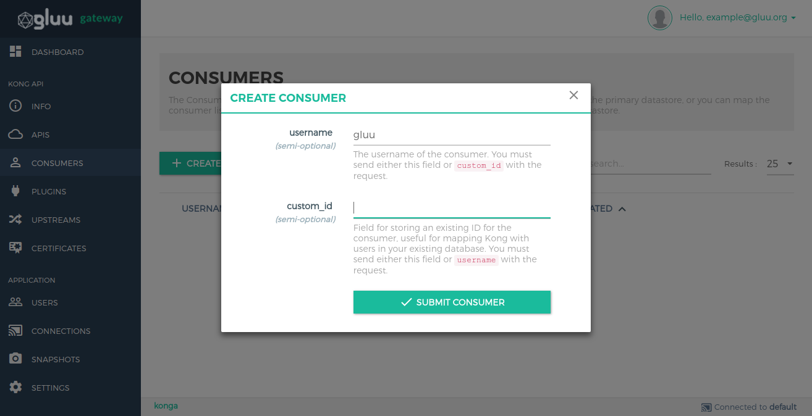
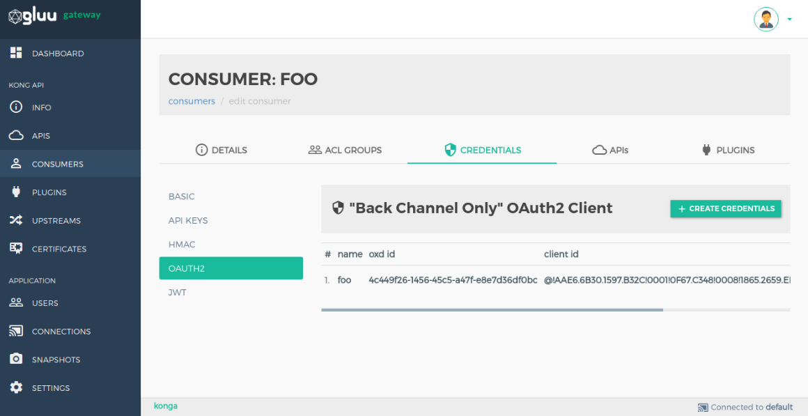
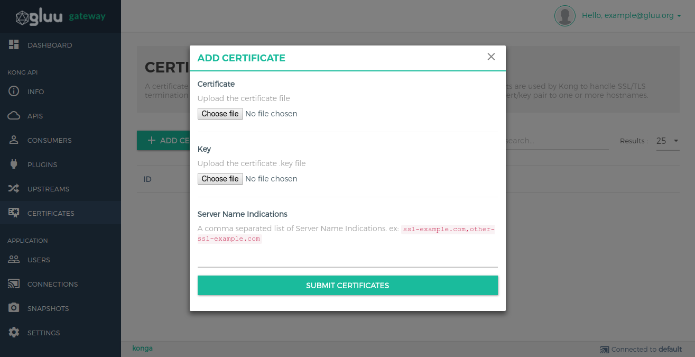
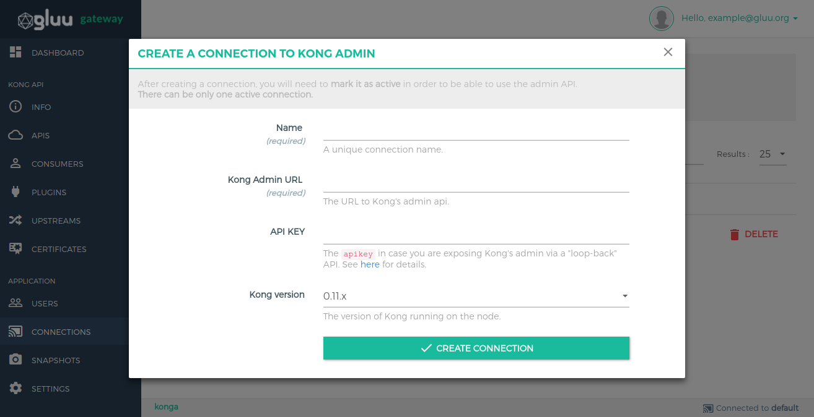

# Admin GUI Portal - Konga Guide

### 1. Dashboard

Dashboard section shows all application configuration details. You can see oxd and client details used by konga.

### 2. Info

Info section shows generic details about the kong node.

### 3. APIS

The API object describes an API that's being exposed by Kong. Kong needs to know how to retrieve the API when a consumer is calling it from the Proxy port. Each API object must specify a request host, a request path or both. Kong will proxy all requests to the API to the specified upstream URL.

Add your API by using `+ ADD NEW API` button. Add form shows details of every field.

For Add UMA RS plugin click on `SECURITY` option in API's list.

#### Manage plugins in APIS.

You need to go in manage mode in API section by click on pencil icon in API's list.

API's Plugin list

Add Plugin in API

### 4. Consumers

The Consumer object represents a consumer - or a user - of an API. You can either rely on Kong as the primary datastore, or you can map the consumer list with your database to keep consistency between Kong and your existing primary datastore.

Add consumers by using `+ CREATE CONSUMER` button. Add form shows details of every field.

#### Consumer credential configuration

Some plugins are consumer based. It stores some plugin configuration in consumer credential. You need to go in consumer credential section by clicking on consumer `username`.

### 5. Plugins

A Plugin entity represents a plugin configuration that will be executed during the HTTP request/response workflow, and it's how you can add functionalities to APIs that run behind Kong, like Authentication or Rate Limiting for example.

Add Plugins by using `+ ADD GLOBAL PLUGINS` button.

### 6. Upstreams

The upstream object represents a virtual hostname and can be used to loadbalance incoming requests over multiple services (targets). So for example an upstream named service.v1.xyz with an API object created with an upstream_url=https://service.v1.xyz/some/path. Requests for this API would be proxied to the targets defined within the upstream.

Add Plugins by using `+ CREATE UPSTREAM` button.

### 7. CERTIFICATE

A certificate object represents a public certificate/private key pair for an SSL certificate. These objects are used by Kong to handle SSL/TLS termination for encrypted requests. Certificates are optionally associated with SNI objects to tie a cert/key pair to one or more hostnames.

Add Plugins by using `+ CREATE CERTIFICATE` button.

### 8. Connections

Create connections to Kong Nodes and select the one to use by clicking on the respective star icon.

Add Plugins by using `+ NEW CONNECTION` button.

### 9. Snapshots

Take snapshots of currently active nodes.
All APIs, Plugins, Consumers, Upstreams and Targets will be saved and available for later import.

