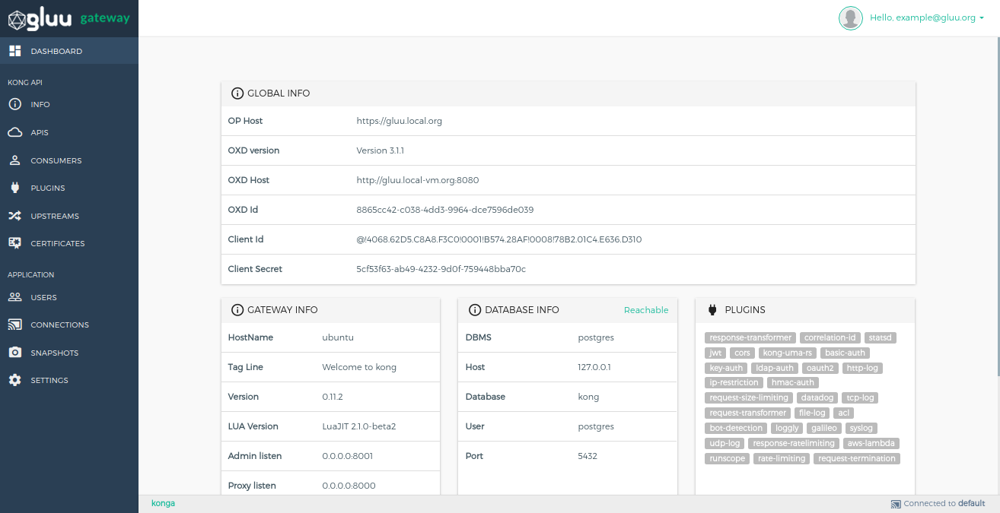
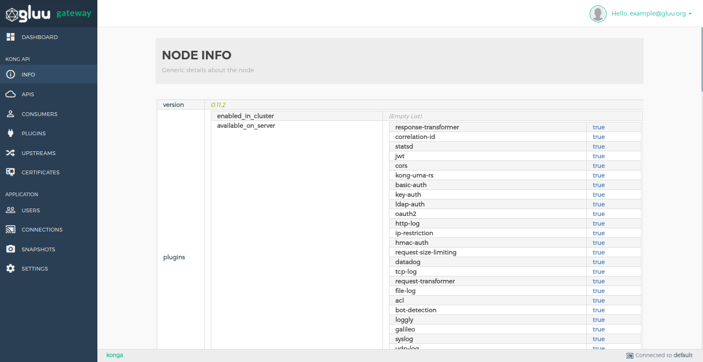
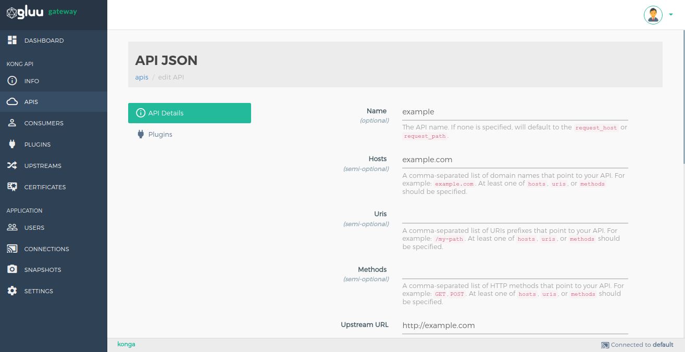
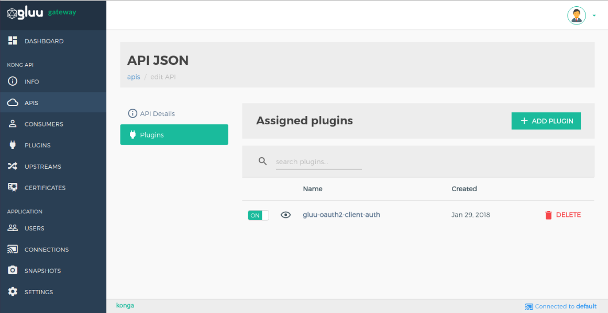
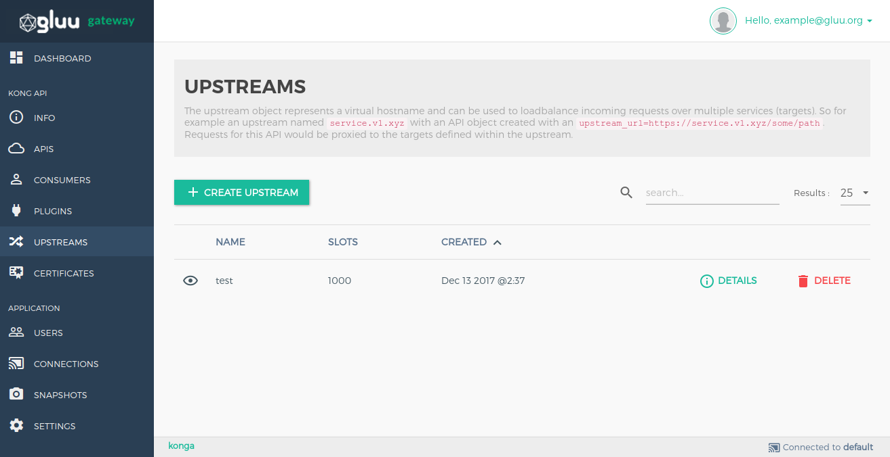
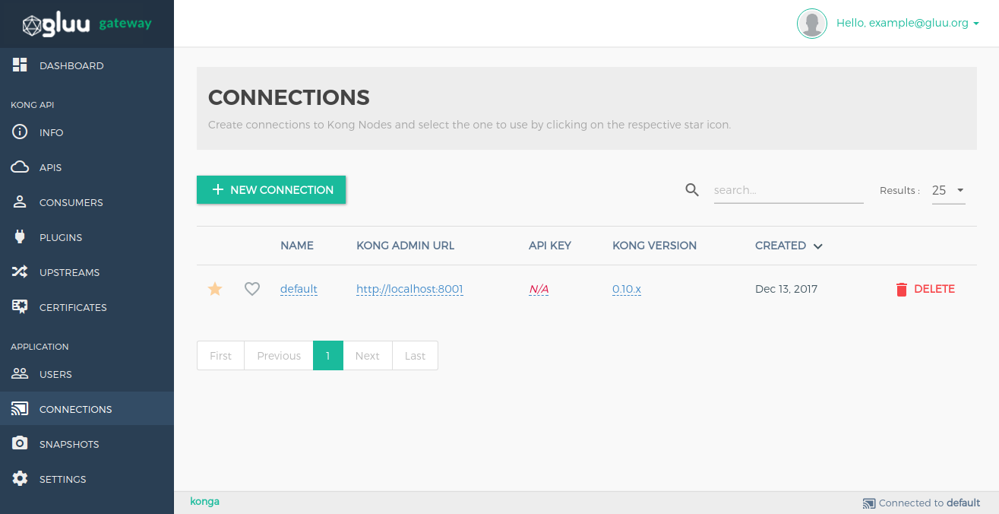

# Admin GUI Portal - Konga Guide

## 1. Dashboard

Dashboard section shows all application configuration details. You can see oxd and client details used by konga.

## 2. Info

Info section shows generic details about the kong node.

## 3. APIS

The API object describes an API that's being exposed by Kong. Kong needs to know how to retrieve the API when a consumer is calling it from the Proxy port. Each API object must specify some combination of `hosts`, `uris`, and `methods`. Kong will proxy all requests to the API to the specified upstream URL. 

!!! Note
    `SECURITY` option is for [UMA plugin](./plugin/ui.md) configuration.
    

### Add API

Add your API by using `+ ADD NEW API` button in [API section](#3-apis).

Below is the attributes of API object.

| **FORM PARAMETER** | **DESCRIPTION** |
|-----------|-------------|
| **name** | The API name. |
| **hosts** *(semi-optional)* | A comma-separated list of domain names that point to your API. For example: `example.com`. At least one of `hosts`, `uris`, or `methods` should be specified. |
| **uris** *(semi-optional)* | A comma-separated list of URIs prefixes that point to your API. For example: `/my-path`. At least one of `hosts`, `uris`, or `methods` should be specified. |
| **methods** *(semi-optional)* | A comma-separated list of HTTP methods that point to your API. For example: `GET`,`POST`. At least one of `hosts`, `uris`, or `methods` should be specified. |
| **upstream_url** | The base target URL that points to your API server. This URL will be used for proxying requests. For example: `https://example.com`. |
| **strip_uri** *(optional)* | When matching an API via one of the uris prefixes, strip that matching prefix from the upstream URI to be requested. Default: `true`. |
| **preserve_host** *(optional)* | When matching an API via one of the `hosts` domain names, make sure the request `Host` header is forwarded to the upstream service. By default, this is `false`, and the upstream `Host` header will be extracted from the configured `upstream_url`. |
| **retries** *(optional)* | The number of retries to execute upon failure to proxy. The default is `5`. |
| **upstream_connect_timeout** *(optional)* | The timeout in milliseconds for establishing a connection to your upstream service. Defaults to `60000`. |
| **upstream_send_timeout** *(optional)* | The timeout in milliseconds between two successive write operations for transmitting a request to your upstream service Defaults to `60000`. |
| **upstream_read_timeout** *(optional)* | The timeout in milliseconds between two successive read operations for transmitting a request to your upstream service Defaults to `60000`. |
| **https_only** *(optional)* | To be enabled if you wish to only serve an API through HTTPS, on the appropriate port (`8443` by default). Default: `false`. |
| **http_if_terminated** *(optional)* | Consider the `X-Forwarded-Proto` header when enforcing HTTPS only traffic. Default: `false`. |

### Manage APIS

You can edit API and add manage plugin by click on pencil icon in API's list. There are two sections.

1. **API Details:** This section is used to view and edit your API.

2. **Plugins:** This section is used to view the list of added plugin and add new plugin.

    Plugin list
    

    Add Plugin
    

## 4. Consumers

The Consumer object represents a consumer - or a user - of an API. You can either rely on Kong as the primary datastore, or you can map the consumer list with your database to keep consistency between Kong and your existing primary datastore.

Add consumers by using `+ CREATE CONSUMER` button. Add form shows details of every field.

### Consumer credential configuration

Some plugins are consumer based. It stores some plugin configuration in consumer credential. You need to go in consumer credential section by clicking on consumer `username`.

## 5. Plugins

A Plugin entity represents a plugin configuration that will be executed during the HTTP request/response workflow, and it's how you can add functionalities to APIs that run behind Kong, like Authentication or Rate Limiting for example.

Add Plugins by using `+ ADD GLOBAL PLUGINS` button.

## 6. Upstreams

The upstream object represents a virtual hostname and can be used to loadbalance incoming requests over multiple services (targets). So for example an upstream named service.v1.xyz with an API object created with an upstream_url=https://service.v1.xyz/some/path. Requests for this API would be proxied to the targets defined within the upstream.

Add Plugins by using `+ CREATE UPSTREAM` button.

## 7. CERTIFICATE

A certificate object represents a public certificate/private key pair for an SSL certificate. These objects are used by Kong to handle SSL/TLS termination for encrypted requests. Certificates are optionally associated with SNI objects to tie a cert/key pair to one or more hostnames.

Add Plugins by using `+ CREATE CERTIFICATE` button.

## 8. Connections

Create connections to Kong Nodes and select the one to use by clicking on the respective star icon.

Add Plugins by using `+ NEW CONNECTION` button.

## 9. Snapshots

Take snapshots of currently active nodes.
All APIs, Plugins, Consumers, Upstreams and Targets will be saved and available for later import.

