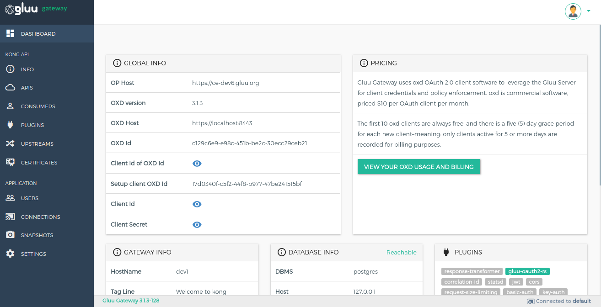
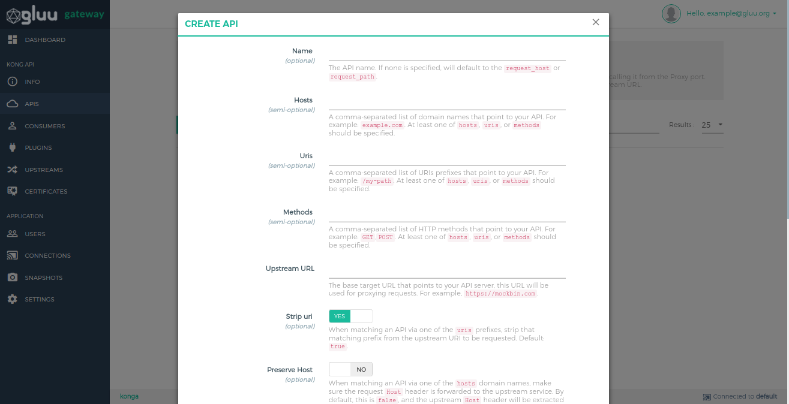
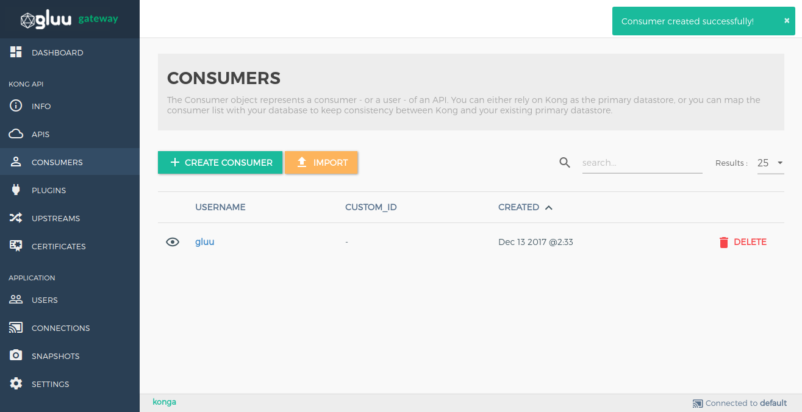
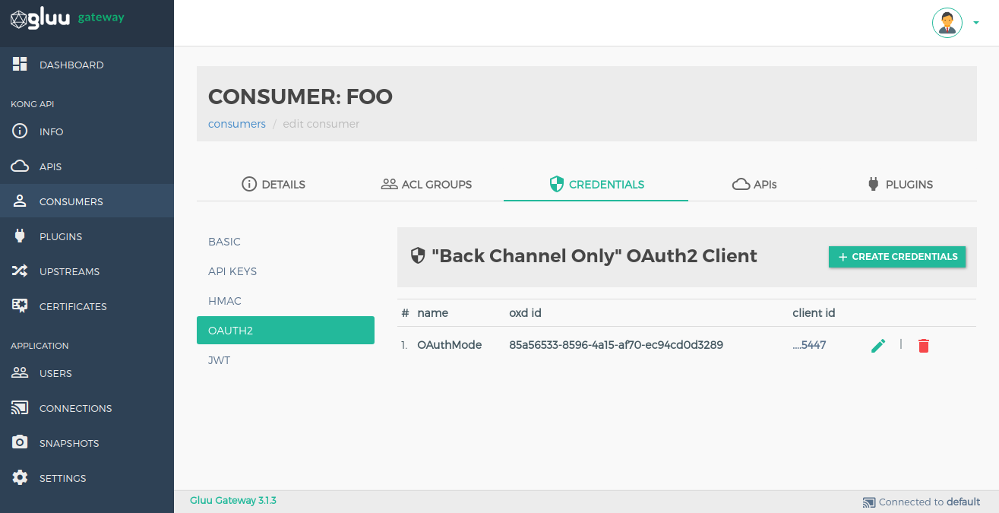
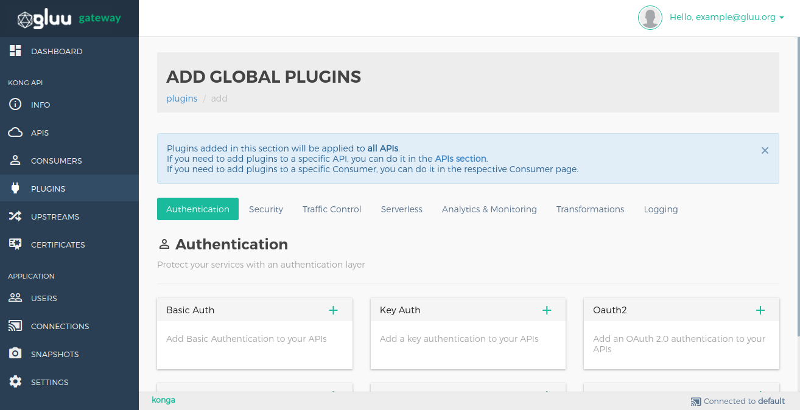

# Admin GUI Portal - Konga Guide

## Dashboard

The Dashboard section shows all application configuration details. You can see oxd and client details used by Konga.

## Info

The Info section shows generic details about the Kong node.

## APIs

The API object describes an API that's being exposed by Kong. Kong needs to know how to retrieve the API when a consumer is calling it from the Proxy port. Each API object must specify some combination of `hosts`, `uris`, and `methods`. Kong will proxy all requests to the API to the specified upstream URL. 

!!! Note
    The `SECURITY` option is for the [gluu-oauth2-rs plugin](./plugin/gui.md) configuration. Saving any configuration of paths, HTTP methods and scopes in the UMA Resources means adding the gluu-oauth2-rs plugin to the given API, which is necessary for successful execution of [UMA and Mix flows](https://gluu.org/docs/gg/3.1.3/#uma-mode).
    

### Add an API

Add your API by using the `+ ADD NEW API` button in the [API section](#3-apis).

Attributes of an API object are listed below.

| **FORM PARAMETER** | **DESCRIPTION** |
|-----------|-------------|
| **name** | The API name. |
| **hosts** *(semi-optional)* | A comma-separated list of domain names that point to your API. For example: `example.com`. At least one of `hosts`, `uris`, or `methods` should be specified. |
| **uris** *(semi-optional)* | A comma-separated list of URIs prefixes that point to your API. For example: `/my-path`. At least one of `hosts`, `uris`, or `methods` should be specified. |
| **methods** *(semi-optional)* | A comma-separated list of HTTP methods that point to your API. For example: `GET`,`POST`. At least one of `hosts`, `uris`, or `methods` should be specified. |
| **upstream_url** | The base target URL that points to your API server. This URL will be used for proxying requests. For example: `https://example.com`. |
| **strip_uri** *(optional)* | When matching an API via one of the uris prefixes, strip that matching prefix from the upstream URI to be requested. Default: `true`. |
| **preserve_host** *(optional)* | When matching an API via one of the `hosts` domain names, make sure the request `Host` header is forwarded to the upstream service. By default, this is `false`, and the upstream `Host` header will be extracted from the configured `upstream_url`. |
| **retries** *(optional)* | The number of retries to execute upon failure to proxy. The default is `5`. |
| **upstream_connect_timeout** *(optional)* | The timeout in milliseconds for establishing a connection to your upstream service. Defaults to `60000`. |
| **upstream_send_timeout** *(optional)* | The timeout in milliseconds between two successive write operations for transmitting a request to your upstream service. Defaults to `60000`. |
| **upstream_read_timeout** *(optional)* | The timeout in milliseconds between two successive read operations for transmitting a request to your upstream service. Defaults to `60000`. |
| **https_only** *(optional)* | Enable if you wish to only serve an API through HTTPS, on the appropriate port (`443` by default). Default: `false`. |
| **http_if_terminated** *(optional)* | Consider the `X-Forwarded-Proto` header when enforcing HTTPS-only traffic. Default: `false`. |

### Manage APIS

You can edit an API and manage its plugins by clicking on the pencil icon on the API list. There are two sections.

**API Details:** This section is used to view and edit your API.

**Plugins:** This section is used to view the list of added Plugins and add a new Plugin.

* The Plugin list
  
  

* Add a Plugin
  
  

## Consumers

The Consumer object represents a consumer - or a user - of an API. You can either rely on Kong as the primary datastore, or you can map the consumer list with your database to keep consistency between Kong and your existing primary datastore.

Add consumers by using the `+ CREATE CONSUMER` button. The creation form shows details of every field.

### Consumer credentials configuration

Some plugins are consumer-based and store some plugin configuration in consumer credentials. You need to go to the consumer credentials section by clicking on a consumer's `username`.

## Plugins

A Plugin entity represents a plugin configuration that will be executed during the HTTP request/response workflow. It also enables the user to add functionalities to APIs that run behind Kong, e.g. Authentication or Rate Limiting. You can read about the available Kong Plugins [here](https://konghq.com/plugins/). 

Plugins added in this section of the Gluu Gateway will be applied to all APIs. If you need to add plugins to a specific API, you can do it in the APIs section.
If you need to add plugins to a specific Consumer, you can do it in the respective Consumer page.

Add Plugins by using the `+ ADD GLOBAL PLUGINS` button.

## Upstreams

The Upstream object represents a virtual hostname and can be used to load balance incoming requests over multiple services (targets), e.g. an upstream named service.v1.xyz with an API object created with an upstream_url=https://service.v1.xyz/some/path. Requests for this API would be proxied to the targets defined within the upstream.

Add Plugins by using the `+ CREATE UPSTREAM` button.

## CERTIFICATE

A Certificate object represents a public certificate/private key pair for an SSL certificate. These objects are used by Kong to handle SSL/TLS termination for encrypted requests. Certificates are optionally associated with SNI objects to tie a cert/key pair to one or more hostnames.

Add Plugins by using the `+ CREATE CERTIFICATE` button.

## Connections

Create connections to Kong nodes and select the one to use by clicking on the respective star icon.

Add Plugins by using the `+ NEW CONNECTION` button.

## Snapshots

Take snapshots of currently active nodes.
All APIs, Plugins, Consumers, Upstreams and Targets will be saved and available for later import.

## Settings

You can set dashboard refresh interval and logout session timeout in settings section.

