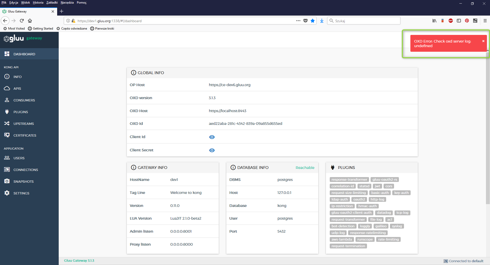

# Frequently Asked Questions (FAQ)

## General FAQs and troubleshooting

### How is Gluu Gateway licensed, and how much does it cost?
Gluu Gateway is subject to the MIT License, but uses commercially licensed oxd OAuth 2.0 client software to leverage the Gluu Server for client credentials and policy enforcement. oxd is commercial software, priced $10 per OAuth client per month. The first 10 oxd clients are always free, and there is a five (5) day grace period for each new client–meaning: only clients active for 5 or more days are recorded for billing purposes.

### Where should Gluu Gateway be used?
Gluu Gateway should be used in every API gateway where you need advanced security measures with OAuth 2.0 and User-Managed Access (UMA) 2.0 Grant.

### How can I investigate Gluu Gateway problems?
Gluu Gateway uses Gluu Server and oxd with the oxd-https-extension. That means any potential issue on these servers can influence the work of Gluu Gateway.

If you see an error message such as the one in the screenshot, you should check the logs for possible issues:

`/var/log/oxd-server/oxd-server.log`

You can also check the [oxd FAQ section](https://gluu.org/docs/oxd/3.1.3/faq/).

### How can I find my Gluu Gateway version?
Your Gluu Gateway version is always visible in the bottom left corner of the Gluu Gateway Admin Panel. 

## Technical FAQs

### How can I generate an OAuth token?
In order to generate an OAuth token by calling oxd-server endpoint `/get-client-token` with customer credentials in the OAuth mode. Read more OAuth generation [here](https://gluu.org/docs/oxd/api/#get-client-token).

### How can I generate UMA tokens?
In order to generate an UMA token, follow these steps:

1. Send a `get-client-token` request with UMA-RS Plugin details (`oxd_id`, `client_id`, `client_secret`)

1. Send an `uma-rs-check-access` request with UMA-RS Plugin `oxd_id` and the access token from the previous call

1. Send a `get-client-token` request with Consumer `oxd_id`, `client_id` and `client_secret` 

1. Send an `uma-rp-get-rpt` request with Consumer `oxd_id`, the ticket from Step 2 and the access token from Step 3.

### How can I generate Mix mode tokens?
The process is the same as for OAuth token generation. The Consumer must have the Mix mode set.  

### What can I do if I get "Unauthorized! gluu-oauth2-client-auth cache is not found"?
If you see this message in any response, it means that you haven't added the custom gluu-oauth2-client-auth plugin to your API. Go back to the API details and add it in the [Plugins section](https://gluu.org/docs/gg/3.1.3/admin-gui/#manage-apis). 

### How can I change the listening address and port?
By default, Gluu Gateway listens to localhost only, but you can change it manually by configuring the `local.js` config file using the [Configuration section](https://gluu.org/docs/gg/3.1.3/configuration/#admin-gui-portal-konga). You just need to update the `explicitHost` to your global IP or remove this attribute. Read more about the configuration [here](https://sailsjs.com/documentation/reference/configuration/sails-config).
 
### How can I change Gluu Gateway Client expiration date?
By default, the Gluu Gateway Client expiration date is set for one day during the installation process. To change it, set a different value on your Gluu Server.

If you require any further support, please open a ticket on the [Gluu support portal](https://support.gluu.org).
