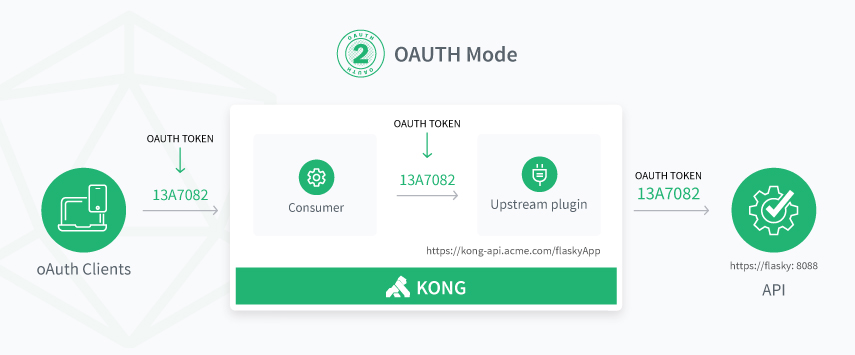

# Gluu Gateway 3.1.3

## Overview

Gluu Gateway is an API Gateway that leverages the open source [Gluu Server](https://gluu.org/) for central client management and access control, and inherits its core gateway functionality from the open source [Kong API Gateway](https://konghq.com/kong-community-edition/). 
    

## Features
Gluu Gateway inherits its API Gateway features from the open source Kong API Gateway, and adds the following additional functionality:

- Leverage the Gluu Server IAM platform for central client authentication
- Control access to APIs using OAuth and UMA scopes
- Manage Kong Admin API, Consumer and Plugin objects.
- API Dashboard to configure and monitor the health of your servers.
- Backup, restore and migrate Kong instances using snapshots.    

## Access Control
Gluu Gateway enables API access management via OAuth scopes, UMA scopes or both ("mix mode"). 

### OAuth Mode
In the OAUTH Mode, an OAuth token is generated with the use of Consumer credentials (oxd_id, client_id and client_secret). Then a call with the access token is made to Kong which proxies the Upstream API. You can read more about Consumer credentials in the [Consumer section](./admin-gui.md#consumers).

### UMA Mode
In the UMA Mode, an RPT token is generated by sending UMA Plugin credentials to Gluu Gateway. After checking the access and obtaining a ticket, you can generate an access token which is used to make an API request. You can read more about UMA in [Gluu OAuth 2.0 UMA RS plugin](./plugin/api.md#gluu-oauth-20-uma-rs-plugin).

### Mix Mode
In the Mix Mode, an OAuth token is generated with the use of Consumer credentials (oxd_id, client_id and client_secret). Optionally, the client can also send pushed claims with the UMA_PUSHED_CLAIMS header. You can make an API call using an access token. Gluu Gateway will proxy the Upstream API, automatically executing the UMA flow without any user input.

## Components

The Gluu Gateway software package bundles the following software components:

- [Kong v0.11.x](https://getkong.org): An open source API Gateway and Micro services Management Layer, delivering high performance and reliability.

- [Gluu Konga Admin GUI](https://github.com/GluuFederation/gluu-gateway/tree/master/konga): A web administration portal, based on [Konga](https://github.com/pantsel/konga) GUI, which makes it easier to manage your Gluu Gateway.

- [Gluu Gateway Kong plugins](https://github.com/GluuFederation/gluu-gateway): Use Gluu Server to control access to upstream APIs using OAuth 2.0 clients and UMA 2.0.

- [oxd-Server v3.1.3.1](https://oxd.gluu.org): An OpenID Connect and UMA middleware service used to enable client credential management and cryptographic validation against an OAuth 2.0 Authorization Server, like the Gluu Server .

- Others: The following runtime environment is required by the Gluu Gateway package: 
    - OpenJDK v8
    - Python v2.x
    - Postgres v10
    - Node v8.9.4
    - NPM v5.6.0'
    
    
## Get Started

Use the following links to get started:  

1. [Installation](./installation.md)
1. [Configuration](./configuration.md)
1. [Admin GUI](./admin-gui.md)
1. Plugins
    1. [Admin GUI](./plugin/gui.md)
    2. [Admin API](./plugin/api.md)
1. [FAQ](./faq.md)

## Licenses

Gluu Gateway leverages software written by Gluu and incorporated from other projects. The license for each software component is listed below.

| Component | License |
|-----------|---------|
| Kong API Gateway | [Apache2]( http://www.apache.org/licenses/LICENSE-2.0) |
| Konga GUI | [MIT License](http://opensource.org/licenses/MIT) |
| Gluu Gateway plugins | [MIT License](http://opensource.org/licenses/MIT) |
| oxd-Server | [OXD License](https://github.com/GluuFederation/oxd/blob/master/LICENSE) |
