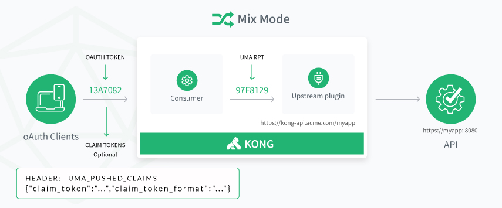

# Gluu Gateway 3.1.3

## Overview

Gluu Gateway is an API Gateway which can be used to quickly deploy an OAuth 2.0 and User-Managed Access (UMA) 2.0 Grant protected API gateway.

1. In the OAUTH Mode, an OAuth token is generated with the use of Consumer credentials (oxd_id, client_id and client_secret). Then a call with the access token is made to Kong which proxies the Upstream API. You can read more about Consumer credentials in the [Consumer section](./admin-gui.md#consumers).

1. In the UMA Mode, an RPT token is generated by sending UMA Plugin credentials to Gluu Gateway. After checking the access and obtaining a ticket, you can generate an access token which is used to make an API request. You can read more about UMA in [Gluu OAuth 2.0 UMA RS plugin](./plugin/api.md#gluu-oauth-20-uma-rs-plugin).

1. In the Mix Mode, an OAuth token is generated with the use of Consumer credentials (oxd_id, client_id and client_secret). Optionally, the client can also send pushed claims with the UMA_PUSHED_CLAIMS header. You can make an API call using an access token. Gluu Gateway will proxy the Upstream API, automatically executing the UMA flow without any user input.

## Components

Gluu Gateway uses the following components:

1. **[Gluu Server v3.1.3](https://gluu.org):** A free open source software package for identity and access management. You should need to use Gluu Server version >= 3.1.3.
1. **[OXD-Server v3.1.3](https://oxd.gluu.org):** An OpenID Connect and UMA middleware service used for client credential management and cryptographic validation. 
1. **[Kong v0.11.x](https://getkong.org):** An open source API Gateway and Micro services Management Layer, delivering high performance and reliability.
1. **[Gluu Kong plugins](https://github.com/GluuFederation/gluu-gateway)**: Use Gluu Server to control access to upstream APIs using OAuth 2.0 clients and UMA 2.0.
1. **[Admin GUI - Konga](https://github.com/GluuFederation/gluu-gateway/tree/master/konga)**: A web administration portal, based on [Konga](https://github.com/pantsel/konga) GUI, which makes it easier to manage your Gluu Gateway.
1. **Others**: The following runtime environment required by the Gluu Gateway package: 
    - OpenJDK v8
    - Python v2.x
    - Postgres v10
    - Node v8.9.4
    - NPM v5.6.0

## Features

1. Manage Kong Admin API, Consumer and Plugin objects.
1. Configure User-Managed Access (UMA) 2.0 Grant for OAuth 2.0 Authorization to register API objects.
1. API Dashboard to configure and monitor the health of your servers.
1. Backup, restore and migrate Kong instances using snapshots.
1. Leverage the security and upgradability of the oxd-server.

## Get Started

Use the following links to get started with the credentials manager:  

1. [Installation](./installation.md)
1. [Configuration](./configuration.md)
1. [Admin GUI](./admin-gui.md)
1. Plugin
    1. [Configure a plugin using Admin GUI](./plugin/gui.md)
    2. [Configure a plugin using Admin API](./plugin/api.md)
1. [FAQ](./faq.md)

## License

Gluu Gateway is a container distribution composed of software written by Gluu and incorporated from other open source projects. The license for each software component is listed below.

| Component | License |
|-----------|---------|
| [Gluu Server](https://www.gluu.org/) | [MIT License](http://opensource.org/licenses/MIT) |
| [OXD-Server](https://oxd.gluu.org) | [OXD License](https://github.com/GluuFederation/oxd/blob/master/LICENSE) |
| [Kong](https://getkong.org/) | [Apache2]( http://www.apache.org/licenses/LICENSE-2.0) |
| Gluu-Gateway | [MIT License](http://opensource.org/licenses/MIT) |
