# Admin GUI Portal - Konga Guide

## Dashboard
The Dashboard section is divided into subsections which show application configuration details. 

In the Global Info you can see oxd and client details used by Konga. If you want to check the version of the currently used oxd server or the address of the Gluu Server, all the necessary information is provided here. OXD Id Client, Id of OXD Id, Setup client OXD Id, Client Id and Client Secret are the credentials created during the Gluu Gateway installation and setup. 

By default, two oxd clients are created during the installation and setup of the Gluu Gateway. You can always check their activity and billing status by clicking the green button in the Pricing subsection, which will take you to the oxd ecommerce platform. The Pricing table also provides more information on the oxd usage and billing.

The Gateway and Database Info show information on the gateway itself and the used postgres database, respectively. 

The Plugins section displays all the plugins supported by the Gluu Gateway. When inactive, a plugin is shown as gray. If you add a plugin to an API/a Consumer or set a global one, its name will turn green on the dashboard.

The remaining subsections of Requests, Connections and Timers show real-time metrics on the Gluu Gateway health.  

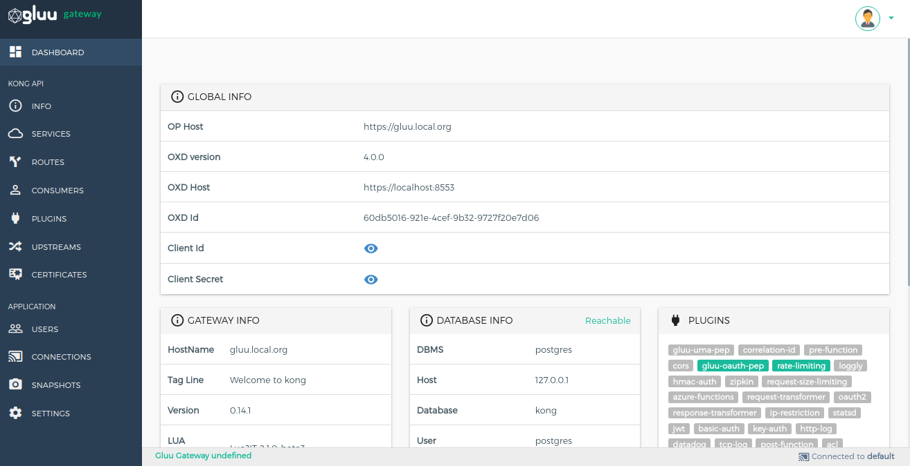

## Info

The Info section shows generic details about the Kong node.
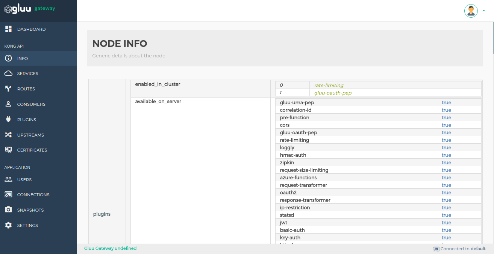

## SERVICEs

### Service List

Service entities, as the name implies, are abstractions of each of your own upstream services. Examples of Services would be a data transformation microservice, a billing API, etc. [More details](https://docs.konghq.com).   
    

| Tools | Details |
|---|-----|
| **+ ADD NEW SERVICE** | This button is used to add new service.|
| **Gluu Security** | This column only shows the added gluu plugins.|
| **Edit Button** | This button is used to edit service, configure route and configure plugins of selected service. You can click on **service name** to edit service.|
| **Delete Button** | This button is used to delete selected service. |
   
### Add an Service

Add your Service using the `+ ADD NEW SERVICE` button.

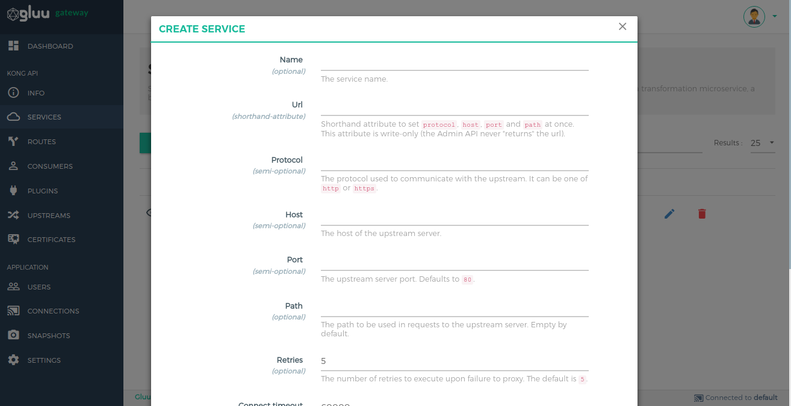

### Manage Service

You can edit an API and manage its plugins by clicking on the pencil icon on the API list. There are two sections.

#### Service Details
This section is used to view and edit your Service.

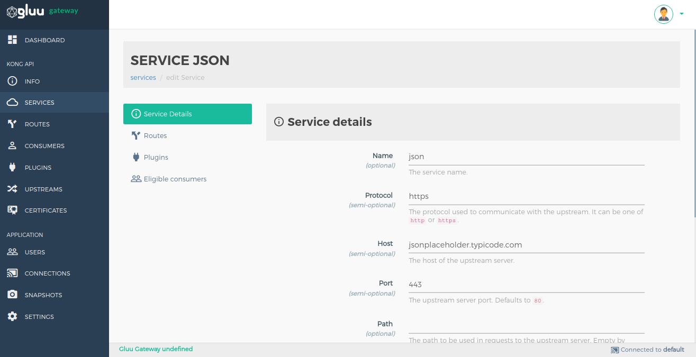

#### Routes
This section is used to manage route within selected service.

| Tools | Details |
|---|-----|
| **+ ADD ROUTE** | This button is used to add new route.|
| **Edit Button** | This button is used to edit route, configure route and configure plugins of selected service.|
| **Delete Button** | This button is used to delete selected route. |

#### Plugins
This section is used to view the list of added Plugins and add a new Plugin.

##### Plugin list
  
  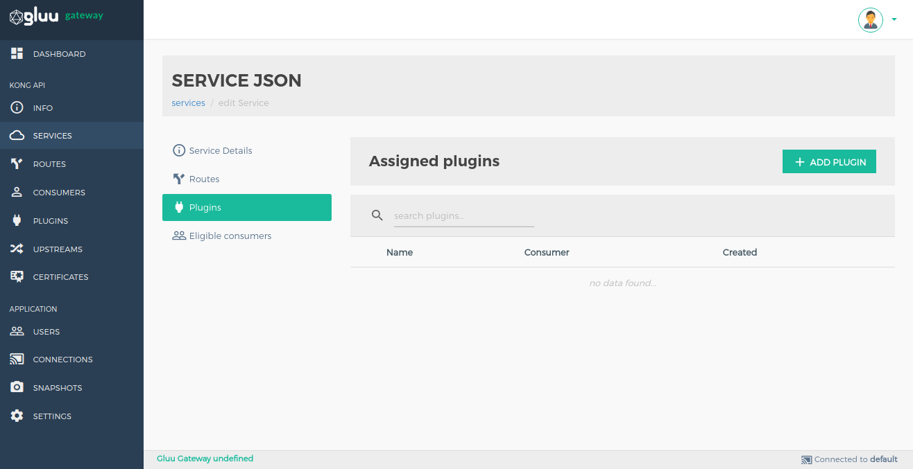

  | Tools | Details |
  |---|-----|
  | **+ ADD PLUGIN** | This button is used to add plugin.|
  | **Edit Plugin** | Click on plugin name to edit plugin configurations.|
  | **Delete Button** | This button is used to delete selected route. |
  | **ON/OFF Switch** |If you want to switch a plugin on/off, just use the toggle bar.|

##### Add Plugin

  Add a Plugin by clicking the plus icon next to a plugin’s name.
  
  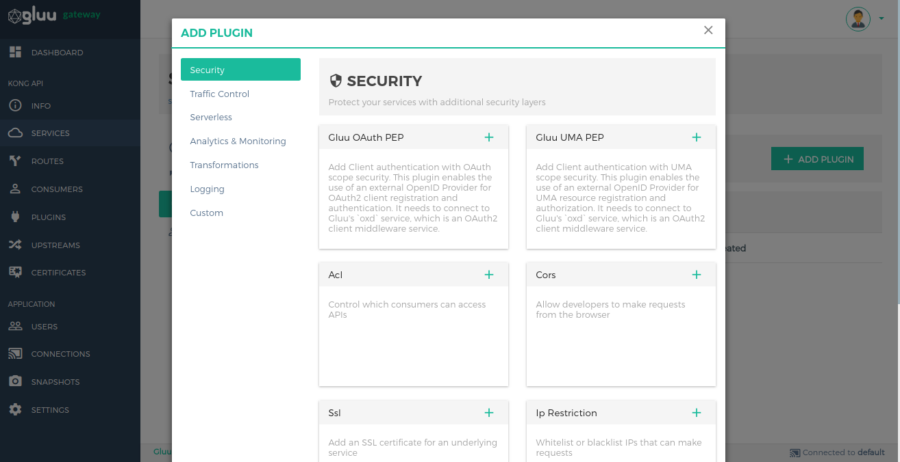

#### Eligible consumers

  This section is for ACL kong plugin which Restrict access to an API by whitelisting or blacklisting consumers using arbitrary ACL group names. It shows the list of consumers which is configure with ACL Groups.

  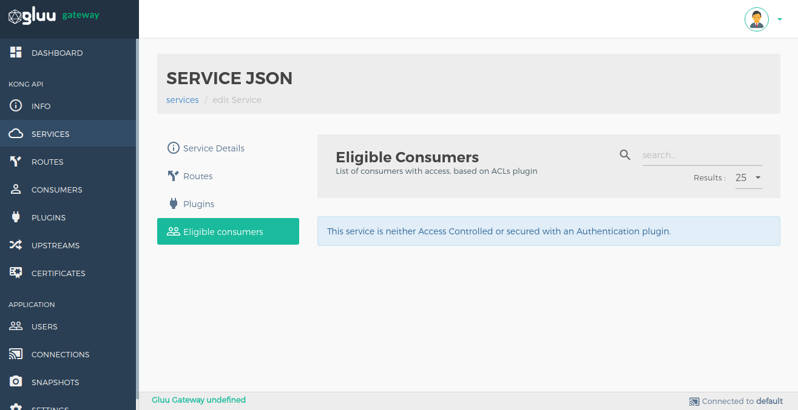

## Consumers

The Consumer object represents a consumer - or a user - of an API. You can either rely on Kong as the primary datastore, or you can map the consumer list with your database to keep consistency between Kong and your existing primary datastore.

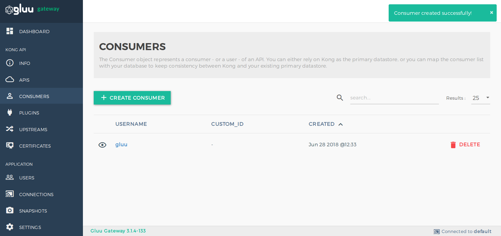

Add Consumers by using the `+ CREATE CONSUMER` button. The creation form shows details of every field.

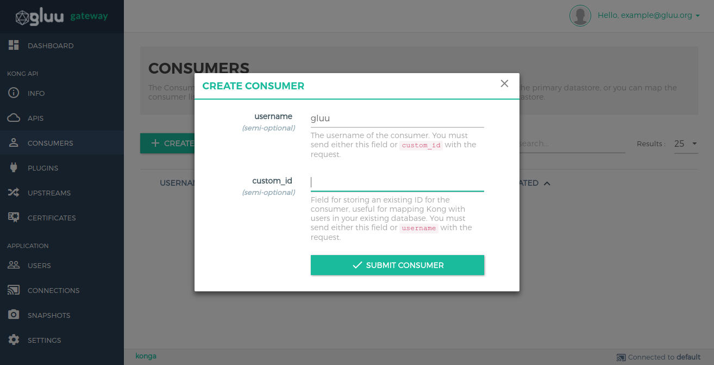

### Consumer credentials configuration

Some plugins are consumer-based and store some plugin configuration in consumer credentials. You need to go to the consumer credentials section by clicking on a consumer's `username`.

## Plugins

A Plugin entity represents a plugin configuration that will be executed during the HTTP request/response workflow. It also enables the user to add functionalities to APIs that run behind Kong, e.g. Authentication or Rate Limiting. You can read about the available Kong Plugins [here](https://konghq.com/plugins/). 

Plugins added in this section of the Gluu Gateway will be applied to all APIs. If you need to add plugins to a specific API, you can do it in the APIs section.
If you need to add plugins to a specific Consumer, you can do it in the respective Consumer page.

Add Plugins by using the `+ ADD GLOBAL PLUGINS` button.

## Upstreams

The Upstream object represents a virtual hostname and can be used to load balance incoming requests over multiple services (targets), e.g. an upstream named service.v1.xyz with an API object created with an upstream_url=https://service.v1.xyz/some/path. Requests for this API would be proxied to the targets defined within the upstream.

Add Upstreams by using the `+ CREATE UPSTREAM` button.

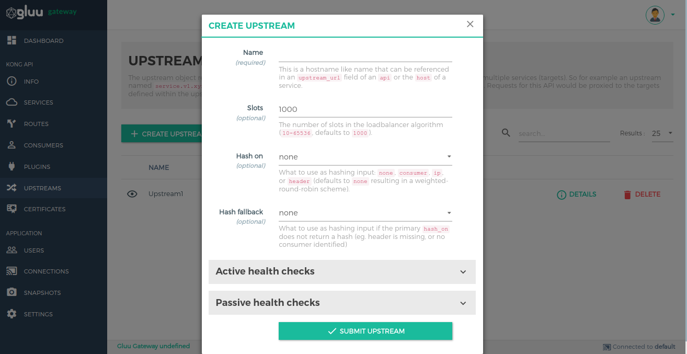

You can modify the details of your Upstream by clicking the `DETAILS` button next to its name. While changing the number of slots, make sure that the number corresponds to the `Orderlist` and exactly matches its value. For instance, if you want 999 slots, delete slot 1000, for 998 - delete 999 and 1000, etc.).

The `Targets` section enables target addition. Because the upstream maintains a history of target changes, the targets cannot be deleted from the list or modified. To disable a target, post a new one with weight=0 or click on the `DELETE` button next to its name, which will automatically assign 0 to its weight. 

## CERTIFICATE

A Certificate object represents a public certificate/private key pair for an SSL certificate. These objects are used by Kong to handle SSL/TLS termination for encrypted requests. Certificates are optionally associated with SNI objects to tie a cert/key pair to one or more hostnames.

Add Certificates by using the `+ CREATE CERTIFICATE` button.

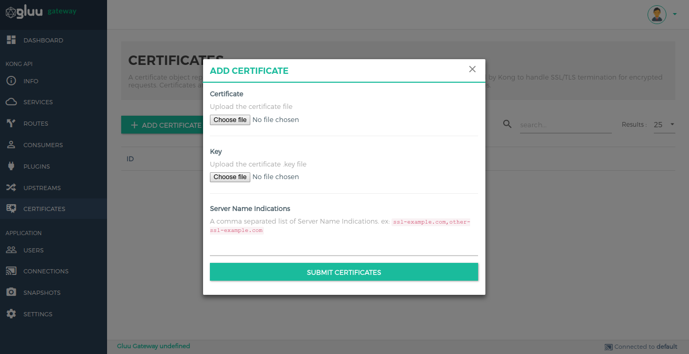

## Connections

Create connections to Kong nodes and select the one to use by clicking on the respective star icon.

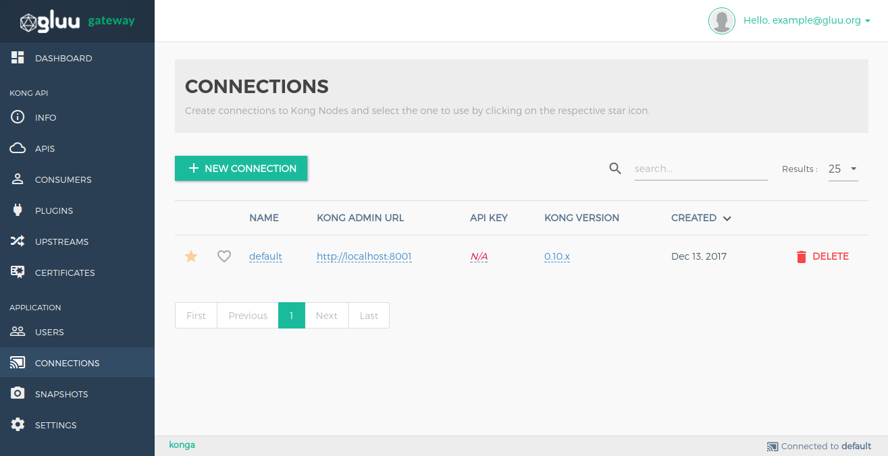

Add Connections by using the `+ NEW CONNECTION` button.

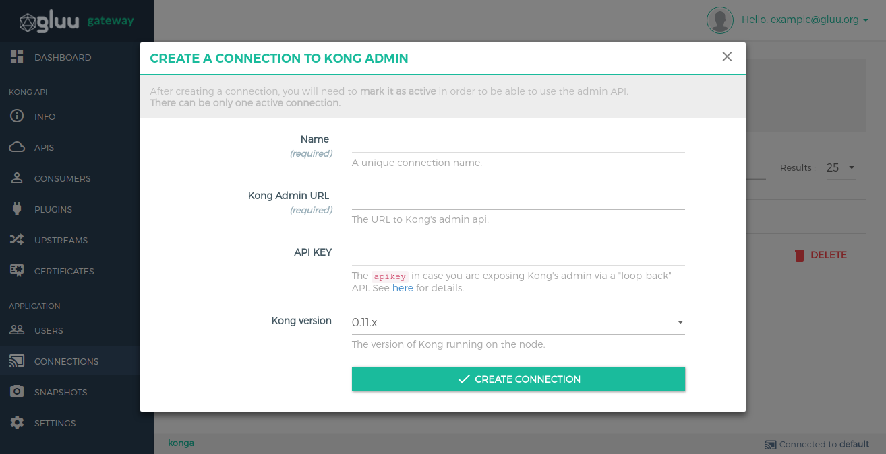

## Snapshots

Take snapshots of currently active nodes.
All APIs, Plugins, Consumers, Upstreams and Targets will be saved and available for later import.

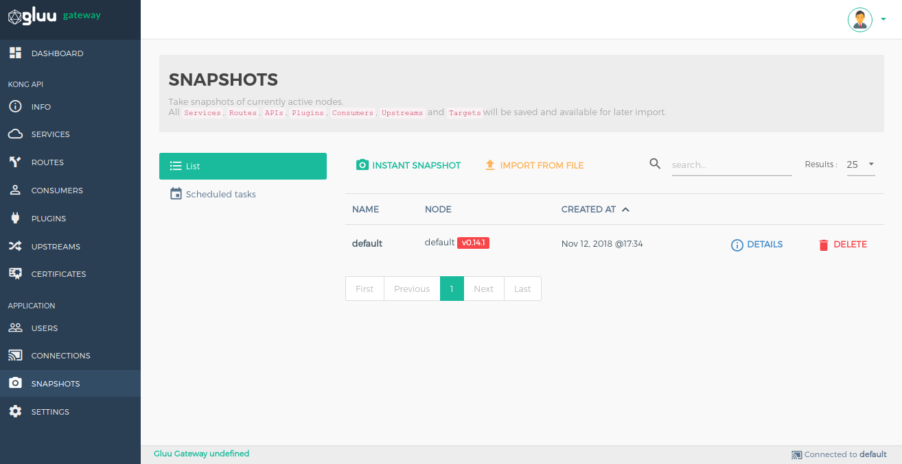

## Settings

You can set dashboard refresh interval and logout session timeout in settings section.

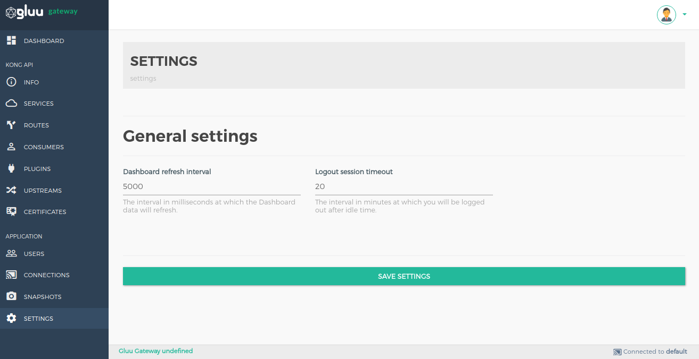
