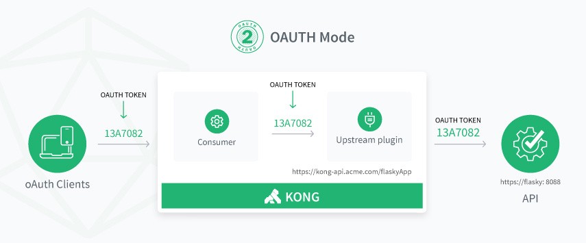
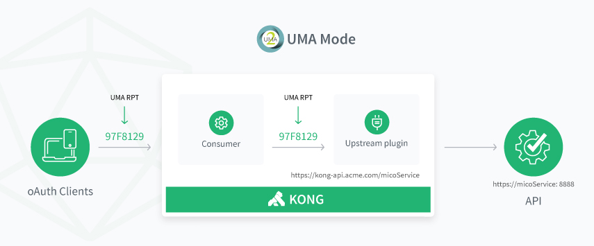

# Gluu Gateway 4.0.Beta

## Overview

Gluu Gateway is an API Gateway that leverages the open source [Gluu Server](https://gluu.org/) for central client management and access control, and inherits core gateway functionality from the open source [Kong API Gateway](https://konghq.com/kong-community-edition/). 

## Features
Gluu Gateway adds the following functionality to the Kong API Gateway:

- Leverage Gluu's OAuth 2.0 authorization server for central client authentication.
- Control access to APIs using OAuth and UMA scopes.
- GUI to manage Kong API, Consumer and Plugin objects.
- API Dashboard to configure and monitor the health of your servers.
- Backup, restore and migrate Kong instances using snapshots.    

## Access Control
Gluu Gateway enables API access management via OAuth PEP and UMA PEP(policy enforcement point). 

### OAuth PEP
OAuth PEP is client security which authenticate OAuth token and token scope security.

### UMA PEP
UMA PEP is client security which authenticate RPT token and UMA scope security.

## Components

Gluu Gateway makes use of the following software components:

- [Kong v0.14](https://getkong.org): An open source API Gateway and Micro services Management Layer, delivering high performance and reliability.

- [Gluu Konga Admin GUI](https://github.com/GluuFederation/gluu-gateway/tree/master/konga): A web administration portal, based on [Konga](https://github.com/pantsel/konga) GUI, to manage your Gluu Gateway.

- [Gluu Gateway plugins](https://github.com/GluuFederation/gluu-gateway): Use Gluu Server for central client management and to control access to upstream APIs using OAuth 2.0 and UMA 2.0.

- [oxd-Server v4.0.Beta](https://oxd.gluu.org): An OpenID Connect and UMA middleware service used to enable client credential management and cryptographic validation against an OAuth 2.0 Authorization Server, like the Gluu Server.

- Others: The following runtime environment is required by the Gluu Gateway package: 
    - OpenJDK v8
    - Python v2.x
    - Postgres v10
    - Node v8.9.4
    - NPM v5.6.0'
    
## Get Started

Use the following links to get started:  

1. [Installation](./installation.md)
1. [Configuration](./configuration.md)
1. [Admin GUI](./admin-gui.md)
1. Plugins
    1. [Admin GUI](./plugin/gui.md)
    2. [Admin API](./plugin/api.md)
1. [FAQ](./faq.md)

## Licenses

Gluu Gateway leverages software written by Gluu and incorporated from other projects. The license for each software component is listed below.

| Component | License |
|-----------|---------|
| Kong API Gateway | [Apache2]( http://www.apache.org/licenses/LICENSE-2.0) |
| Konga GUI | [MIT License](http://opensource.org/licenses/MIT) |
| Gluu Gateway plugins | [MIT License](http://opensource.org/licenses/MIT) |
| oxd-Server | [Apache2]( http://www.apache.org/licenses/LICENSE-2.0) |
