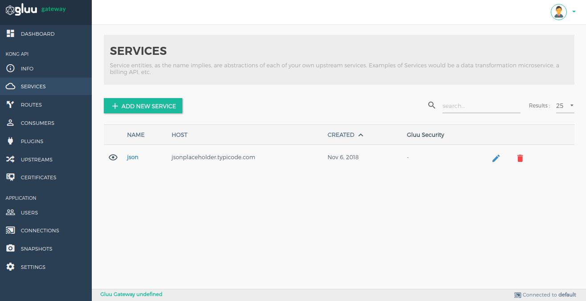
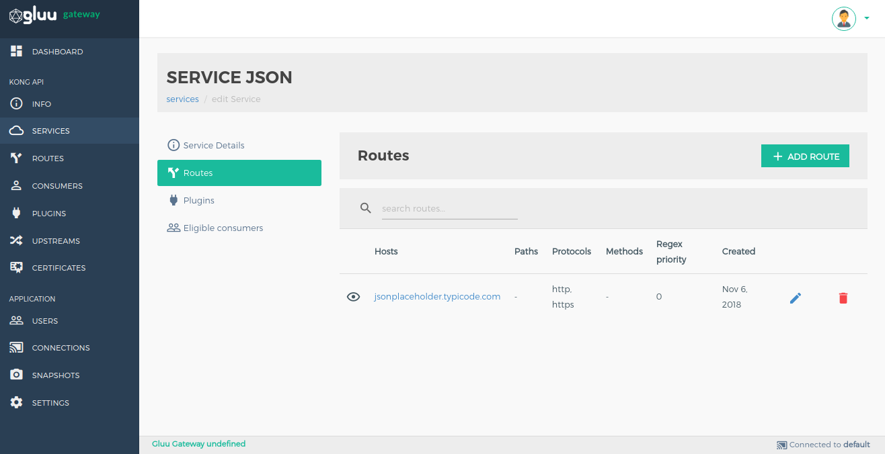
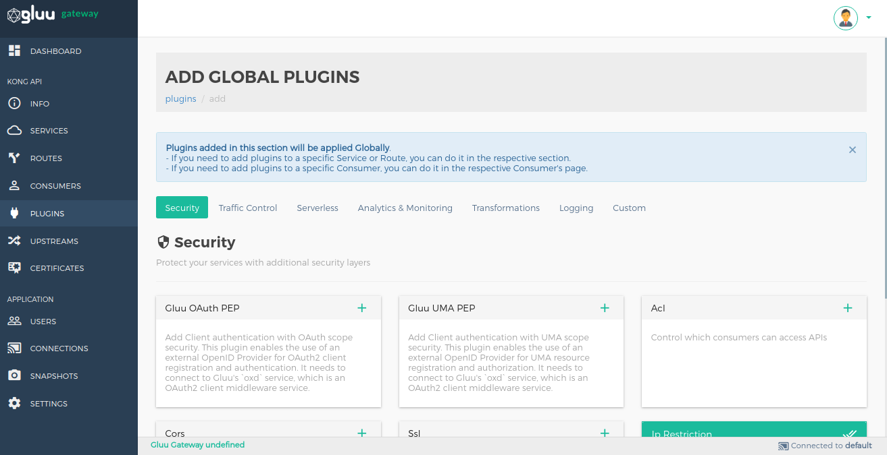

# Gluu OAuth PEP

It is used to add Client authentication with OAuth scope security. This plugin enables the use of an external OpenID Provider for OAuth2 client authentication. It needs to connect to Gluu's `oxd` service, which is an OAuth2 client middleware service.

You can configure plugin on Service, Route and Global.

## Configuration

### Enable plugin on Service

#### 1. Add Service

##### 1.1 Add Service using GG UI

Use [Service section](../admin-gui/#2-add-service) to add service using GG UI.



##### 1.2 Add Service using Kong Admin API

```
$ curl -X POST \
  http://localhost:8001/services \
  -H 'Content-Type: application/json' \
  -d '{
  "name": "<service_name>",
  "url": "http://upstream-api-url.com"
}'
```

#### 2. Configure Plugin

##### 2.1 Configure plugin using GG UI

Use the [Manage Service](../admin-gui/#332-add-plugin) section in GG UI to enable the Gluu OAuth PEP plugin. In the security category, there is a Gluu OAuth PEP box. Click on the **+ icon** to enable the plugin.


After clicking on **+ icon**, you will see the below form.


##### 2.2 Configure plugin using Kong Admin API

```
$ curl -X POST \
  http://localhost:8001/plugins \
  -H 'Content-Type: application/json' \
  -d '{
  "name": "gluu-oauth-pep",
  "config": {
    "oxd_url": "<your_oxd_server_url>",
    "op_url": "<your_op_server_url>",
    "oxd_id": "<oxd_id>",
    "client_id": "<client_id>",
    "client_secret": "<client_secret>",
    "oauth_scope_expression": [
      {
        "path": "/posts",
        "conditions": [
          {
            "httpMethods": [
              "GET"
            ],
            "scope_expression": {
              "rule": {
                "and": [
                  {
                    "var": 0
                  },
                  {
                    "var": 1
                  }
                ]
              },
              "data": [
                "admin",
                "employee"
              ]
            }
          }
        ]
      }
    ],
    "ignore_scope": <false|true>,
    "deny_by_default": <false|true>,
    "hide_credentials": <false|true>
  },
  "service_id": "<kong_service_object_id>"
}'
```

!!! Note
    Kong not allow to proxy only using service object. you must have to add route for this. In short, you need one service to register Upstream API and one route for proxy.

### Enable plugin on Route

#### 1. Add Route

##### 1.1 Add Route using GG UI

Use [Manage Service Section](../admin-gui/#32-routes) to add route using GG UI.



##### 1.2 Add Route using Kong Admin API

```
$ curl -X POST \
    http://192.168.200.16:8001/routes \
    -H 'Content-Type: application/json' \
    -d '{
    "hosts": [
      "<your_host.com>"
    ],
    "service": {
      "id": "<kong_service_object_id>"
    }
  }'
```

#### 2. Configure Plugin

##### 2.1 Configure plugin using GG UI

Use the [Manage Service](../admin-gui/#332-add-plugin) section in GG UI to enable the Gluu OAuth PEP plugin. In the security category, there is a Gluu OAuth PEP box. Click on the **+ icon** to enable the plugin.


After clicking on **+ icon**, you will see the below form.


##### 2.2 Configure plugin using Kong Admin API

```
$ curl -X POST \
  http://localhost:8001/plugins \
  -H 'Content-Type: application/json' \
  -d '{
  "name": "gluu-oauth-pep",
  "config": {
    "oxd_url": "<your_oxd_server_url>",
    "op_url": "<your_op_server_url>",
    "oxd_id": "<oxd_id>",
    "client_id": "<client_id>",
    "client_secret": "<client_secret>",
    "oauth_scope_expression": [
      {
        "path": "/posts",
        "conditions": [
          {
            "httpMethods": [
              "GET"
            ],
            "scope_expression": {
              "rule": {
                "and": [
                  {
                    "var": 0
                  },
                  {
                    "var": 1
                  }
                ]
              },
              "data": [
                "admin",
                "employee"
              ]
            }
          }
        ]
      }
    ],
    "ignore_scope": <false|true>,
    "deny_by_default": <false|true>,
    "hide_credentials": <false|true>
  },
  "route_id": "<kong_route_object_id>"
}'
```

### Enable plugin Globally

If you enable plugin globally, it will apply for all the services and routes.

#### 1. Configure Plugin

##### 1.1 Configure plugin using GG UI

Use the [Plugin section](../admin-gui/#add-plugin) in GG UI to enable the Gluu OAuth PEP plugin. In the security category, there is a Gluu OAuth PEP box. Click on the **+ icon** to enable the plugin.



After clicking on **+ icon**, you will see the below form.


##### 1.2 Configure plugin using Kong Admin API

```
$ curl -X POST \
  http://localhost:8001/plugins \
  -H 'Content-Type: application/json' \
  -d '{
  "name": "gluu-oauth-pep",
  "config": {
    "oxd_url": "<your_oxd_server_url>",
    "op_url": "<your_op_server_url>",
    "oxd_id": "<oxd_id>",
    "client_id": "<client_id>",
    "client_secret": "<client_secret>",
    "oauth_scope_expression": [
      {
        "path": "/posts",
        "conditions": [
          {
            "httpMethods": [
              "GET"
            ],
            "scope_expression": {
              "rule": {
                "and": [
                  {
                    "var": 0
                  },
                  {
                    "var": 1
                  }
                ]
              },
              "data": [
                "admin",
                "employee"
              ]
            }
          }
        ]
      }
    ],
    "ignore_scope": <false|true>,
    "deny_by_default": <false|true>,
    "hide_credentials": <false|true>
  }
}'
```
