# Admin GUI Portal - Konga Guide

## Dashboard
The Dashboard section shows application configuration details.

**Global Info** shows the oxd and client details used by Konga. You can verify the version of the oxd server or the hostname of the Gluu Server in this section. The `OXD ID`, `Client ID` and `Client Secret` are the credentials for the Konga client created by default during the Gluu Gateway installation and setup.

The **Gateway** and **Database Info** sections show details about the Gateway itself and the included Postgres database.

The **Plugins** section displays all the plugins supported by the Gluu Gateway. When inactive, a plugin is shown as gray. When plugin is added to an API/Consumer or globally, its name will turn green on the dashboard.

The remaining subsections, **Requests**, **Connections** and **Timers** show real-time metrics for Gluu Gateway's health.  

## Info

The Info section shows generic details about the Kong node.

[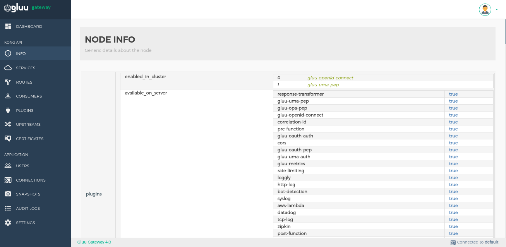](img/2_info.png)

## Services

### Service List

Service entities, as the name implies, are abstractions of each of your own upstream services. Examples of Services would be a data transformation microservice, a billing API, etc.

See Kong's [Service configuration](https://docs.konghq.com/1.3.x/proxy/#reminder-how-to-configure-a-service) documentation for more details.

!!! Note
    The eye icon is used to see raw JSON objects. Use this to see the object ID, if needed.

| Tools | Details |
|---    |-----    |
| **+ ADD NEW SERVICE** | This button is used to add a new service.|
| **Gluu Security** | This column only shows the added Gluu plugins.|
| **Edit Button** | This button is used to edit a service, and configure routes and plugins for the selected service. Click on **service name** to edit the service.|
| **Delete Button** | This button is used to delete the selected service. |

### Add Service

Add a Service using the `+ ADD NEW SERVICE` button.

### Manage Service

Edit a Service and manage its plugins by clicking on the pencil icon on the Service list. There are four sections:

#### Service Details
This section is used to view and edit a Service.

#### Service Routes
This section is used to manage the routes within the selected service.

Check Kong [routes configuration](https://docs.konghq.com/1.3.x/proxy/#routes-and-matching-capabilities) docs for more details.

| Tools | Details |
|---|-----|
| **+ ADD ROUTE** | This button is used to add a new route.|
| **Edit Button** | This button is used to edit a route, configure a route and configure plugins of the selected service.|
| **Delete Button** | This button is used to delete the selected route. |

#### Service Plugins

This section is used to add and view plugins.

##### Service Plugin List

  [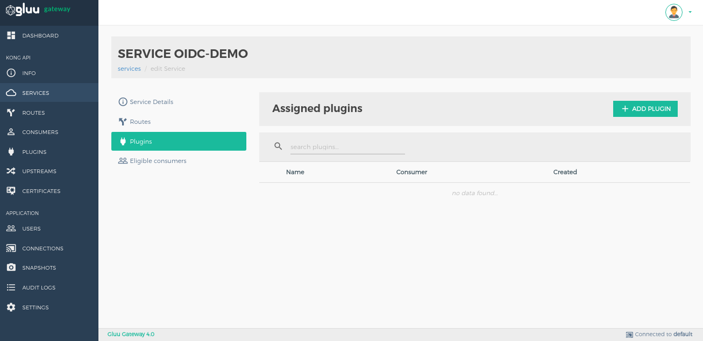](img/3_service_plugins.png)

  | Tools | Details |
  |---|-----|
  | **+ ADD PLUGIN** | This button is used to add a plugin.|
  | **Edit Plugin** | Click on a plugin's name to edit its configuration.|
  | **Delete Button** | This button is used to delete a selected route. |
  | **ON/OFF Switch** | Toggle a plugin on/off.|

##### Add Service Plugin

  Add a Plugin by clicking the `+` icon next to the plugin’s name.

  

#### Eligible Consumers for Service

This section is for the ACL Kong plugin, which restricts access to an API by whitelisting or blacklisting consumers using arbitrary ACL group names. It shows the list of consumers that are configured with ACL groups.

  [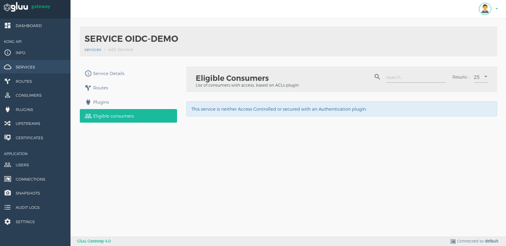](img/3_service_eligible_consumer.png)

## Routes

### Route List

The Route entities define rules to match client requests. Each Route is associated with a Service, and a Service may have multiple Routes associated with it. Every request matching a given Route will be proxied to its associated Service.

Check Kong [routes configuration](https://docs.konghq.com/1.3.x/proxy/#routes-and-matching-capabilities) docs for more details.

[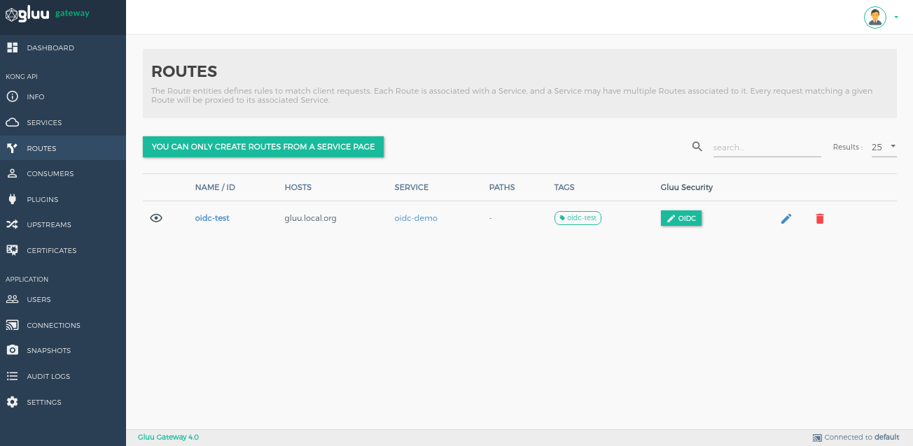](img/4_routes.png)

| Tools | Details |
|---|-----|
| **Gluu Security** | This column only shows the added Gluu plugins.|
| **Edit Button** | This button is used to edit a Route and configure its plugins. Click on **ROUTE ID** to edit the Route.|
| **Delete Button** | This button is used to delete the selected Route. |

### Add Route

[Use the Service section to add new route](#service-routes).

### Manage Route

Edit a Route and manage its plugins by clicking on the pencil icon on the Route list. There are three sections:

#### Route Details
This section is used to view and edit a Route.

[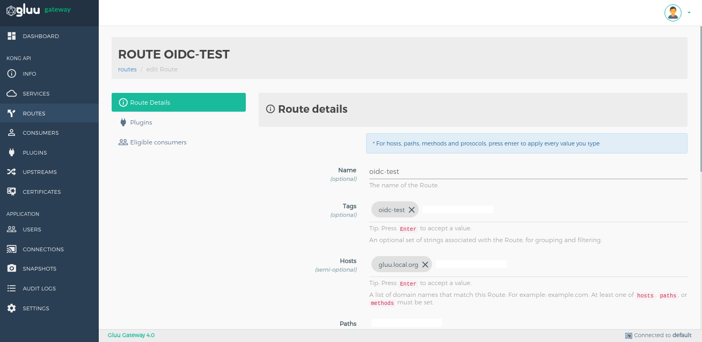](img/4_route_manage.png)

#### Route Plugins
This section is used to view the list of added Plugins and add a new Plugin.

##### Route Plugin List

  [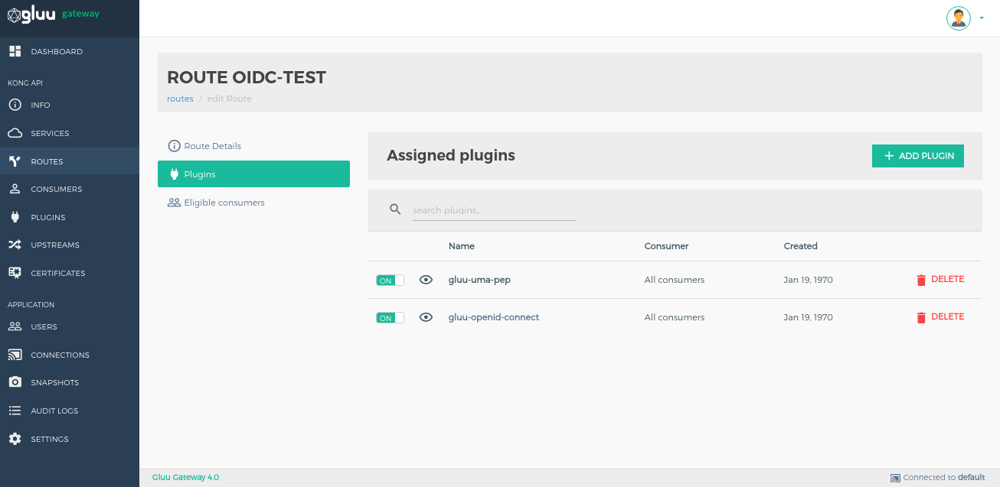](img/4_route_plugins.png)

  | Tools | Details |
  |---    |-----|
  | **+ ADD PLUGIN** | This button is used to add plugin.|
  | **Edit Plugin** | Click on plugin name to edit plugin configurations.|
  | **Delete Button** | This button is used to delete selected route. |
  | **ON/OFF Switch** | Toggle a plugin on/off.|

##### Add Route Plugin

  Add a Plugin by clicking the `+` icon next to a plugin’s name.

  

#### Eligible Consumers for Route

  This section is for the ACL Kong plugin, which restricts access to an API by whitelisting or blacklisting consumers using arbitrary ACL group names. It shows the list of consumers that are configured with ACL Groups.

  [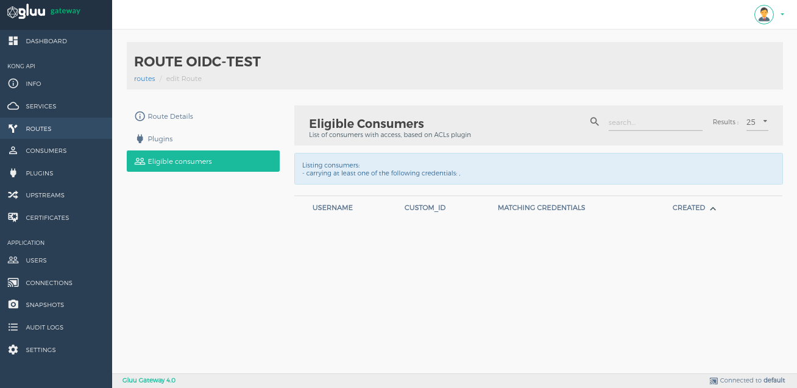](img/4_route_eligible_consumer.png)

## Consumers

The Consumer object represents a consumer - or a user - of a Service. Either rely on Kong as the primary datastore, or map the consumer list with a database to keep consistency between Kong and the existing primary datastore.

[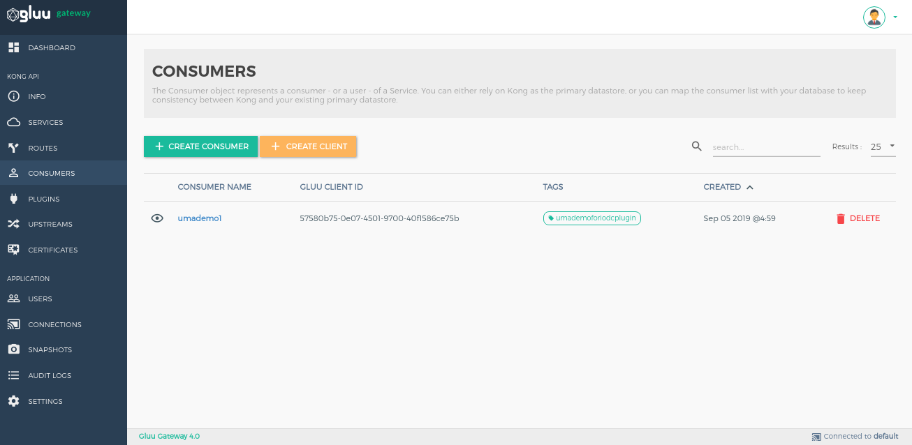](img/5_consumers.png)

Add Consumers by using the `+ CREATE CONSUMER` button.

| Fields | Details |
|---|-----|
| **Consumer Name** | The Kong Consumer Username, which is the identifier used by Kong for the client. Should contain no spaces or special characters.|
| **Gluu Client Id** | The Kong Consumer Custom ID, used to correlate an access token with a Kong consumer. The client must already exist before being registered here as a way to identify a consumer.|
| **Tags** | An optional set of strings associated with the Consumer, for grouping and filtering. |

### Manage Consumer

Click on the **Consumer Name** to manage a consumer. Edit and manage ACL plugin groups and add plugins here.

#### Consumer Details

View and edit the selected consumer details here.

[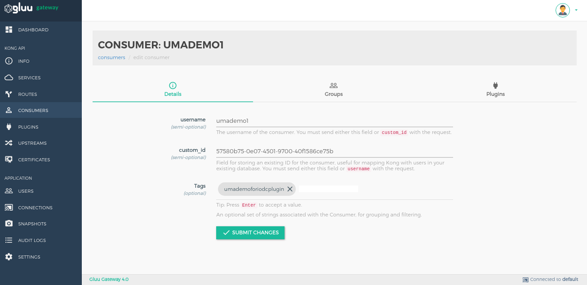](img/5_consumer_manage.png)

#### Groups

Create a group for ACL plugins to whitelist and blacklist consumers according to ACL plugin configuration.

[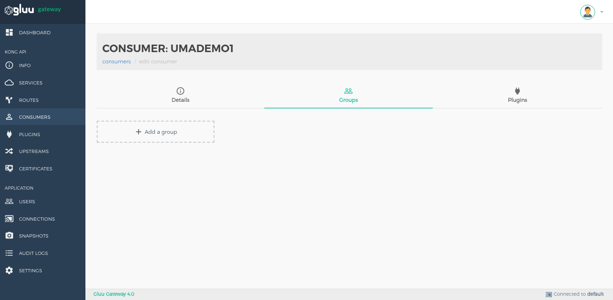](img/5_consumer_groups.png)

#### Consumer Plugins

Some plugins can be configured for each specific consumer. This section will also add the plugin globally, which will apply for every service and route.

[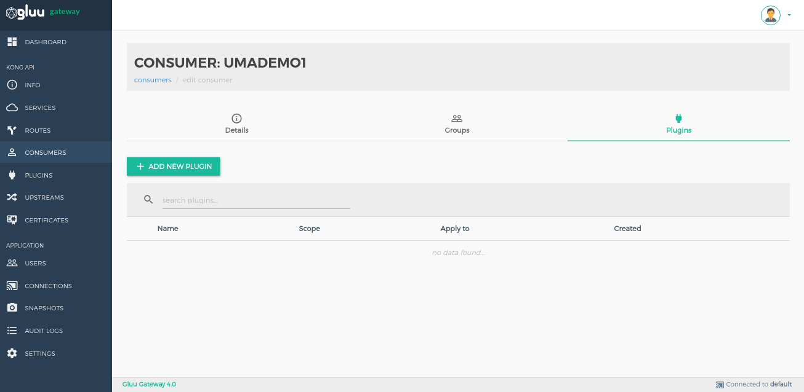](img/5_consumer_plugins.png)

### Create Client

Click on the `+ CREATE CLIENT` button to create OP client. It will create a client with the `client_credentials` grant type. It creates a client using OXD `register-site` API, so you can use direct OXD API also.

[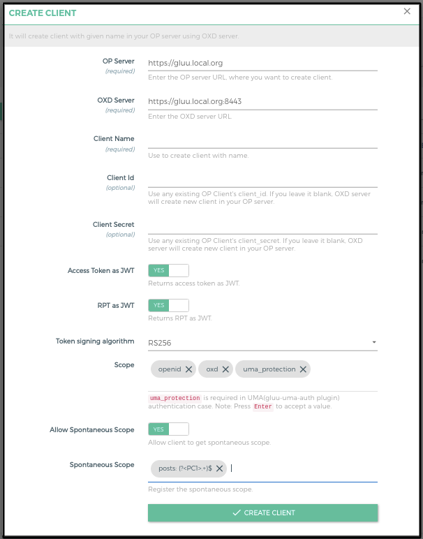](img/5_consumer_client_add.png)

| Fields | Details |
|---|-----|
| **Client Name**(required) | Name for newly-created client.|
| **Client Id**(optional) | Use any existing OP Client's client_id. If left blank, the oxd server will create a new client in the OP server.|
| **Client Secret**(optional) | Use any existing OP Client's client_secret. If left blank, the oxd server will create a new client in the OP server.|
| **Access Token as JWT**(optional) | It will create client with `Access Token as JWT:true`, It is used to return the access token as a JWT. The Gluu OAuth PEP plugin supports JWT access tokens.|
| **RPT as JWT**(optional) |It will create client with `RPT as JWT:true`. It is used to return access token(RPT) as JWT. The Gluu UMA PEP plugin supports JWT RPT access tokens.|
| **Token signing algorithm**(optional) | The default token signing algorithm for the client. It is used for both OAuth access tokens and UMA RPT tokens. Currently, plugins only support 3 algorithms: **RS256**, **RS384** and **RS512**.|
| **Scope**|The scope for the OP Client. `uma_protection` is required in UMA(gluu-uma-auth plugin) authentication case. Note: Press Enter to accept a value.|

## Plugins

A plugin entity represents a plugin configuration that will be executed during the HTTP request/response lifecycle. Plugins add functionality to services that run behind Kong, such as Authentication or Rate Limiting.

Plugins added in this section of the Gluu Gateway will be applied to all services and routes. To add plugins to a specific service or route, do so in the [services](#service-plugins) or [routes](#routes-plugins) section.
If you need to add plugins to a specific consumer, do so in the respective [consumer page](#consumer-plugins).

### Plugin List

[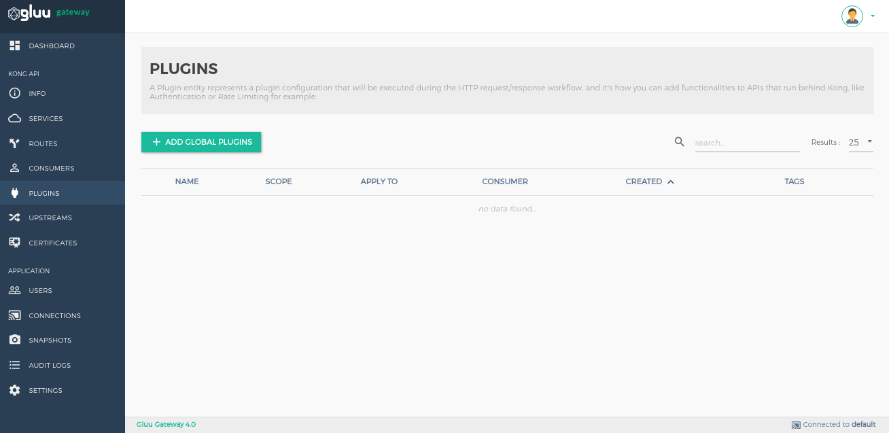](img/6_plugins.png)

### Add Plugin

Add Plugins by using the `+ ADD GLOBAL PLUGINS` button.

[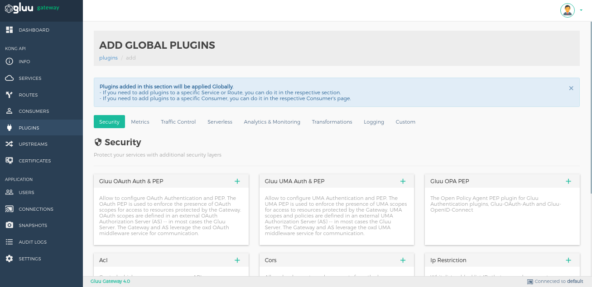](img/6_plugins_add.png)

## Upstreams

The upstream object represents a virtual hostname and can be used to loadbalance incoming requests over multiple services (targets). For example, an upstream with the name `service.v1.xyz` loadbalances requests for a Service object whose host is service.v1.xyz. Requests for this Service would be proxied to the targets defined within the upstream.

Check Kong [load balancing](https://docs.konghq.com/1.3.x/loadbalancing/) and [health-check](https://docs.konghq.com/1.3.x/health-checks-circuit-breakers/) docs for more details.

[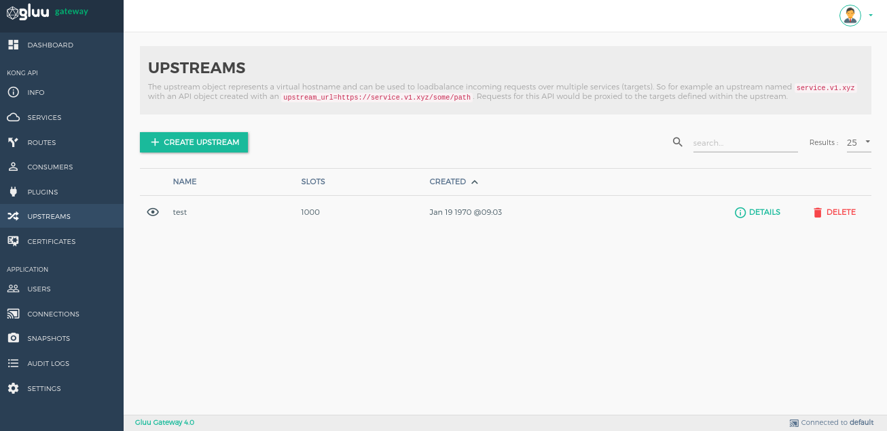](img/7_upstreams.png)

Add Upstreams by using the `+ CREATE UPSTREAM` button.

[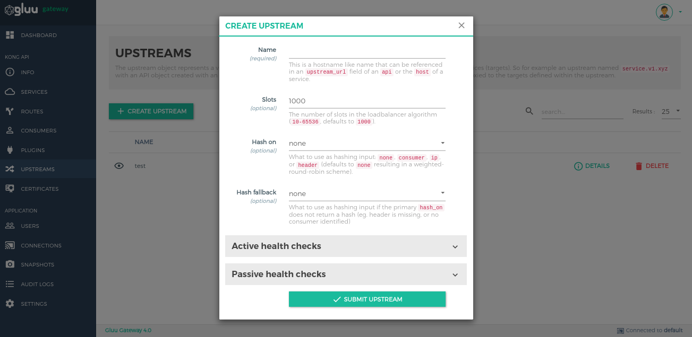](img/7_upstream_add.png)

You can modify the details of an Upstream by clicking the `DETAILS` button next to its name.

[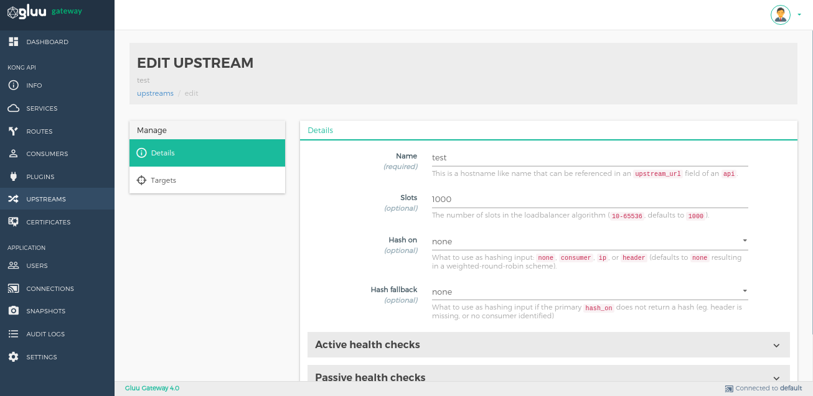](img/7_upstreams_manage.png)

The `Targets` section is for managing targets. A target is an IP address/hostname with a port that identifies an instance of a backend service. Every upstream can have many targets, and the targets can be dynamically added. Changes are implemented on the fly.

[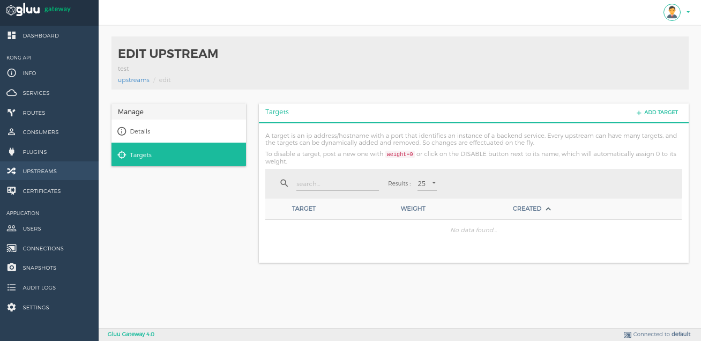](img/7_upstreams_targets.png)

## Certificates

A Certificate object represents a public certificate/private key pair for an SSL certificate. These objects are used by Kong to handle SSL/TLS termination for encrypted requests. Certificates are optionally associated with SNI objects to tie a certificate/key pair to one or more hostnames.

Check Kong [certificate configuration](https://docs.konghq.com/1.3.x/proxy/#configuring-ssl-for-a-route) docs for more details.

Add Certificates by using the `+ CREATE CERTIFICATE` button.

[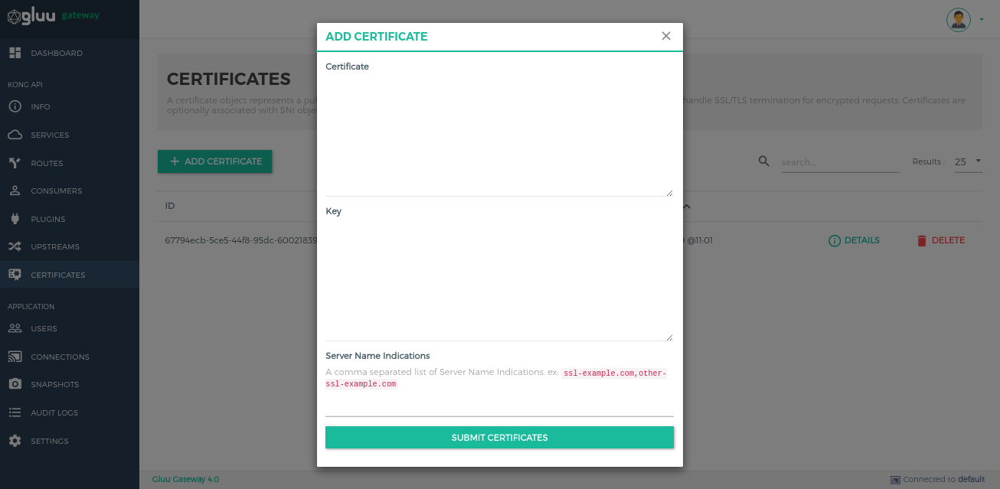](img/8_certificates_add.png)

Add `SNI`.

[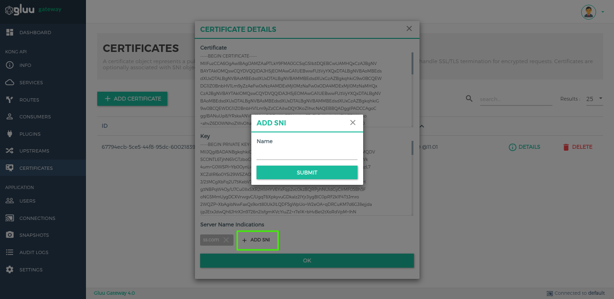](img/8_certificates_add_sni.png)

## Connections

Create connections to Kong nodes and select the one to use by clicking on the respective star icon.

Add Connections by using the `+ NEW CONNECTION` button.

[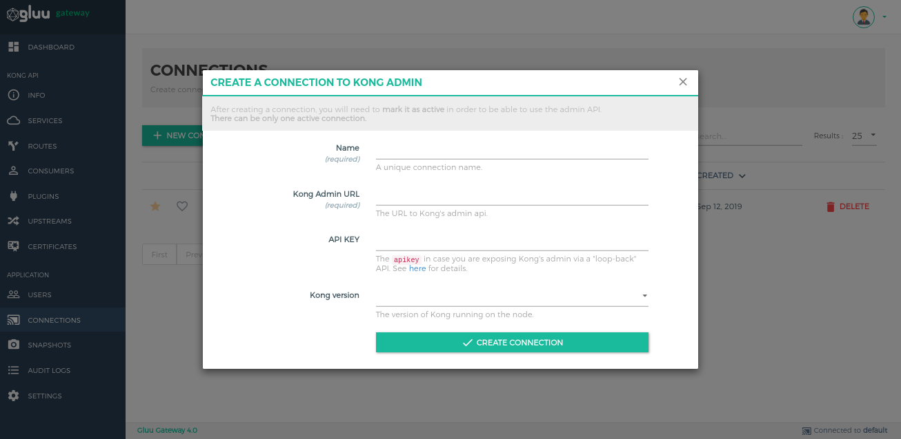](img/10_connection_add.png)

## Snapshots

Take snapshots of currently active nodes.
All services, routes, plugins, consumers, upstreams and targets will be saved and available for later import.

### List

It shows the list of snapshots.

[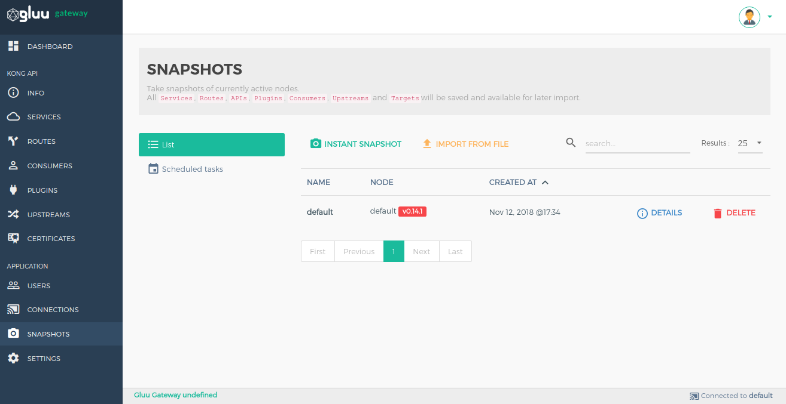](img/9_snapshot.png)

### Take Snapshot

[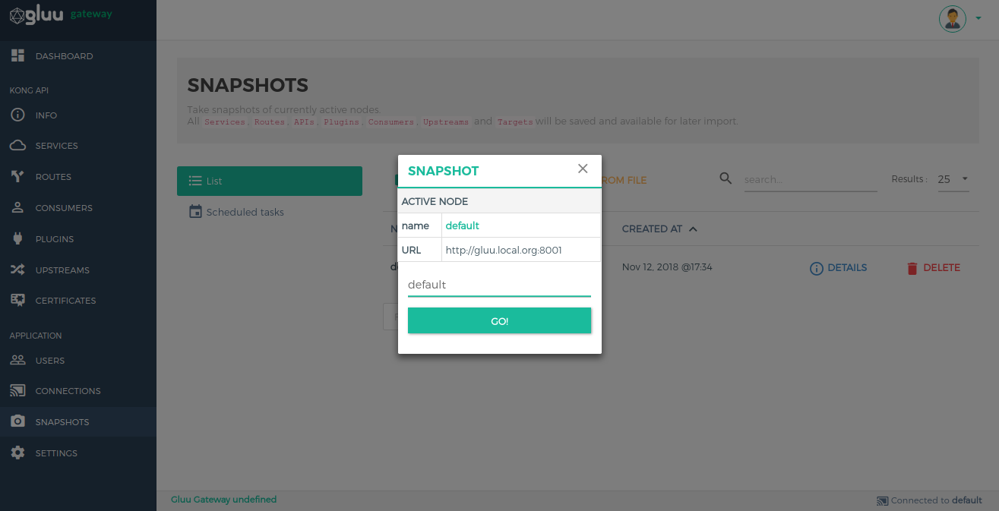](img/9_take_snapshot.png)

### Snapshot Details

Click on the `Details` option in snapshot list view to see more information about the snapshot.

Restore objects by clicking on the `RESTORE` button.

[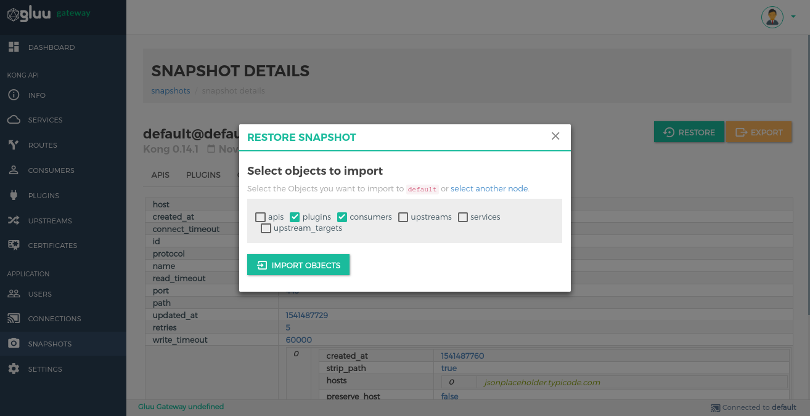](img/9_snapshot_restore.png)

Export data by clicking on the `EXPORT` button.

### Scheduled tasks

This is used to schedule a task to periodically take snapshots.

Create a scheduled task using the `ADD SCHEDULE` button.

## Audit logs

This section shows logs about the `gluu-openid-connect` plugin operations(add, edit, delete).

[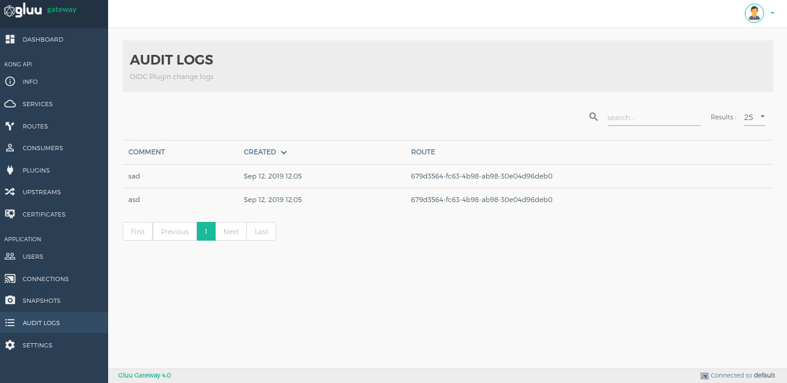](img/11_audit_logs.png)

## Settings

Set the dashboard refresh interval, logout session timeout and login restrictions in the settings section.

[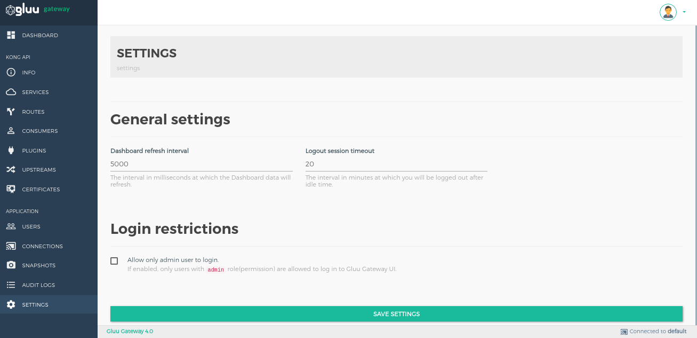](img/12_settings.png)

### General settings

|Setting|Description|
|-------|-----------|
|Dashboard refresh interval|The interval in milliseconds at which the Dashboard data will refresh. Default is 5000 milliseconds.|
|Logout session timeout|The interval in minutes a user will be logged out after idle time. Default is 5000 minutes.|

### Login restrictions

|Setting|Description|
|-------|-----------|
|Allow only admin user to login.|If enabled, only OP Users with the  **admin** role(permission) is allowed to log in to Gluu Gateway UI.|

### Configure Role for User

Open the `Users` section in the Gluu Server and use the `User Permission` attribute to add a role to the user. Click on `User Permission`, it will create a text box. Add the `admin` role and save the user.

[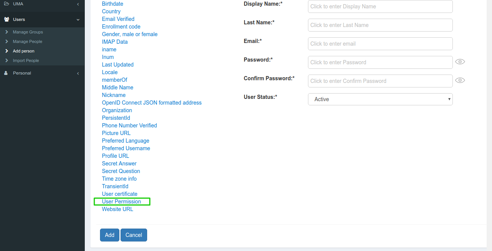](img/16_user_role_permission_add.png)

Navigate to `OpenID Connect` > `Scopes` and allow the `permission` scope.

[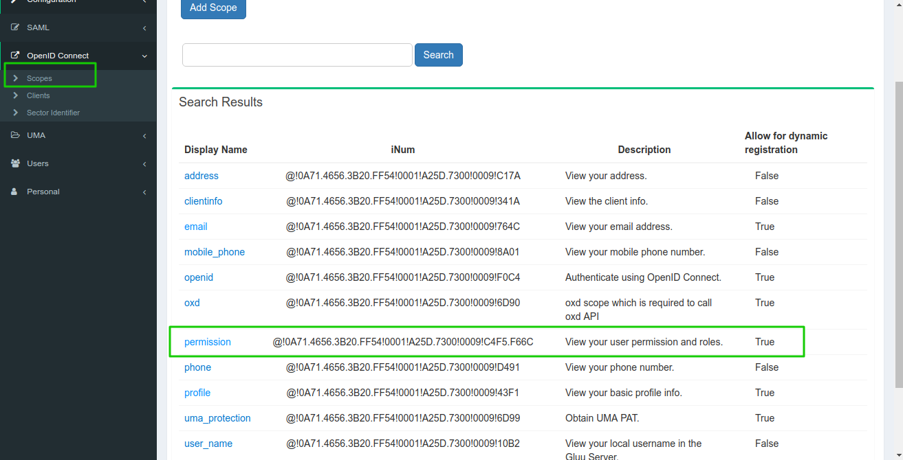](img/16_user_permission_scope.png)
