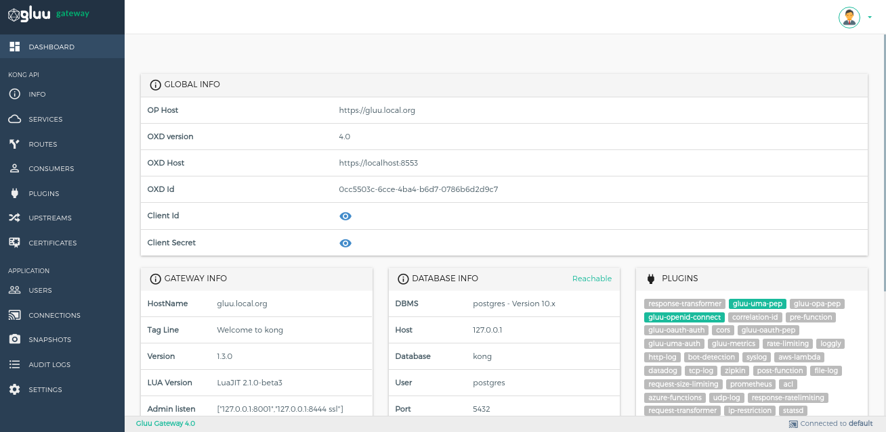

# Admin GUI Portal - Konga Guide

## Dashboard
The Dashboard section is divided into subsections that show application configuration details. 

In the Global Info you can see oxd and client details used by Konga. If you want to check the version of the currently used oxd Server or the address of the Gluu Server, all the necessary information is provided here. ID of oxd ID, Client ID and Client Secret are the credentials created during the Gluu Gateway installation and setup.

By default, one oxd clients are created during the installation and setup of the Gluu Gateway.

The Gateway and Database Info show information on the gateway itself and the used postgres database, respectively. 

The Plugins section displays all the plugins supported by the Gluu Gateway. When inactive, a plugin is shown as gray. If you add a plugin to an API/a Consumer or set a global one, its name will turn green on the dashboard.

The remaining subsections of Requests, Connections and Timers show real-time metrics on the Gluu Gateway health.  

## Info

The Info section shows generic details about the Kong node.

## Services

### Service List

Service entities, as the name implies, are abstractions of each of your own upstream services. Examples of Services would be a data transformation microservice, a billing API, etc. [More details](https://docs.konghq.com).   
    

| Tools | Details |
|---|-----|
| **+ ADD NEW SERVICE** | This button is used to add a new service.|
| **Gluu Security** | This column only shows the added Gluu plugins.|
| **Edit Button** | This button is used to edit a service, configure route and configure plugins of the selected service. You can click on **service name** to edit the service.|
| **Delete Button** | This button is used to delete the selected service. |
   
### Add Service

Add your Service using the `+ ADD NEW SERVICE` button.

### Manage Service

You can edit a Service and manage its plugins by clicking on the pencil icon on the Service list. There are four sections.

#### Service Details
This section is used to view and edit your Service.

#### Routes
This section is used to manage the route within selected service.

| Tools | Details |
|---|-----|
| **+ ADD ROUTE** | This button is used to add a new route.|
| **Edit Button** | This button is used to edit a route, configure a route and configure plugins of the selected service.|
| **Delete Button** | This button is used to delete the selected route. |

#### Plugins
This section is used to view the list of added Plugins and add a new Plugin.

##### Plugin list
  
  

  | Tools | Details |
  |---|-----|
  | **+ ADD PLUGIN** | This button is used to add a plugin.|
  | **Edit Plugin** | Click on a plugin's name to edit its configuration.|
  | **Delete Button** | This button is used to delete selected route. |
  | **ON/OFF Switch** |If you want to switch a plugin on/off, just use the toggle bar.|

##### Add Plugin

  Add a Plugin by clicking the `+` icon next to the plugin’s name.
  
  

#### Eligible consumers

  This section is for the ACL Kong plugin, which restricts access to an API by whitelisting or blacklisting consumers using arbitrary ACL group names. It shows the list of consumers which are configured with ACL groups.

  

## Routes

### Route List

The Route entities define rules to match client requests. Each Route is associated with a Service, and a Service may have multiple Routes associated with it. Every request matching a given Route will be proxied to its associated Service. [More details](https://docs.konghq.com).

| Tools | Details |
|---|-----|
| **Gluu Security** | This column only shows the added Gluu plugins.|
| **Edit Button** | This button is used to edit a Route and configure its plugins. You can click on **ROUTE ID** to edit the Route.|
| **Delete Button** | This button is used to delete the selected Route. |

### Add Route

[Use Service section to add new route](#routes).

### Manage Route

You can edit a Route and manage its plugins by clicking on the pencil icon on the Route list. There are three sections.

#### Route Details
This section is used to view and edit your Route.

#### Plugins
This section is used to view the list of added Plugins and add a new Plugin.

##### Plugin list

  

  | Tools | Details |
  |---|-----|
  | **+ ADD PLUGIN** | This button is used to add plugin.|
  | **Edit Plugin** | Click on plugin name to edit plugin configurations.|
  | **Delete Button** | This button is used to delete selected route. |
  | **ON/OFF Switch** |If you want to switch a plugin on/off, just use the toggle bar.|

##### Add Plugin

  Add a Plugin by clicking the plus icon next to a plugin’s name.

  

#### Eligible consumers

  This section is for ACL kong plugin which Restrict access to an API by whitelisting or blacklisting consumers using arbitrary ACL group names. It shows the list of consumers which is configure with ACL Groups.

  

## CONSUMERS

The Consumer object represents a consumer - or a user - of a Service. You can either rely on Kong as the primary datastore, or you can map the consumer list with your database to keep consistency between Kong and your existing primary datastore.

Add Consumers by using the `+ CREATE CONSUMER` button.

| Fields | Details |
|---|-----|
| **Consumer Name** | It is Kong Consumer Username, Identifier used by Kong for the client. Should contain no spaces or special characters.|
| **Gluu Client Id** | It is Kong Consumer Custom Id, Used to correlate an access token with a Kong consumer. You must create a client before you can register it here as a way to identify a consumer.|

### Manage Consumer

Click on **Consumer Name** of consumer to manage consumer. You can edit, manage ACLs plugin group and add plugins in manage consumer.

#### Details

You can see and edit the selected consumer details.

#### Groups

You can create a group for ACL plugin. which whitelist and blacklist consumer according to ACL plugin configuration.

#### Plugins

Some plugins provide facility to configure plugin with specific consumer. You can use this section to configure plugin for selected consumer. It will add plugin as global plugin which will apply for every service and route.

### Create Client

Click on `+ CREATE CLIENT` button to create OP client. It will create client with `openid`, `oxd` scope and with `client_credentials` grant type.

| Fields | Details |
|---|-----|
| **Client Name**(required) |Use to create client with name.|
| **Client Id**(optional) |Use any existing OP Client's client_id. If you leave it blank, OXD server will create new client in your OP server.|
| **Client Secret**(optional) |Use any existing OP Client's client_secret. If you leave it blank, OXD server will create new client in your OP server.|
| **Access Token as JWT**(optional) |It will create client with `Access Token as JWT:true`. It is used to return access token as JWT. Gluu OAuth PEP plugin support access token as JWT.|
| **RPT as JWT**(optional) |It will create client with `RPT as JWT:true`. It is used to return access token(RPT) as JWT. Gluu UMA PEP support access token(RPT) as JWT.|
| **Token signing algorithm**(optional) |It is used to set default token signing algorithm for client. It is used for both tokens OAuth access token and UMA RPT token. Currently plugins supports only 3 Algorithm **RS256**, **RS384** and **RS512**.|

## PLUGINS

A Plugin entity represents a plugin configuration that will be executed during the HTTP request/response lifecycle. It is how you can add functionalities to Services that run behind Kong, like Authentication or Rate Limiting for example.

Plugins added in this section of the Gluu Gateway will be applied to all SERVICEs and ROUTEs. If you need to add plugins to a specific SERVICEs or ROUTEs, you can do it in the [SERVICEs](#services) or [ROUTEs](#routes) section.
If you need to add plugins to a specific Consumer, you can do it in the respective [Consumer page](#consumers).

### Plugin list

### Add Plugin

Add Plugins by using the `+ ADD GLOBAL PLUGINS` button.

## UPSTREAMS

The upstream object represents a virtual hostname and can be used to loadbalance incoming requests over multiple services (targets). So for example an upstream named service.v1.xyz for a Service object whose host is service.v1.xyz. Requests for this Service would be proxied to the targets defined within the upstream.

Add Upstreams by using the `+ CREATE UPSTREAM` button.

You can modify the details of your Upstream by clicking the `DETAILS` button next to its name.

The `Targets` section is for manage targets. A target is an ip address/hostname with a port that identifies an instance of a backend service. Every upstream can have many targets, and the targets can be dynamically added. Changes are effectuated on the fly.

## CERTIFICATES

A Certificate object represents a public certificate/private key pair for an SSL certificate. These objects are used by Kong to handle SSL/TLS termination for encrypted requests. Certificates are optionally associated with SNI objects to tie a cert/key pair to one or more hostnames.

Add Certificates by using the `+ CREATE CERTIFICATE` button.

## CONNECTIONS

Create connections to Kong nodes and select the one to use by clicking on the respective star icon.

Add Connections by using the `+ NEW CONNECTION` button.

## SNAPSHOTS

Take snapshots of currently active nodes.
All SERVICEs, ROUTEs, Plugins, Consumers, Upstreams and Targets will be saved and available for later import.

### List

It shows the list of snapshots.

### Take Snapshot

### Details

Click on `Details` option in snapshot list view to see details of snapshot.

You can restore objects by clicking on `RESTORE` button.

You can export data by clicking on `EXPORT` button.

### Scheduled tasks

This is used to schedule task which periodically take snapshot.

Create schedule task using `ADD SCHEDULE` button.

## SETTINGS

You can set dashboard refresh interval, logout session timeout and login restriction in settings section.

### General settings

|Setting|Description|
|-------|-----------|
|Dashboard refresh interval|The interval in milliseconds at which the Dashboard data will refresh. Default is 5000 miliseconds.|
|Logout session timeout|The interval in minutes at which you will be logged out after idle time. Default is 5000 minute.|

### Login restrictions

|Setting|Description|
|-------|-----------|
|Allow only admin user to login.|If enabled, only OP Users with **admin** role(permission) is allowed to log in to Gluu Gateway UI. Follow [CE Docs](https://gluu.org/docs/ce/user-management/user-registration/#adding-attributes-to-registration) to add role in user.|