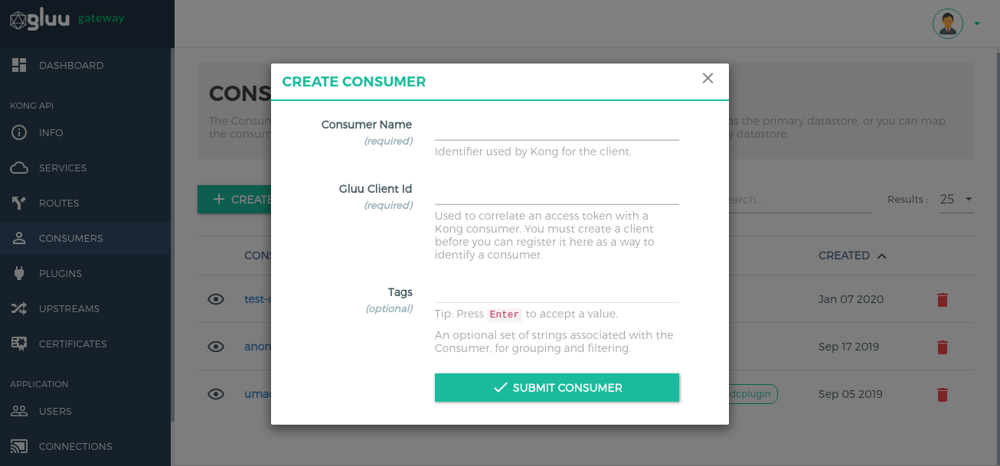

# Consumer

The Admin API is an entity that represents a developer or machine using the API. The Consumer only communicates with Kong, which then proxies all calls to the appropriate Upstream Service. In both authentication `gluu-oauth-auth` and `gluu-uma-auth` plugins, the OP client is validated by checking the Consumer entity.

In authentication plugins, it first introspects the token. Then, it performs the Kong consumer authentication. At the second step, it checks if the `consumer's custom_id` is equal to `Introspect token response's client id` to authenticate a valid consumer client and request.

```
Kong consumer's custom_id = Introspect token response's client_id
```

## Make OAuth Client

An OAuth Client is required to add a consumer in Kong. This is the same client that accesses APIs. There are three ways to make a client.

1. Using Gluu Server oxTrust. Navigate to `OpenID Connect` > `Clients` > `+ Add Client`.

1. Using oxd `/register-site` endpoint. [More Details](https://gluu.org/docs/oxd/4.1/api/#register-site)

1. Using GG UI. Navigate to `Consumers` > `+ Create Client`. It creates a client with the `client_credentials` grant type.

     [](../img/5_consumer_client_add.png)

     | Fields | Details |
     |---|-----|
     | **Client Name**(required) | Name for newly-created client.|
     | **Client Id**(optional) | Use any existing OP Client's client_id. If left blank, the oxd server will create a new client in the OP server.|
     | **Client Secret**(optional) | Use any existing OP Client's client_secret. If left blank, the oxd server will create a new client in the OP server.|
     | **Access Token as JWT**(optional) | It will create client with `Access Token as JWT:true`, It is used to return the access token as a JWT. The Gluu OAuth PEP plugin supports JWT access tokens.|
     | **RPT as JWT**(optional) |It will create client with `RPT as JWT:true`. It is used to return access token(RPT) as JWT. The Gluu UMA PEP plugin supports JWT RPT access tokens.|
     | **Token signing algorithm**(optional) | The default token signing algorithm for the client. It is used for both OAuth access tokens and UMA RPT tokens. Currently, plugins only support 3 algorithms: **RS256**, **RS384** and **RS512**.|
     | **Scope**|The scope for the OP Client. `uma_protection` is required in UMA(gluu-uma-auth plugin) authentication case. Note: Press Enter to accept a value.|
     | **Allow Spontaneous Scope**|Used to configure client which Allow client to issue and register the spontaneous scope.|
     | **Spontaneous Scope** |Used to add list of spontaneous scope. Which supports the PCRE regexp. Chech [here](../../plugin/common-features/#spontaneous-scope) for more details.|

## Add Kong Consumer

There are two ways to make a Consumer:

1. Using Kong Admin API:

      ```
      curl --location --request POST 'http://localhost:8001/consumers' \
      --header 'Content-Type: application/json' \
      --data-raw '{
      	"username": "<username>",
      	"custom_id": "<oauth_clients_client_id>"
      }'
      ```

2. Using the GG UI, navigate to `Consumers` > `+ Create Consumer`. 

     [](../img/5_consumer_add.png)
     
     Click on the consumer's name to access settings to create a group for ACL plugins to whitelist and blacklist consumers according to ACL plugin configuration.
     
## Usage

Add any authentication plugin, [`gluu-oauth-auth`](../../tutorials/oauth-auth-pep-tutorial) or [`gluu-uma-pep`](../../tutorials/uma-claim-gathering-tutorial/) , get OAuth token using this client and call the proxy endpoint. 
