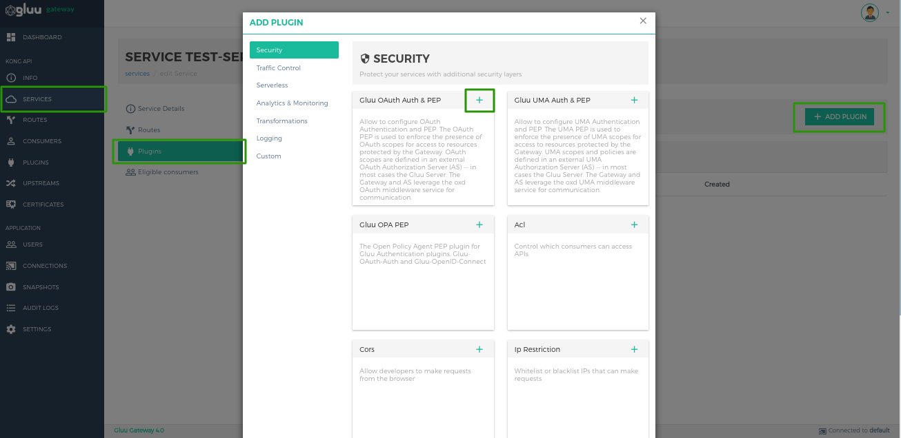
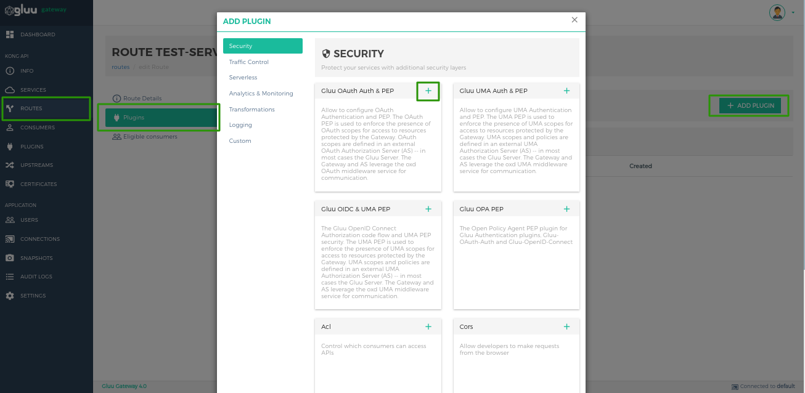
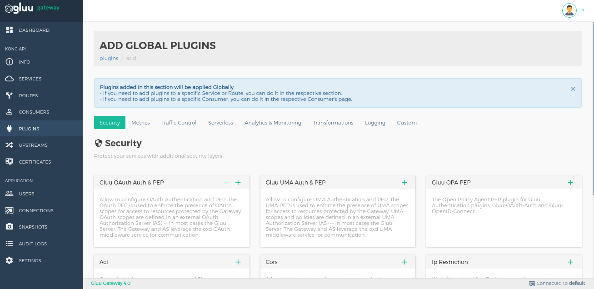

# Plugins

A plugin entity represents a plugin configuration that will be executed during the HTTP request/response lifecycle. Plugins add functionality to services that run behind Kong, such as Authentication, Security, Rate Limiting and others.

There are 3 scopes to add plugins.

- [Add Plugins on Service](#add-plugins-on-service)
- [Add Plugins on Route](#add-plugins-on-route)
- [Add Plugins Globally](#add-plugins-globally)

## Add Plugins on Service

If you add plugins in Service entity then plugin will execute for every route which is under the service.

For example: You created one service `test-service1` and it has two routes `route1` and `route2`. Then you added one plugin on service `test-service1`. When user request for `route1`, it will execute the plugin. When user request for `route2`, it will also execute the plugin. Because overall it targeting to same service and plugin is configured on service.

Below are the steps to enable plugins on the Service entity.

- Go to `Services` view by clicking on `Services` in left side of the navigation bar.

- Click on the Service name or pencil icon on which you want to add plugins.

- Click on the `Plugins` tab.

- Click on the `+ ADD PLUGIN` button.

- Now click on `+` icon of the plugin which you want to add

## Add Plugins on Route

If you add plugins in Route entity then plugin will execute for only configured route.

For example: You created one service `test-service1` and it has two routes `route1` and `route2`. Then you added one plugin on route `route1`. When user request for `route1`, it will execute the plugin. When user request for `route2`, it **will not execute** the plugin. Because plugin added only for `route1`.

Below are the steps to enable plugins on the Route entity.

- Go to `Routes` view by clicking on `Routes` in left side of the navigation bar.

- Click on the Route name or pencil icon on which you want to add plugins.

- Click on the `Plugins` tab.

- Click on the `+ ADD PLUGIN` button.

- Now click on `+` icon of the plugin which you want to add.

## Add Plugins Globally

If you add plugin globally then it will apply for every services and routes.

- Go to `Plugins` view by clicking on `Plugins` in left side of the navigation bar.

- Add Plugins by using the `+ ADD GLOBAL PLUGINS` button.

- Now click on `+` icon of the plugin which you want to add.

## Gluu Plugin Combinations and scopes

Below table describe you the possible combination of the Gluu Plugins for security and where you can add this plugins.

| Plugin | Service | Route | Globally |
|--------|---------|-------|----------|
|gluu-oauth-auth| ✔ | ✔ | ✔ |
|gluu-oauth-auth and gluu-oauth-pep| ✔ | ✔ | ✔ |
|gluu-oauth-auth and gluu-opa-pep| ✔ | ✔ | ✔ |
|gluu-uma-auth and gluu-uma-pep| ✔ | ✔ | ✔ |
|gluu-openid-connect|-|✔|-|
|gluu-openid-connect and gluu-uma-pep|-|✔|-|
|gluu-openid-connect and gluu-opa-pep|-|✔|-|
|gluu-metrics|-|-|✔|
