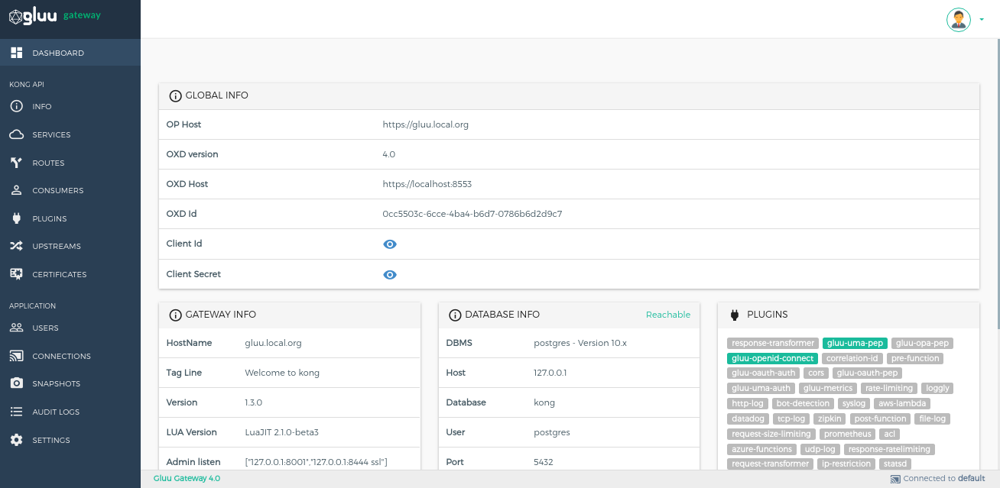
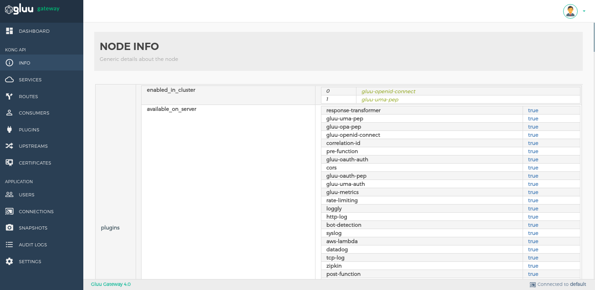

# Getting started with the admin UI

This guide will explain how to use the admin UI to configure upstream applications, add plugins and set security configurations.

## Dashboard - Kong Proxy Details

The dashboard provides application credentials and configuration details, including the following:

1. **Global Info:** shows the oxd OP Client credentials which is used to log in to GG UI. GG UI is just a UI to configure the Kong and plugins. which are protected using OpenID Connect flow. It shows the `OXD Id`, `Client Id` and `Client Secret` used by GG UI. This credentials has been created during installation step.

2. **Gateway:** shows details about the Gateway itself. This is the details which are needed to hit the Kong proxy endpoint. After GG installation, some ports and endpoints are exposed:
     - **Proxy endpoint:** Exposed on `443` port. This is the endpoint which is globally exposed and will be hit by the end-users or client applications. 
     - **Admin API endpoint:** This important endpoint is exposed by Kong. which is locally available on `8001` http and `8445` https. It is used to configure service, routes, consumers and plugins.  

3. **Database Info:** It shows you details about the Database that is used by Kong.

4. **Plugins:** It displays all the plugins supported by the Gluu Gateway. When inactive, a plugin is shown as gray. When a plugin is added to an API/Consumer or globally, its name will turn green on the dashboard.

5. The remaining subsections, **Requests**, **Connections** and **Timers** show real-time metrics for Gluu Gateway's health.  

## Info - Kong configuration details

The Info section shows generic details about the Kong node. In short, it shows all the details provided by the`Kong Admin API Endpoint`, which is `http://localhost:8001`. It shows every setting configured in `/etc/kong/kong.conf` file. Use this file to update the Kong proxy port, admin API port, SSL certificates and other Kong configurations. 

