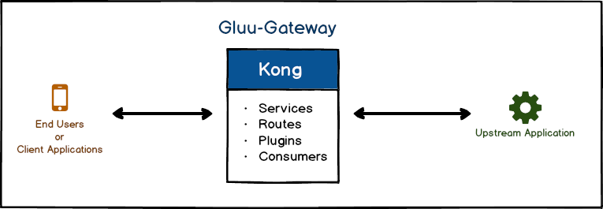
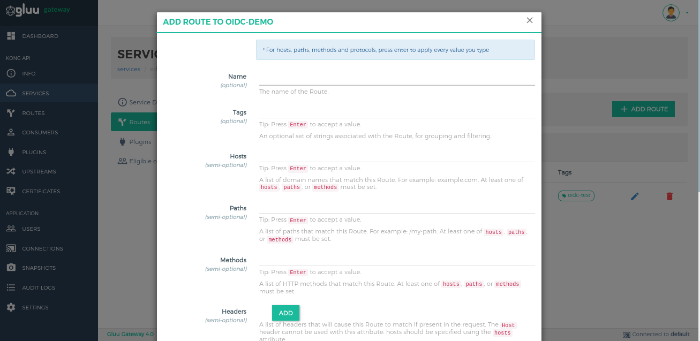

# Services and Routes Configurations

This section describes how to configure an upstream app with Gluu Gateway. GG uses Kong as its proxy with a very simple flow, described below. You just need to add your upstream application in kong.

[](../img/how-kong-proxy-works.png)
 
## Create a new Service

First, add the Upstream Application in Kong. In Kong, the Service entity represents the `Upstream Application`. Just add the Upstream Application's URL.

- Open the `Services` section, left side in the navigation menu.

- Click on `+ ADD NEW SERVICE` button.

    [](../img/3_services.png)

- It will open the following form.  

    [](../img/3_service_add.png)

- Enter the `name` and `URL`. 
    
    For Example: If your upstream service URL is `http://localhost:5555`, then set the URL to `http://localhost:5555` and the name to `test-service`.
    
    Kong also allows Services to be configured using `Protocol`, `Host`, `Path`, and `Port` (optional). To configure the Service using this method, you just need to leave the URL field and enter values in this field one by one. The URL field is just quick and short way to configure service. 

- Click on `SUBMIT SERVICE` at the bottom of the form

If successful, it will show it in list. Click on name of the service or pencil icon to see full details about service. 

## Create a new Route attached to the Service

The second step is to create a route in the newly created Service. The Route represents the actual request to the Kong proxy endpoint to reach at Kong service.

- To create a new Route, click on service name or pencil icon and it will open below view.

     [](../img/3_service_manage.png) 
     
- Click on `Routes`. It will show you previously-created routes. Click on `+ ADD ROUTE` button to add new route. 

     [](../img/3_service_routes.png)

- After clicking on the button, it will open the following form. The Route will also need a name, and at least one of the following fields: `Host`, `Methods`, or `Paths`. Set the name to `test-service-route` and hosts to `test.com`. Press enter after adding values to the hosts field.

     [](../img/4_route_add.png) 

- Click on `SUBMIT ROUTE` button at the bottom of form to create route.

If successful, it will shows it in listing in `Routes` section.

## Test the new Service and Route

Use the following curl command which sends a request to the Kong proxy endpoint and verifies that Kong is properly forwarding request to Service. As per default, the setup Kong proxy endpoint is exposed on `:443` port.

- Run this command on the same machine where you installed Gluu Gateway. This example uses `https://localhost` because I am on the same machine.

     ```
     curl -k -X GET \
       https://localhost \
       -H 'Host: test.com'
     ```

- Run this command on any other machine, after exposing the proxy endpoint globally with a domain. For example: if GG is installed on `dev.gluu.org` then request will be 

     ```
     curl -k -X GET \
       https://dev.gluu.org \
       -H 'Host: test.com'
     ```

- For example, with the `/users` endpoint, add an endpoint path in URL like below example.

     ```
     curl -k -X GET \
       https://dev.gluu.org/users \
       -H 'Host: test.com'
     ```

One important thing is here, `Host: test.com` is passed in the header at the filter for the newly created route, which is configured with same host details. When the request is made, Kong matches all the requests with Kong route configurations. In the above case, it is matching `host`. There are several possibilities for routing.

## Route configuration

The route configuration is just like defining APIs in any programming language, adding HTTP Methods and Endpoint Paths. Here, Kong has more powerful tools for routing. The Route can add `Hosts`, `HTTP Methods`, `Paths` and `Headers`. For example,

- GREEN requests are valid and allowed by Kong.
- RED requests are invalid and deny by Kong.

| Route Configuration | Requests |
|---------------------|---------|
| <ul><li>Hosts: test.com</li></ul>|<ul style="color:green;padding:5px;border:1px solid green;"><li>`curl -k -X GET  https://localhost -H 'Host: test.com'`</li><li>`curl -k -X POST  https://localhost -H 'Host: test.com'`</li><li>`curl -k -X PUT  https://localhost -H 'Host: test.com'`</li><li>Allow request which has host `test.com`</li></ul><ul style="color:red;padding:5px;border:1px solid red;"><li>`curl -k -X GET  https://localhost`</li><li>`curl -k -X GET  https://localhost -H 'Host: anyother.com'`</li></ul>|
| <ul><li>Hosts: test.com</li><li>Methods: GET</li></ul>|<ul style="color:green;padding:5px;border:1px solid green;"><li>`curl -k -X GET https://localhost -H 'Host: test.com'`</li></ul><ul style="color:red;padding:5px;border:1px solid red;"><li>`curl -k -X GET  https://localhost`</li><li>`curl -k -X GET  https://localhost -H 'Host: anyother.com'`</li><li>`curl -k -X POST  https://localhost -H 'Host: anyother.com'`</li></ul>|
| <ul><li>Methods: GET</li></ul>|<ul style="color:green;padding:5px;border:1px solid green;"><li>`curl -k -X GET https://localhost`</li><li>`curl -k -X GET https://localhost -H 'Host: test.com'`</li><li>Adding extra Host header will not affect because kong only checking HTTP `GET` request</li></ul><ul style="color:red;padding:5px;border:1px solid red;"><li>`curl -k -X POST https://localhost`</li></ul>|
| <ul><li>Methods: GET, POST</li></ul>|<ul style="color:green;padding:5px;border:1px solid green;"><li>`curl -k -X GET https://localhost`</li><li>`curl -k -X POST https://localhost`</li><li>Allow only HTTP `GET` and `POST` request</li></ul><ul style="color:red;padding:5px;border:1px solid red;"><li>`curl -k -X PUT https://localhost`</li></ul>|
| <ul><li>Paths: /v1 </li></ul> | <ul style="color:green;padding:5px;border:1px solid green;"><li>`curl -k -X GET https://localhost/v1`</li><li>`curl -k -X POST https://localhost/v1`</li><li>For your `/users` endpoint: `curl -k -X POST https://localhost/v1/users`</li><li>Allow request which has `/v1` in URL.</li></ul> |

## Configure multiple Upstream Application

Multiple upstream applications can be configured in Kong. You just need to organization and configure the routes.

[](../img/how-kong-proxy-works-multiple-upstreams.png)

For Example: we have three upstream applications **http://localhost:5001**, **http://localhost:5002** and **http://localhost:5003** then the configuration is follows:

1. **http://localhost:5001**

      - **Service:** `name: test-service-5001`, `URL: http://localhost:5001`
      - **Route:** `Hosts: test.com`
      
1. **http://localhost:5002**

      - **Service:** `name: test-service-5002`, `URL: http://localhost:5002`
      - **Route:** `Hosts: test.com`, `Path: /v2`      

1. **http://localhost:5003**

      - **Service:** `name: test-service-5003`, `URL: http://localhost:5003`
      - **Route:** `Hosts: test.com`, `Path: /v3`      

This example uses the `PATHs` field of the Route to configure and differentiate the request from other services. 

For `http://localhost:5001`, request with `Host: test.com` in header.

For `http://localhost:5002`, request with `Host: test.com` and `/v2` in URL.

For `http://localhost:5003`, request with `Host: test.com` and `/v3` in URL.

