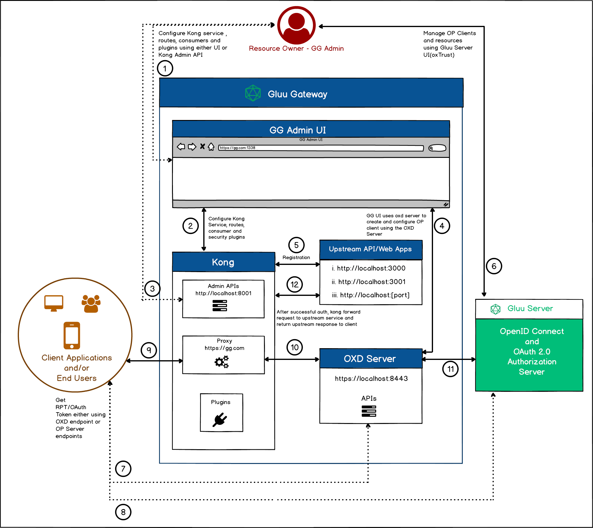

# Overview

Gluu Gateway architecture will help you understand the components of the GG and flow between the components. 

## Terminology

- **Upstream Service/Application**: The upstream application can be a REST API or Web Application. This is the application secured by Gluu Gateway.   

- **Gateway or Proxy:** The gateway is proxy software that acts as middleware between client applications and upstream applications. It provides very the powerful ability to add and execute code to filter requests and and add a layer of security. If the request is approved, the gateway takes the response from the upstream application and returns it to the client applications. Gluu Gateway uses Kong for this purpose. 

- **Kong Services:** The Kong Admin API entity that represents an upstream application.

- **Kong Routes:** The Kong Admin API entity that represents a way to map downstream requests to upstream services. It's used to filter the request and send it to the appropriate service at the upstream application.

  ```
  Request --> Routes --> Service --> Upstream Application
  ```
 
- **Consumer:** The Admin API entity that represents a developer or machine using the API. The consumer only communicates with Kong, which then proxies every call to the appropriate upstream API. In both the `gluu-oauth-auth` and `gluu-uma-auth` plugins, the OP client is validated by checking with consumer entity.
  
     In Gluu Gateway, a `OpenID Connect Client's client_id` is associated with a `Consumer` in Kong. This is useful where access control is restricted to certain clients. All other default Kong client authentication plugins are disabled in the Gluu Gateway Admin GUI -- we just want to use an **OAuth Authorization Server** like the **Gluu Server** for client authentication. The Gluu Server plugins verify the `client_id` for which a token was issued by looking at the JSON equivalent (either the JWT or the introspection response).

## Components

Gluu Gateway includes the following components.

- [Kong CE v1.3.x](https://konghq.com/community/): An open source API Gateway and Microservices Management Layer, delivering high performance and reliability. We are using Kong Community edition version 1.3 here. 

- [Gluu Admin UI](https://github.com/GluuFederation/gluu-gateway/tree/version_4.0/konga): A web administration portal, based on the [Konga](https://github.com/pantsel/konga) GUI, to manage your Gluu Gateway configurations.

- [Gluu Gateway plugins](https://github.com/GluuFederation/gluu-gateway/tree/version_4.0/kong/plugins): Plugins that leverage the Gluu Server for central client management and to control access to upstream APIs using OAuth 2.0 and UMA 2.0.

- [oxd Server v4.0](https://www.gluu.org/docs/oxd/4.0): Middleware server for OpenID, OAuth, and UMA client communication with an associated OAuth Authorization Server, typically an instance of the Gluu Server. Gluu-gateway uses oxd server endpoints to communicate with OP Server.

- Others: The following runtime environment is required by the Gluu Gateway package:
    - OpenJDK v8
    - Python v2.x
    - Postgres v10
    - Node v8.9.4
    - NPM v5.6.0

## Architecture

This diagram illustrates the architecture of Gluu Gateway and some of its components:



The following sections explain the numbered points in the diagram:

### 1. Admin UI

The first step is setting up configuration and adding security plugins. Gluu Gateway (GG) will provide its [`Admin UI`](./admin-gui.md) on port `:1338`. Use this UI to add your API or Web application (such as Upstream Service/API/Web) with `kong service object`, `kong route object`, `create OpenID Connect client`, `kong consumer object` and configure the `plugins`. 

The Upstream Service should be registered with the Kong Service. See the [Services](./admin-gui.md#services) and [Routes](./admin-gui.md#routes) sections.

### 2. Security configuration using UI

The GG UI uses the [Kong Admin APIs](https://docs.konghq.com/1.3.x/admin-api/) to configure Kong's Services, Routes, Consumers and Plugins.

### 3. Security configuration using Kong API

Instead, you can directly use the [Kong Admin APIs](https://docs.konghq.com/1.3.x/admin-api/) to configure the Kong's Services, Routes, Consumers and Plugins. You can find API descriptions in the [Kong Docs](https://docs.konghq.com/1.3.x/admin-api/) and [GG plugins docs](./plugin/gluu-openid-connect-uma-pep.md) for Gluu plugins configuration API.

### 4. The UI uses the oxd server to manage the OP Client

The UI uses the [oxd server](https://gluu.org/docs/oxd/4.0/) endpoint during plugin configuration to create and manage the OpenID Connect Client.

### 5. Upstream API/Web Application registration

The Upstream Service is the Rest API/Web application to protect using Kong and the plugins, as discussed in point 1, above. The Kong Service is the object where the Upstream Application is registered. You can register multiple upstream applications. As shown in diagram, there are three different upstream applications registered in Kong. Upstream Apps should be locally hosted and not publically accessible. However, the Kong proxy endpoint should be opened for end-users or client applications. Check the [Services](./admin-gui.md#services) and [Routes](./admin-gui.md#routes) docs for upstream application registration in Kong.

After registering an upstream app as a service or route in Kong, the next step is to add security plugins. Check the [plugins](./plugin/gluu-openid-connect-uma-pep.md) and [tutorial](./tutorials/oidc-steppedup-auth-tutorial.md) docs for plugin details and configuration.

### 6. OpenID Connect Server configuration

This is the last configuration step. The UI creates the OP Client, which can be managed using oxTrust, the Gluu Server UI.

!!! Important
    Do not update the client using the OP server, always use the oxd server's `/update-site` endpoint to update the client, since GG uses the oxd server with both the client and OP server.
    
### 7. Client Application requests a token using the oxd server

The client application sends a request to the application endpoint (i.e. the Kong proxy endpoint :443). The admin has to provide the OP Client's `client_id` and `client_secret` to the client application for it to use these credentials to get the OAuth token and send a request to access registered resources in GG.

The client application can use the oxd server endpoint to get the token. In this case, it needs to use the [oxd server endpoints](https://gluu.org/docs/oxd/4.0/api/).

### 8. Client Application request for Token directly to OP server endpoints

This is same as the previous step, but this time the client application directly communicates with the OP server using `client_id` and `client_secret` to get tokens.

### 9. Client Application request to protected resources

Now the token is with the client application. It will send a request to the Kong proxy endpoint with the token in the `authorization` header. 

### 10. Kong executes the configured plugins

At this point, Kong executes all configured plugins and uses the oxd server to validate the token with the OP Server. Using the `OAuth Plugin`, for example, the plugin uses the [`/introspect-access-token`](https://gluu.org/docs/oxd/4.0/api/#introspect-access-token) endpoint to validate the token.

### 11. The oxd server sends a request to the OP Server

The oxd server sends a request to the OP server for authentication and authorization. Using the `OAuth Plugin`, for example, the oxd server sends a request to the OP server's introspection endpoint to validate the token.

### 12. Send Upstream response to Client Application

After successful client authentication and authentication, Kong sends an upstream response to the client application.
