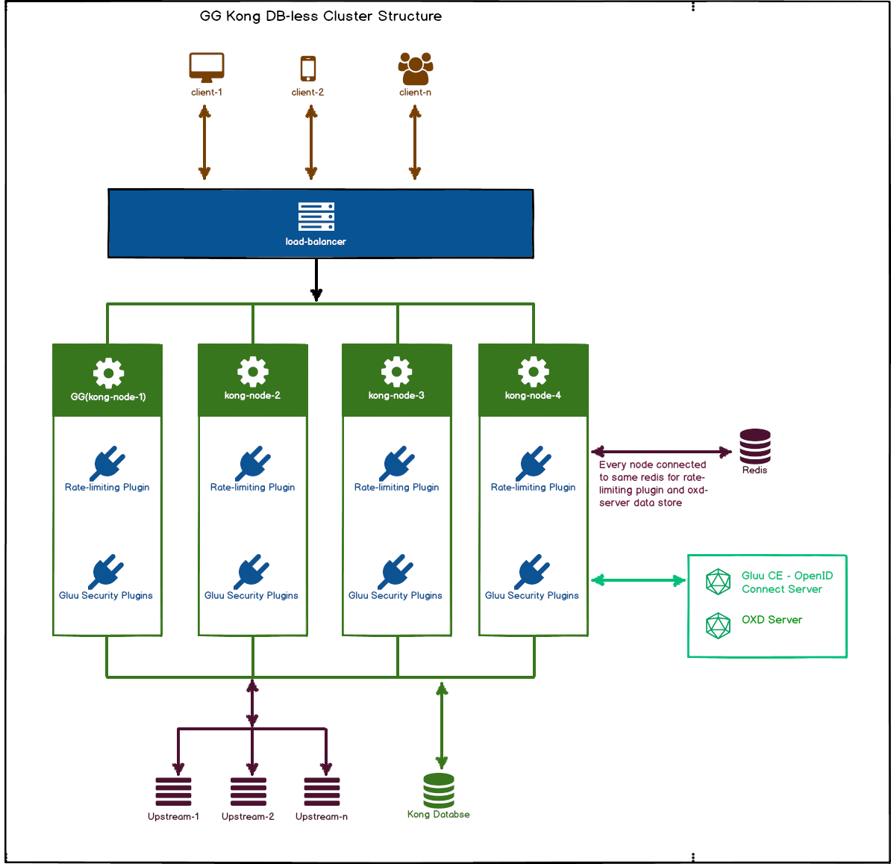

# Clustering

Gluu Gateway is based on the [Kong Gateway](https://konghq.com/kong/), which supports clustering. Kong's docs about clustering are available [here](https://docs.konghq.com/1.3.x/clustering/).

A Kong cluster can scale the system horizontally by adding more machines/VMs/containers to handle more incoming requests.

To configure multiple Kong nodes into a cluster, point them all to the same datastore or use the same declarative configuration in DB-less mode.

A load balancer is required in front of the Kong cluster to distribute traffic across the available nodes.

## Architecture 

GG has some more components for full integration, `Kong`, `GG UI`, `OXD-server` and `Gluu Server`. 

There are two approaches in Kong for configuration storage.

### GG Kong DB Clustering
 
   In this approach `Kong` uses the `Database(Postgres or Cassandra)` to store the `Services`, `Routes`, `Plugins` and `Consumer`.
   
   You can see in below diagram it using `Kong Database` for storing configuration and same database access by every Kong Node.
   
   

### GG Kong DB-less Clustering

   In this approach Kong uses the second configuration file, in YAML or JSON, using [declarative configuration](https://docs.konghq.com/1.3.x/db-less-and-declarative-config/#what-is-declarative-configuration). 
   
   To use Kong in DB-less mode, set the `database` directive of `kong.conf` to `off`. As usual, you can do this by editing `kong.conf` and setting `database=off` or via environment variables. You can then start Kong as usual.
   
   Check [here](https://docs.konghq.com/1.3.x/db-less-and-declarative-config/) for Kong DB-less configurations.
   
   In below diagram there is no `Kong Database`. It use YAML Configuration file on every node with same configurations.
   
   

### Components and configurations 

1. **Kong Node**

     You need to install Kong on every Node. Which will share the same Database and Configurations.

2. **OXD-Server**

     Kong(Plugins) uses the OXD-Server for every operation to communicate with OP Server. For OXD-Server clustering you need to deploy OXD-Server on every node and use the same `redis` for central data storage and access. For more details check [OXD redis setup](https://gluu.org/docs/oxd/4.0/configuration/redis/) docs. 
     
3. **GG UI**

     You need only `one UI` to configure Kong. In `DB-Less` mode, you only see the configurations. To update the configuration, you need to update the YAML Config file.   

4. **Plugins**

     You can use any kong approach to store the configurations. In diagrams there is one `rate-limiting` plugin example. Which point to same `redis` server for data store, accsss and share between all the kong nodes.

## Set up the Gluu Gateway node

Before Setup Nodes, You need to [install the GG](installation.md) one any one node so you have `GG UI`, `Postgres DB` and `OXD Server`. which you can connect to other nodes for quick setup.

Below are the 2 steps to setup the kong nodes.

### 1. Install Kong

1. Ubuntu 16
    
      - Download Kong 1.3 from [here](https://bintray.com/kong/kong-deb/download_file?file_path=kong-1.3.0.xenial.amd64.deb).
      - 
        ```
        sudo apt-get update
        sudo apt-get install openssl libpcre3 procps perl
        sudo dpkg -i kong-*.deb
        ``` 
      
1. Ubuntu 18
    
      - Download Kong 1.3 from [here](https://bintray.com/kong/kong-deb/download_file?file_path=kong-1.3.0.bionic.amd64.deb).
      - 
        ```
        sudo apt-get update
        sudo apt-get install openssl libpcre3 procps perl
        sudo dpkg -i kong-*.deb
        ``` 

1. RHEL 7
  
      - Download Kong 1.3 from [here](https://bintray.com/kong/kong-rpm/download_file?file_path=rhel/7/kong-1.3.0.rhel7.amd64.rpm)
      - 
        ```
        sudo yum install kong-*.rpm --nogpgcheck
        ```

1. CentOS 7

      - Download Kong 1.3 from [here](https://bintray.com/kong/kong-rpm/download_file?file_path=centos/7/kong-1.3.0.el7.amd64.rpm)
      - 
        ```
        sudo yum install epel-release
        sudo yum install kong-*.rpm --nogpgcheck
        ```

### 2. Set up GG plugins and libraries

- Download [gluu-gateway-node-deps.tar.gz](https://github.com/GluuFederation/gluu-gateway-setup/blob/version_4.1/setup/gluu-gateway-node-deps.tar.gz)

- `tar -xvzf gluu-gateway-node-deps.tar.gz`

- `cd gluu-gateway-node-deps`

- `python gg-kong-node-setup.py`

- The script will ask the following questions about the Postgres database, which is shared between the nodes. If you want to configure DB-less then after this setup, you need to manually update the `kong.conf`.

    | Questions | Descriptions |
    |-----------|--------------|
    |Enter PG host|Enter your Postgres database host or IP|
    |Enter PG Port|Enter your Postgres database port|
    |Enter PG User|Enter your Postgres database user|
    |Enter PG Password|Enter your Postgres database password. It will not show during typing values, so you just need to type your password.|
    |Enter PG Database|Enter your Postgres database name which you are already sharing between multiple kong nodes.|
    
- Done. If any problems arise, check the `gg-kong-setup-error.log` and `gg-kong-setup.log` log files.

Other Kong configurations are adjusted by updating `/etc/kong/kong.conf`.

<!--
## Deploy Gluu-Gateway node as Docker container

Coming soon. 
-->
