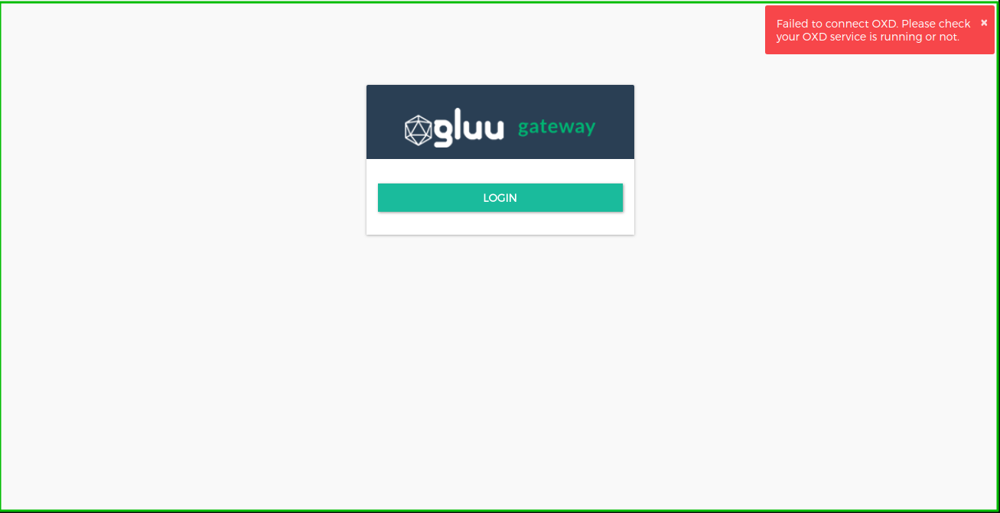

# Frequently Asked Questions (FAQ)

## General FAQs and troubleshooting

### Where should Gluu Gateway be used?
Gluu Gateway should be used in every API gateway where you need advanced security measures using OAuth 2.0 and User-Managed Access (UMA) 2.0 Grant. For Web, there is OpenID Connect Authentication. 

### Can I install the Gluu Server and Gluu Gateway on same machine?
Although it is not recommended, Gluu Gateway (GG) can be installed on the same machine as CE, but both use port 443. Before installing GG, the main Gluu Server's port will need to be changed. If it's required to use both on the same machine, port 443 should be assigned to GG, since this service is exposed to the application end-user.

### Should the oxd server be installed on the machine with Gluu Gateway or the Gluu Server?
The oxd server is the OIDC Client that sends requests to the OP server. Gluu Gateway acts as the relying party, so oxd should be installed on the Gluu Gateway machine. The oxd server can be installed as an option during the Gluu Gateway installation and setup. Check [the docs](https://gluu.org/docs/oxd/4.1/) for more details about oxd. 

### Where can I get more information about Kong Service and Route configuration?
Check the [Kong 2.0.x docs about proxy configuration](https://docs.konghq.com/2.0.x/proxy/).

### Should we need to expose OXD endpoint public/outside web?
GG uses OXD to communicate with OP Server. You don't need to open it when you deal with OAuth and OpenID Connect case but when you deal with UMA at this case, you may need to expose it globally for your client applications because it is bit complex to get RPT token for protected resources. You can get RPT token without using OXD endpoints for this you need to study and manually code to get RPT token, take a look [UMA Docs here](https://docs.kantarainitiative.org/uma/wg/rec-oauth-uma-grant-2.0.html) for more information. 

### How can I investigate Gluu Gateway problems?
Gluu Gateway works in connection with the Gluu Server and oxd. That means any potential issue on these servers can affect the Gluu Gateway.

If you see an error message such as the one in the screenshot, check the logs for possible issues:

`/var/log/oxd-server/oxd-server.log`

You can also check the [oxd FAQ section](https://gluu.org/docs/oxd/faq).

### How can I find my Gluu Gateway version?
Your Gluu Gateway version is always visible in the bottom left corner of the Gluu Gateway Admin Panel. 

## Technical FAQs

### How can I generate an OAuth token?
Generate an OAuth token during OAuth-PEP authentication by calling the oxd server `/get-client-token` endpoint with customer credentials. Read more about OAuth token generation [here](https://gluu.org/docs/oxd/api/#get-client-token).

### How can I generate UMA tokens?
In order to generate an UMA token, follow these steps:  

1. Send a request to the Kong proxy API without a token and get a ticket.  

1. Send a `get-client-token` request with Consumer `oxd_id`, `client_id` and `client_secret`   

1. Send an `uma-rp-get-rpt` request with Consumer `oxd_id`, the ticket from Step 1 and the access token from Step 2.  

### How can I change the listening address and port for GG UI?
By default, Gluu Gateway UI listens to localhost only, but you can change it manually by configuring the `local.js` config file using the [Configuration doc](./configuration.md#admin-gui-portal-konga). You just need to update the `explicitHost` to your global IP and `ggUIRedirectURLHost` with your Host name.
 
 
If you require any further support, please open a ticket on the [Gluu support portal](https://support.gluu.org).
