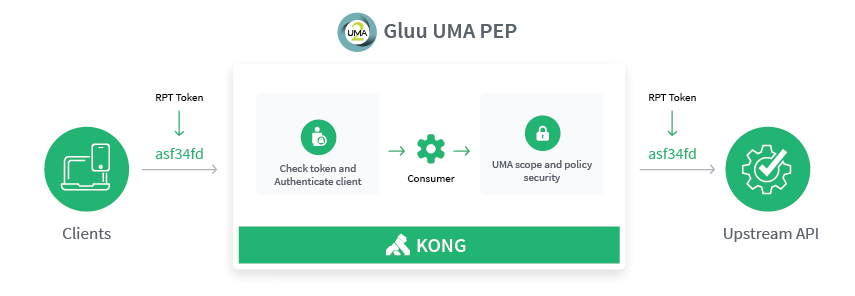
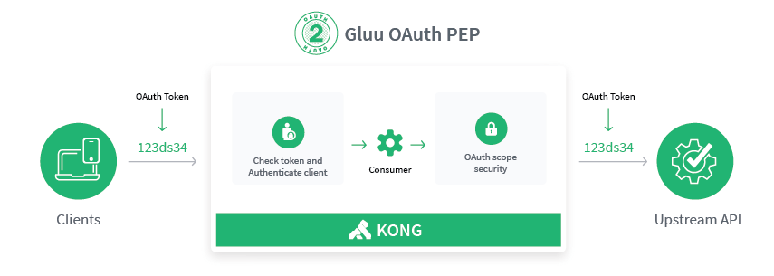

# Gluu Gateway 4.0.x

## Overview

Gluu Gateway (GG) enables access management for APIs and websites by requiring valid access tokens issued by the [Gluu Server](https://gluu.org/) OAuth or UMA Authorization Server (AS), or the [Open Policy Agent](https://www.openpolicyagent.org) Policy Decision Point (PDP) 

Gluu Gateway inherits its core API gateway functionality from [Kong CE v0.14](https://konghq.com/community/), and leverages the strong ecosystem of Kong plugins to enable rate limiting, logging, and many other capabilities.

## Features

Primary use cases and functionalities supported by Gluu Gateway include:

- Control access to APIs by requiring OAuth or UMA scopes
- Control access to API's by delegating the decision to an Open Policy Agent server (PDP)
- Proxy websites, acting as an OpenID Connect Relying Party (RP)
- Control access to websites by requiring a valid UMA token
- Collect and report OAuth and UMA usage metrics
- Introspect bearer access tokens
- Validate the signature of JWT access tokens
- Provide a web GUI to simplify ongoing administration
- Support Kong plugins to enable rate limiting, logging, and many other capabilities  
- Provides a plugin for [Open Policy Agent](https://www.openpolicyagent.org/)

## Access Control

Gluu Gateway functions as a policy enforcement point ("PEP"), relying on an external policy decision point ("PDP"). Gluu Gateway has two primary jobs:

1. Validate tokens (both value and reference tokens)
1. Make sure a request is authorized

Gluu Gateway supports both UMA and OAuth tokens. While mechanically the same, scopes have different meanings in UMA and OAuth.

### UMA Authentication and scopes security
UMA scopes represent centralized policy evaluation. For example, in the Gluu Server, administrators can map UMA scopes to policies, expressed as [UMA RPT Authorization interception scripts](https://gluu.org/docs/ce/admin-guide/custom-script/#uma-2-rpt-authorization-policies).

### OAuth Authentication and scopes security
OAuth scopes normally represent a user's authorization, for example authorization to access a user's calendar. How scopes are granted is ultimately up to the Authorization Server that issues it.

### Open Policy Agent based policies

In the Gluu Server, additional claims can be included in an access token. Gluu Gateway can forward this access token to an Open Policy Agent server for a policy decision.

### OIDC and UMA with Claim gathering Security
OpenID is an identity layer. The Gluu Gateway can act as an OpenID Relying Party, redirecting the subject's browser to the OpenID Provider, and obtaining user information. At that point, the Gluu Gateway can attempt to obtain an UMA access token, pushing the OpenID Connect id_token to the UMA RPT endpoint as input to the policy decision. If user interaction is required, the Gluu Gateway may redirect the subject to the UMA Authorization endpoint.  

!!! Note
    An API that uses OAuth for security can only be called by OAuth clients, and likewise, an API that uses UMA for security can only be called by an UMA client.

### Clients v. Consumers
In Gluu Gateway, a `client_id` is associated with a "Consumer" in Kong. This is useful where access control is restricted to certain clients. All other forms of client authentication are disabled in the Gluu Gateway Admin GUI -- we just want to use an OAuth Authorization Server like the Gluu Server for client authentication. The Gluu Server plugins verify the `client_id` for which a token was issued by looking at the JSON equivalent (either the JWT or the introspection response).

## Getting Started

Use the following links to get started:  

1. [Installation](./installation.md)
1. [Configuration](./configuration.md)
1. [Admin GUI](./admin-gui.md)
1. Plugins
    1. [Gluu OAuth Auth and PEP](./plugin/gluu-oauth-auth-pep.md)
    1. [Gluu UMA Auth and PEP](./plugin/gluu-uma-auth-pep.md)
    1. [Gluu OpenID Connect and UMA PEP](./plugin/gluu-openid-connect-uma-pep.md)
    1. [Gluu Metrics](./plugin/gluu-metrics.md)
1. [FAQ](./faq.md)

## License  

Gluu Gateway is available under the [GLUU SUPPORT license](https://raw.githubusercontent.com/GluuFederation/gluu-gateway/master/LICENSE).
