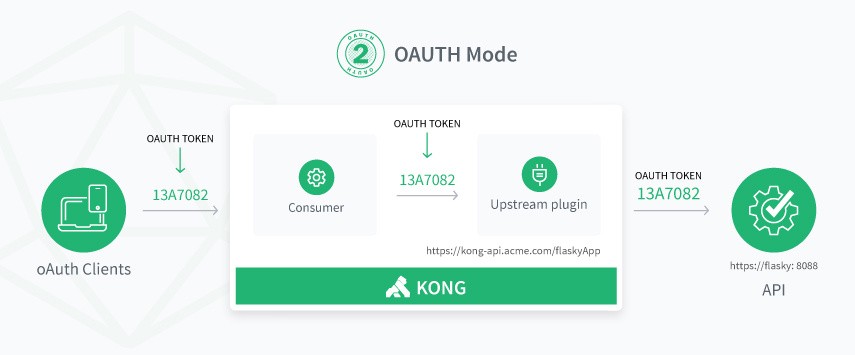

# Gluu Gateway 4.0.Beta

## Overview

Gluu Gateway is a distribution of several open source components, integrated and supported together, to enable API access management. 

## Features

The goal of Gluu Gateway is to enable your organization to restrict access to API's by requiring clients to present a valid access token issued by an OAuth or UMA Authorization Server, typically a Gluu Server. Gluu Gateway is built on top of Kong Community Edition because of the strong ecosystem of plugins which enable rate limiting, logging and many other capabilities. They key features of Gluu Gateway are to:

- Introspect bearer access tokens
- Validate the signature of JWT access tokens
- Control access to APIs by requiring either OAuth and UMA scopes
- Provide a GUI to simplify administration
- Collect and report on OAuth and UMA specific metrics
- Simplify installation, administration, scaling and update of the platform

## Access Control

The Gluu Gateway functions as a policy enforcement point ("PEP"), relying on an external policy decision point ("PDP") for policy evaluation. The PEP has two primary jobs: (1) make sure the token is active; (2) make sure the token has the correct scopes to call the endpoint it is requesting.

Gluu Gateway supports both OAuth and UMA tokens. While mechanically the same, scopes have different meanings in OAuth and UMA. UMA scopes represent centralized policy evaluation. For example, in the Gluu Server, administrators can map scopes to policies, expressed as UMA RPT Authorization interception scripts. Normally, OAuth scopes represent a user's authorization, although how scopes are granted is ultimately up to the Authorization Server that issues it.

In the Gluu Gateway, a `client_id` is associated with a "Consumer" in Kong. This is useful where access control is restricted to certain clients. All other forms of client authentication are disabled in the Gluu Gateway Admin GUI--we just want to use an OAuth Authorization Server like the Gluu Server for client authentication. The Gluu Server plugins can verify the `client_id` for which an token was issued by looking at the JSON equivalent (either the JWT or the introspection response).

This may sound obvious, but an API that uses OAuth for security can only be called by OAuth clients. And an API that uses UMA for security can only be called by an UMA client. See the diagrams below if you prefer a visualization:

## Components

Gluu Gateway makes use of the following software components:

- [Gluu Server CE v3.1.5](https://gluu.org/docs/ce/3.1.5): The Gluu Server is a container distribution of free open source software (FOSS) for identity and access management (IAM). SaaS, custom, open source and commercial web and mobile applications can leverage a Gluu Server for user authentication, identity information, and policy management.

- [Kong v0.14](https://getkong.org): An open source API Gateway and Microservices Management Layer, delivering high performance and reliability.

- [Gluu Konga Admin GUI](https://github.com/GluuFederation/gluu-gateway/tree/master/konga): A web administration portal, based on the [Konga](https://github.com/pantsel/konga) GUI, to manage your Gluu Gateway.

- [Gluu Gateway plugins](https://github.com/GluuFederation/gluu-gateway): Plugins that leverage the Gluu Server for central client management and to control access to upstream APIs using OAuth 2.0 and UMA 2.0.

- [oxd-Server v4.0.Beta](https://oxd.gluu.org):  Gluu's client middleware server for OpenID, OAuth, and UMA client communication.

- Others: The following runtime environment is required by the Gluu Gateway package:
    - OpenJDK v8
    - Python v2.x
    - Postgres v10
    - Node v8.9.4
    - NPM v5.6.0

## Getting Started

Use the following links to get started:  

1. [Installation](./installation.md)
1. [Configuration](./configuration.md)
1. [Admin GUI](./admin-gui.md)
1. Plugins
    1. [Gluu OAuth PEP](./plugin/gluu-oauth-pep.md)
    2. [Gluu UMA PEP](./plugin/gluu-uma-pep.md)
    3. [Gluu Metrics](./plugin/gluu-metrics.md)
1. [FAQ](./faq.md)

## License  

It is published under the [GLUU-STEPPED-UP](https://raw.githubusercontent.com/GluuFederation/gluu-gateway/master/LICENSE) license. You must have an active and compliant support contract to use the software in production.
