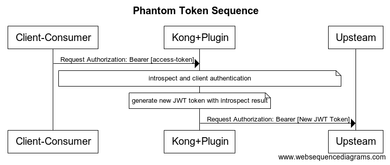
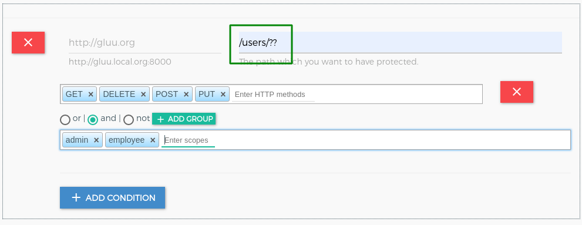

# Common Features

Below are common features in the Gluu OAuth and UMA plugins.

## Phantom Token

Some deployments require the use of a bearer token outside of the internal network and a JWT token within it. This phantom token approach is similar to a reverse proxy, adding a layer of insulation between external requests and the internal network.

 
This feature is available in both the [`gluu-oauth-auth`](../gluu-oauth-auth-pep) and the [`gluu-uma-auth`](../gluu-uma-auth-pep) plugins. To configure phantom token feature, you just need to set `pass_credentials='phantom_token'` in plugin configuration. 

!!! Important
    Set `access_token_as_jwt: false` and `rpt_as_jwt: false` in [client registration](../../admin-gui/#consumers), otherwise client by default returns you access token as JWT. 

## Dynamic Resource Protection

This feature is available for the [`gluu-oauth-pep`](./gluu-oauth-auth-pep.md) and [`gluu-uma-pep`](./gluu-uma-auth-pep.md) plugins. 

There are 3 elements to make more dynamic path registration and protection:

- ? match anyone path element
- ?? match zero or more path elements
- {regexp} - match single path element against PCRE

The priority for the elements are:

1. Exact match
1. Regexp match
1. ?
1. ??

!!! Important
    A slash(/) is required before multiple wildcards placeholders.

!!! Info
    A `?` in the HTTP method allows all HTTP methods.

!!! Info
    You can use this elements to register more dynamic path for `required_acrs_expression` in [`gluu-openid-connect`](./gluu-openid-connect-uma-pep.md)

Examples: 

Assume that all paths below are registered in one plugin:

| Register Path | Allow path | Deny path |
|---------------|------------|-----------|
| `/??` | <ul><li>/folder/file.ext</li><li>/folder/file2</li><li>Allow all the paths</li></ul> | |
| `/folder/file.ext` | <ul><li>/folder/file.ext</li></ul> | <ul><li>/folder/file</li></ul> |
| `/folder/?/file` | <ul><li>/folder/123/file</li> <li>/folder/xxx/file</li></ul> | |
| `/path/??` | <ul><li>/path/</li> <li>/path/xxx</li> <li>/path/xxx/yyy/file</li></ul> | <ul><li>/path - Need slash at last</li></ul> |
| `/path/??/image.jpg` | <ul><li>/path/one/two/image.jpg</li> <li>/path/image.jpg</li></ul> | |
| `/path/?/image.jpg` | <ul><li>/path/xxx/image.jpg - ? has higher priority than ??</li></ul> | |
| `/path/{abc|xyz}/image.jpg` | <ul><li>/path/abc/image.jpg</li> <li>/path/xyz/image.jpg</li></ul> | |
| `/users/?/{todos|photos}` | <ul><li>/users/123/todos</li> <li>/users/xxx/photos</li></ul> | |
| `/users/?/{todos|photos}/?` | <ul><li>/users/123/todos/</li> <li>/users/123/todos/321</li> <li>/users/123/photos/321</li></ul> | |

## Custom Headers

After successful authentication, kong forward request upstream service. During this step, kong sends headers to your upstream headers. You can use this header to check and identify the user or request.

There is feature in all 3 authentication plugins `gluu-oauth-auth`, `gluu-uma-auth` and `gluu-openid-connect`.

Every plugin provide an environment which you need to use to set headers. **For Example:** `gluu-oauth-auth` plugin has the `introspect_data` environment which has the token introspect response data. So If you want to set one header like `x-auth-token-exp` which will has the token expiration timestamp then you need to use the environment `introspect_data.exp` to set value.

Take a look on below table for available environment in every plugin

| Plugin | Environment |
|--------|-------------|
|`gluu-oauth-auth`|<ul><li>`consumer`</li><li>`introspect_data`</li></ul>|
|`gluu-uma-auth`|<ul><li>`consumer`</li><li>`introspect_data`</li></ul>|
|`gluu-openid-connect`|<ul><li>`id_token`</li><li>`userinfo`</li><li>`access_token`</li></ul>|

Every plugin has the `custom_headers` field. which is the the array and below is the structure of an object.

| Field | Description |
|-------|-------------|
|**header_name**|The title for header, may contain {*} placeholder when iterate thru claims, take a look at iterate field below. **Example:** http-kong-id-token|
|**value_lua_exp**|It is the lua expression which will populate the environment values. Note: For custom values you need to pass value in double quotes("value")|
|**format**|the format used to encode the value. **Formats:** string(as it is), base64, urlencoded, list, and jwt(with none alg)|
|**sep**|it is use when your header format is list type. It join the list of values by separator. **Example:** , (comma)|
|**iterate**|the header value should point to an environment values, for example id_token It use to iterate thru keys/values and create separate header for every key. The captured key is accessible in header name via special placeholder i.e. {*}.|

In UI, you will get facility to add custom headers. You just need to use header section. Click on `Add` Button to add header.

### Example

1. `gluu-uma-auth`

     | Header Name | Value | Format | Separator | Iterate |
     |-------------|-------|--------|-----------|---------|
     |x-oauth-client-id|introspect_data|[JWT \| base64]||false|
     |x-consumer-id|consumer.id|[string \| base64 \| urlencoded]||false|
     |x-oauth-client-id|introspect_data.client_id|[string \| base64 \| urlencoded]||false|
     |x-rpt-expiration|introspect_data.exp|[string \| base64 \| urlencoded]||false|
     |x-oauth-token-{*}|introspect_data|[string \| urlencoded \| base64]||true|
     |kong-version|"version 1.3", 
Note: double quotes required for custom values.
|[string \| urlencoded \| base64]||false|

1. `gluu-oauth-auth`

     | Header Name | Value | Format | Separator | Iterate |
     |-------------|-------|--------|-----------|---------|
     |x-oauth-client-id|introspect_data|[JWT \| base64]||false|
     |x-consumer-id|consumer.id|[string \| base64 \| urlencoded]||false|
     |x-oauth-client-id|introspect_data.client_id|[string \| base64 \| urlencoded]||false|
     |x-rpt-expiration|introspect_data.exp|[string \| base64 \| urlencoded]||false|
     |x-oauth-token-{*}|introspect_data|[string \| urlencoded \| base64]||true|
     |kong-version|"version 1.3", 
Note: double quotes required for custom values.
|[string \| urlencoded \| base64]||false|
     |x-authenticated-scope|introspect_data.scope|list|, (comma)|No|

1. `gluu-openid-connect`

     | Header Name | Value | Format | Separator | Iterate |
     |-------------|-------|--------|-----------|---------|
     |kong-openidc-id-token|id_token|[string \| base64]||false|
     |kong-openidc-userinfo|userinfo|[jwt \| base64]|false|
     |kong-openidc-id-token-{*}|id_token|[string \| urlencoded \| base64]||true|
     |kong-openidc-userinfo-{*}|userinfo|[string \| urlencoded \| base64]||true|
     |kong-openidc-userinfo-email|userinfo.email|[string \| urlencoded \| base64]||false|
     |kong-openidc-id-token-exp|id_token.exp|[string \| base64]||false|
     |kong-userinfo-roles|userinfo.roles|[list]|, (comma)|false|
     |gg-access-token|access_token|[string \| urlencoded \| base64]||No|
     
