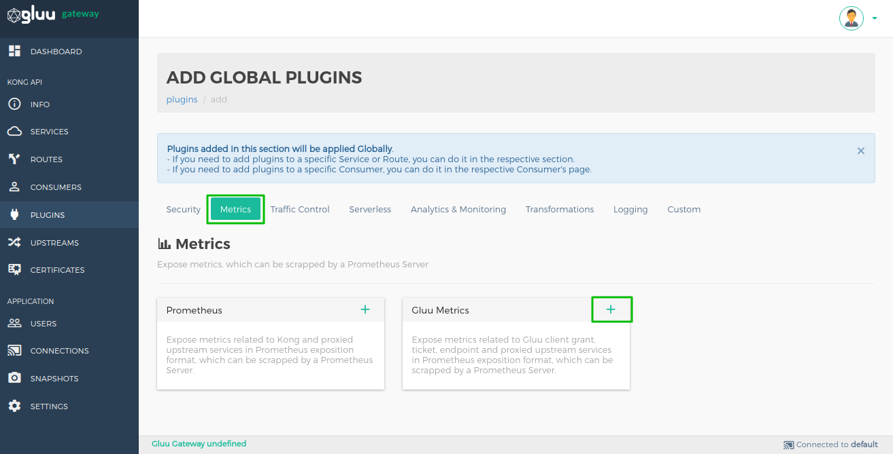
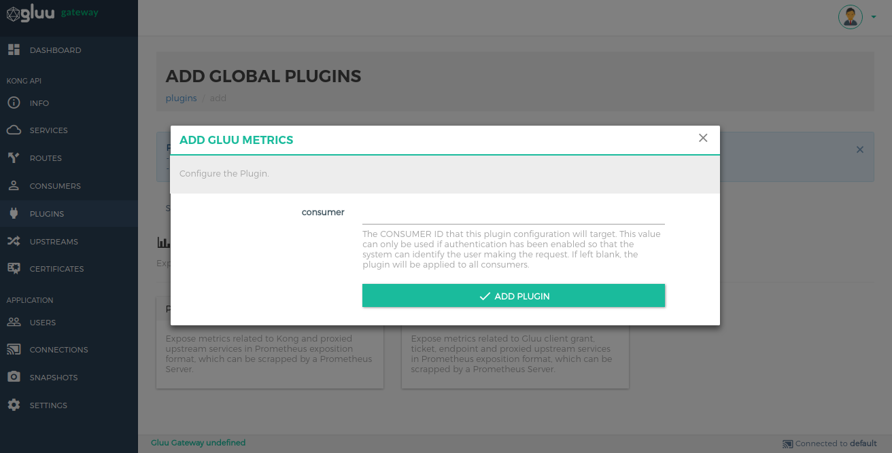
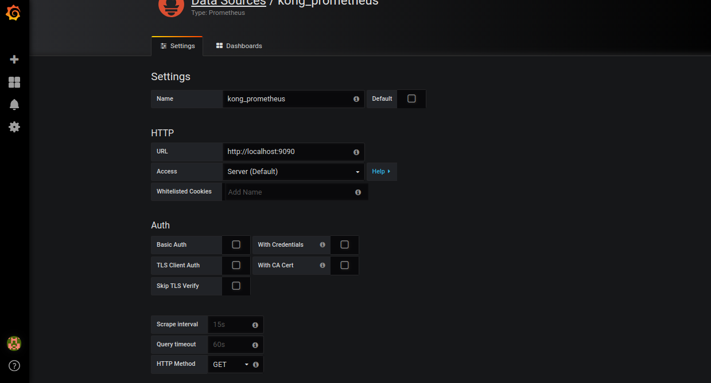

# Gluu Metrics
## Overview
The metrics plugin gathers statistics for authentication-related events generated by Gluu Gateway against its associated Gluu Server. Metrics are exposed in the Prometheus exposition format, which can be scraped by a Prometheus Server.

During Gluu Gateway [setup](../../installation), this plugin is set up globally by default with the `ip restriction` plugin for one service which is used to collect the transaction and usage on our side that is `license.gluu.org`. which request your server twice in a day to collect metrics.

## Configuration

The plugin can be configured on **Service**, **Route** and **Global**. There are several possibilities for plugin configuration with services and routes. More details are available in the [Kong docs](https://docs.konghq.com/0.14.x/admin-api/#precedence).

We recommend enabling the plugin Globally so metrics are gathered for all Gluu Gateway services.

### Using the UI

Navigate to the [Add Global Plugin section](../admin-gui/#add-plugin) in the UI to enable the Gluu Metrics plugin. In the Metrics category, there is a Gluu Metrics box. Click the **+** icon to enable the plugin.



After clicking **+**, the following form will be presented where a Consumer ID can be added:



### Using the API

```
$ curl -X POST \
  http://<kong_hostname>:8001/plugins \
  -H 'Content-Type: application/json' \
  -d '{
  "name": "gluu-metrics",
  "config": { <parameters> }
}'
```

### Parameters

The following parameters can be used for plugin configuration:  

|Parameters|Default|Description|
|-------------|-------|-----------|
|ip_restrict_plugin_id || The ID of the `ip-restriction` plugin|
|gluu_prometheus_server_host || The host(server) which collect the metrics about your server. Set to `license.gluu.org` during setup.|
|kong_admin_url || Your Kong Admin API URL.|
|check_ip_time | 86400 sec| The frequency in seconds to check the IP of the `gluu_prometheus_server_host` server. If IP is changed, it updates the IP restriction plugin, which has `config.ip_restrict_plugin_id` ID. The default value is 86400 seconds(1 day).|

## Metrics Endpoint

Metrics are available via the following Admin API endpoint: `http://<kong_hostname>:8001/gluu-metrics` 

### Available metrics

- **gluu_endpoint_method**: Counts how many times an endpoint is called per method. 

- **gluu_oauth_client_authenticated**: Counts how many times a client (consumer) is authenticated by the OAUTH-PEP plugin per service.

- **gluu_oauth_client_granted**: Counts how many times a client (consumer) is granted access (authorize by OAUTH Scope Expression) by the OAUTH-PEP plugin per service.

- **gluu_uma_client_authenticated**: Counts how many times a client (consumer) is authenticated by the UMA-PEP plugin per service.

- **gluu_uma_client_granted**: Counts how many times a client (consumer) is granted access (authorized by UMA Scope and Policies) by the UMA-PEP plugin per service.

- **gluu_uma_ticket**: Counts how many times an UMA Permission Ticket has been issued by the user for access to resources. This will only count tickets for UMA-PEP.

- **gluu_openid_connect_users_authenticated**: Counts how many time user authenticated by the OpenID Connect

- **gluu_opa_client_granted**: Counts how many time user authorized by the OPA PEP plugin.

- **gluu_total_client_authenticated**: Counts the total authnetication done by all authentication plugin that is `gluu-oauth-auth`, `gluu-uma-auth` and `gluu-openid-connect`.

- **gluu_total_client_authenticated**: Counts the total authnetication done by all authorization plugin that is `gluu-oauth-pep`, `gluu-uma-pep` and `gluu-opa-pep`. 

### Example metrics  

The following is an example of metrics available via the endpoint `/gluu-metrics`: 

```
# HELP gluu_endpoint_method Endpoint call per service in Kong
# TYPE gluu_endpoint_method counter
gluu_endpoint_method{endpoint="/comments",method="POST",service="JSON-API"} 40
gluu_endpoint_method{endpoint="/comments/1",method="DELETE",service="JSON-API"} 40
gluu_endpoint_method{endpoint="/comments/1",method="GET",service="JSON-API"} 40
gluu_endpoint_method{endpoint="/posts/1",method="DELETE",service="JSON-API"} 40
gluu_endpoint_method{endpoint="/posts/1",method="GET",service="JSON-API"} 40
gluu_endpoint_method{endpoint="/posts/1",method="GET",service="none-claim-gatering"} 2

# HELP gluu_nginx_metric_errors_total Number of nginx-lua-prometheus errors
# TYPE gluu_nginx_metric_errors_total counter
gluu_nginx_metric_errors_total 0

# HELP gluu_oauth_client_authenticated Client(Consumer) OAuth authenticated per service in Kong
# TYPE gluu_oauth_client_authenticated counter
gluu_oauth_client_authenticated{consumer="@!19CF.B296.532F.83E2!0001!25C1.E1E4!0008!B9EF.436E.5D35.0C58",service="JSON-API"} 200

# HELP gluu_oauth_client_granted Client(Consumer) OAuth granted per service in Kong
# TYPE gluu_oauth_client_granted counter
gluu_oauth_client_granted{consumer="@!19CF.B296.532F.83E2!0001!25C1.E1E4!0008!B9EF.436E.5D35.0C58",service="JSON-API"} 200

# HELP gluu_uma_client_authenticated Client(Consumer) UMA authenticated per service in Kong
# TYPE gluu_uma_client_authenticated counter
gluu_uma_client_authenticated{consumer="@!19CF.B296.532F.83E2!0001!25C1.E1E4!0008!B9EF.436E.5D35.0C58",service="none-claim-gatering"} 1

# HELP gluu_uma_client_granted Client(Consumer) UMA granted per service in Kong
# TYPE gluu_uma_client_granted counter
gluu_uma_client_granted{consumer="@!19CF.B296.532F.83E2!0001!25C1.E1E4!0008!B9EF.436E.5D35.0C58",service="none-claim-gatering"} 1

# HELP gluu_uma_ticket Permission Ticket getting per services in Kong
# TYPE gluu_uma_ticket counter
gluu_uma_ticket{service="none-claim-gatering"} 1

# HELP gluu_openid_connect_users_authenticated User authenticated per service in Kong
# TYPE gluu_openid_connect_users_authenticated counter
gluu_openid_connect_users_authenticated{service="jsonplaceholder"} 5

# HELP gluu_total_client_authenticated Total authentication(OAuth, UMA and OpenID Connect) in Kong
# TYPE gluu_total_client_authenticated counter
gluu_total_client_authenticated 6

# HELP gluu_total_client_granted Total authorization(OAuth, UMA and OPA PEP) in Kong
# TYPE gluu_total_client_granted counter
gluu_total_client_granted 3

```

## Prometheus Server Configuration

Configure a Prometheus server to listen to the metrics endpoint `gluu-metrics`

1. Install **prometheus server v2.6.0**      
1. Add the `/gluu-metrics` endpoint in prometheus.yml, in the **scrape_configs** section:      
   ```
     - job_name: gluu
       metrics_path: /gluu-metrics
       static_configs:
       - targets: [http://<kong_hostname>:8001]
   ```
1. Restart the Prometheus server.   

## Grafana Configuration

Metrics exported by the plugin can be graphed in Grafana using a drop-in dashboard: [Gluu-Metrics-Grafana.json](https://github.com/GluuFederation/gluu-gateway/blob/version_4.0/setup/templates/Gluu-Metrics-Grafana.json).

1. Install **Grafana v5.4.2**     
1. Add Datasource     
    - Start the grafana service
    - Open in browser (Default port 3000. http://<kong_hostname>:3000)
    - Configuration > Data sources > Add data source > Prometheus
    - Add the Prometheus server URL
    
1. Import JSON: [Gluu-Metrics-Grafana.json](https://github.com/GluuFederation/gluu-gateway/blob/version_4.0/setup/templates/Gluu-Metrics-Grafana.json)     
    - Go to the home page
    - Click on `New dashboard` on top left corner.
    - Click on `import dashboard`
    - Upload .json file
