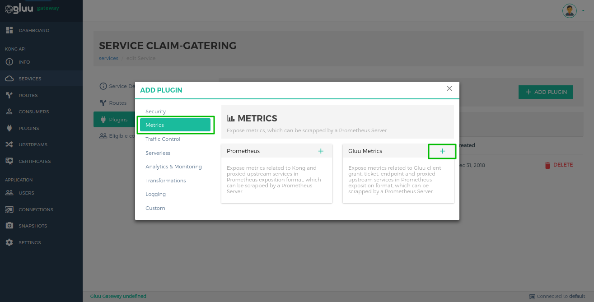
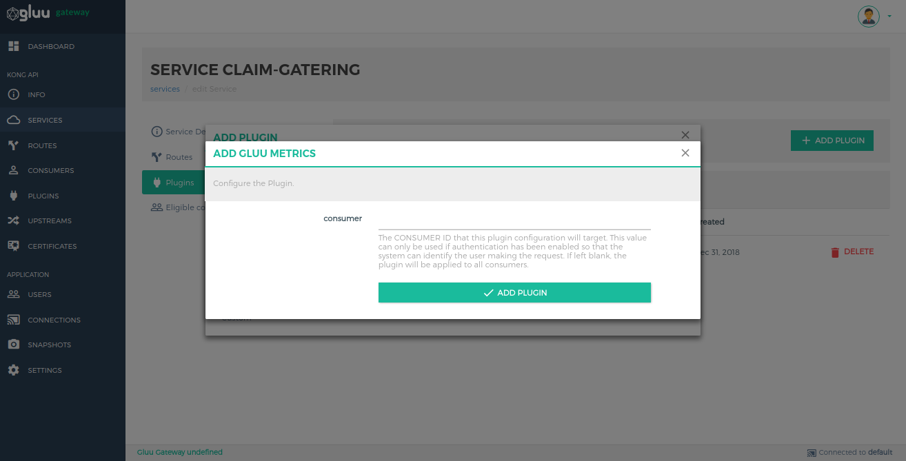

# Gluu Metrics

Expose metrics in Prometheus exposition format, which can be scrapped by a Prometheus Server. It expose below some metrics

1. UMA and OAuth Client Authentication and Grant
2. UMA Permission Ticket
3. Endpoint and methods

## Configuration

You can configure plugin on **Service**, **Route** and **Global**. There are several possibilities for plugin configuration with services and routes. [More Details](https://docs.konghq.com/0.14.x/admin-api/#precedence).

### Enable plugin on Service

#### 1. Add Service

##### 1.1 Add Service using GG UI

Use [Service section](../admin-gui/#2-add-service) to add service using GG UI.


##### 1.2 Add Service using Kong Admin API

```
$ curl -X POST \
  http://localhost:8001/services \
  -H 'Content-Type: application/json' \
  -d '{
  "name": "<service_name>",
  "url": "http://upstream-api-url.com"
}'
```

#### 2. Configure Plugin

##### 2.1 Configure plugin using GG UI

Use the [Manage Service](../admin-gui/#332-add-plugin) section in GG UI to enable the Gluu Metrics plugin. In the metrics category, there is a Gluu Metrics box. Click on the **+ icon** to enable the plugin.



After clicking on **+ icon**, you will see the below form.


##### 2.2 Configure plugin using Kong Admin API

```
$ curl -X POST \
  http://localhost:8001/plugins \
  -H 'Content-Type: application/json' \
  -d '{
  "name": "gluu-metrics",
  "service_id": "<kong_service_object_id>"
}'
```

### Enable plugin Globally

If you enable plugin globally, it will apply for all the services.

#### 1. Configure Plugin

##### 1.1 Configure plugin using GG UI

Use the [Plugin section](../admin-gui/#add-plugin) in GG UI to enable the Gluu Metrics plugin. In the security category, there is a Gluu Metrics box. Click on the **+ icon** to enable the plugin.


After clicking on **+ icon**, you will see the below form.


##### 1.2 Configure plugin using Kong Admin API

```
$ curl -X POST \
  http://localhost:8001/plugins \
  -H 'Content-Type: application/json' \
  -d '{
  "name": "gluu-metrics"
}'
```

