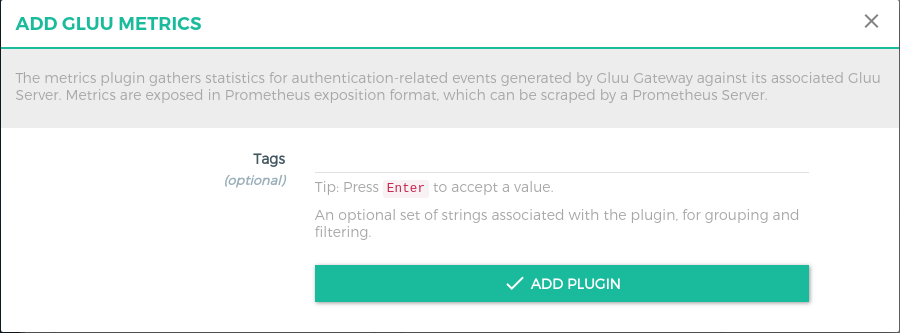

# Gluu Metrics

The metrics plugin gathers statistics for authentication-related events generated by Gluu Gateway against its associated Gluu Server. Metrics are exposed in Prometheus exposition format, which can be scraped by a Prometheus Server.

## Configuration

The plugin can be configured on **Service**, **Route** and **Global**. There are several possibilities for plugin configuration with services and routes. [More details in the Kong docs](https://docs.konghq.com/0.14.x/admin-api/#precedence).

We recommend enabling the plugin Globally so metrics are gathered for all Gluu Gateway services.

### Parameters

The following parameters can be used for plugin configuration:  

|Parameters|Default|Description|
|-------------|-------|-----------|
|name||The name of the plugin to use, in this case gluu-metrics.|
|service_id (optional)||The id of the Service which this plugin will target.|
|consumer_id (optional)||The id of the Consumer which this plugin will target.|
|enabled|true|Whether this plugin will be applied.|

### Using the UI

Navigate to the [Global Plugin Add section](../admin-gui/#add-plugin_2) in the UI to enable the Gluu Metrics plugin. In the Metrics category, there is a Gluu Metrics box. Click the **+** icon to enable the plugin.


After clicking **+**, the following form will be presented where a Consumer ID can be added:



### Using the API

```
$ curl -X POST \
  http://localhost:8001/plugins \
  -H 'Content-Type: application/json' \
  -d '{
  "name": "gluu-metrics"
}'
```

## Metrics Endpoint

Metrics are available via the following Admin API endpoint: `http://<kong_hostname>:8001/gluu-metrics` 

### Available metrics

- **gluu_endpoint_method**: Counts how many times an endpoint is called per method. 

- **gluu_oauth_client_authenticated**: Counts how many times an client(consumer) is authenticated by the OAUTH-PEP plugin per service.

- **gluu_oauth_client_granted**: Counts how many times an client(consumer) is granted(passing by scope expression) by the OAUTH-PEP plugin per service.

- **gluu_uma_client_authenticated**: Counts how many times an client(consumer) is authenticated by the UMA-PEP plugin per service.

- **gluu_uma_client_granted**: Counts how many times an client(consumer) is granted(passing by scope expression) by the UMA-PEP plugin per service.

- **gluu_uma_ticket**: Count how many times UMA Permission Ticket issued by user for resources. This will count ticket only in UMA-PEP case.


### Example metrics  

The following is an example of metrics available via the endpoint `/gluu-metrics`: 

```
# HELP gluu_endpoint_method Endpoint call per service in Kong
# TYPE gluu_endpoint_method counter
gluu_endpoint_method{endpoint="/comments",method="POST",service="JSON-API"} 40
gluu_endpoint_method{endpoint="/comments/1",method="DELETE",service="JSON-API"} 40
gluu_endpoint_method{endpoint="/comments/1",method="GET",service="JSON-API"} 40
gluu_endpoint_method{endpoint="/posts/1",method="DELETE",service="JSON-API"} 40
gluu_endpoint_method{endpoint="/posts/1",method="GET",service="JSON-API"} 40
gluu_endpoint_method{endpoint="/posts/1",method="GET",service="none-claim-gatering"} 2

# HELP gluu_nginx_metric_errors_total Number of nginx-lua-prometheus errors
# TYPE gluu_nginx_metric_errors_total counter
gluu_nginx_metric_errors_total 0

# HELP gluu_oauth_client_authenticated Client(Consumer) OAuth authenticated per service in Kong
# TYPE gluu_oauth_client_authenticated counter
gluu_oauth_client_authenticated{consumer="@!19CF.B296.532F.83E2!0001!25C1.E1E4!0008!B9EF.436E.5D35.0C58",service="JSON-API"} 200

# HELP gluu_oauth_client_granted Client(Consumer) OAuth granted per service in Kong
# TYPE gluu_oauth_client_granted counter
gluu_oauth_client_granted{consumer="@!19CF.B296.532F.83E2!0001!25C1.E1E4!0008!B9EF.436E.5D35.0C58",service="JSON-API"} 200

# HELP gluu_uma_client_authenticated Client(Consumer) UMA authenticated per service in Kong
# TYPE gluu_uma_client_authenticated counter
gluu_uma_client_authenticated{consumer="@!19CF.B296.532F.83E2!0001!25C1.E1E4!0008!B9EF.436E.5D35.0C58",service="none-claim-gatering"} 1

# HELP gluu_uma_client_granted Client(Consumer) UMA granted per service in Kong
# TYPE gluu_uma_client_granted counter
gluu_uma_client_granted{consumer="@!19CF.B296.532F.83E2!0001!25C1.E1E4!0008!B9EF.436E.5D35.0C58",service="none-claim-gatering"} 1

# HELP gluu_uma_ticket Permission Ticket getting per services in Kong
# TYPE gluu_uma_ticket counter
gluu_uma_ticket{service="none-claim-gatering"} 1
```

## Grafana configuration

Metrics exported by the plugin can be graphed in Grafana using a drop in dashboard: [Gluu-Metrics-Grafana.json](https://github.com/GluuFederation/gluu-gateway/blob/version_4.0.0/setup/templates/Gluu-Metrics-Grafana.json).

1. Install **Grafana v5.4.2**     
1. Add Datasource     
    - Start grafana service
    - Open in browser (Default port 3000. http://localhost:3000)
    - Configuration > Data sources > Add data source > Prometheus
    - Add prometheus server URL
    
1. Import JSON: [Gluu-Metrics-Grafana.json](https://github.com/GluuFederation/gluu-gateway/blob/version_4.0.0/setup/templates/Gluu-Metrics-Grafana.json)     
    - Go to home pade
    - Click on `New dashboard` on top left corner.
    - Click on `import dashboard`
    - Upload .json file

## Prometheus server configuration

Simply configure a Prometheus server to listen to the metrics endpoint `gluu-metrics`

1. Install **prometheus server v2.6.0**      
1. Add our endpoint in prometheus.yml in **scrape_configs** section.      
   ```
     - job_name: gluu
       metrics_path: /gluu-metrics
       static_configs:
       - targets: [your-kong-host-server.com:8001]
   ```
1. Restart prometheus server.       
