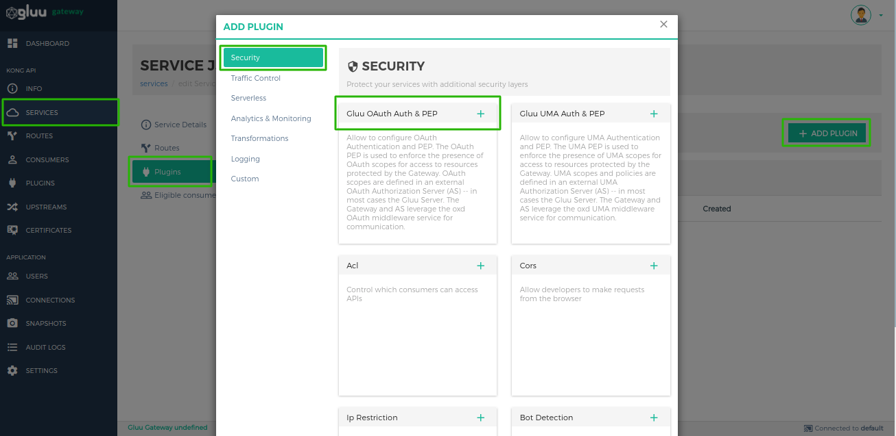
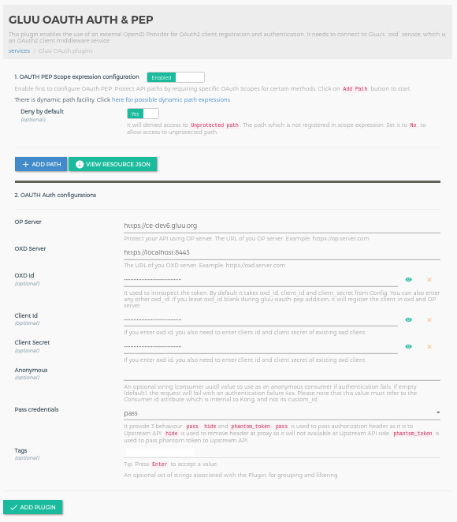

# Gluu OAuth Auth and OAuth PEP
## Overview
The OAuth Auth and OAuth PEP is used for client authentication and to enforce the presence of OAuth scopes for access to resources protected by the Gateway. OAuth scopes are defined in an external OAuth Authorization Server (AS) -- in most cases the Gluu Server. The Gateway and AS leverage the oxd OAuth middleware service for communication.

There are two plugins for OAuth security.

   1. **gluu-oauth-auth**: Authenticate client by OAuth Token. The plugin priority is `999`.
   1. **gluu-oauth-pep**: Authorization by OAuth token scopes. The plugin priority is `996`.

!!! Note
    The higher the priority, the sooner your plugin’s phases will be executed in regard to other plugins’ phases 

The plugin supports two types of tokens: 

   1. **Default Access Token**: The plugin will authenticate the token using introspection.
   1. **Access Token as JWT**: The plugin will authenticate the token using JWT to verify. Currently the plugin supports three algorithms:  **RS256**, **RS384** and **RS512**.

## Configuration

Plugins can be configured at the **Service**, **Route** or **Global** level. There are several possibilities for plugin configuration with services and routes. For information on plugin precedence, [read the Kong docs](https://docs.konghq.com/0.14.x/admin-api/#precedence).

!!! Important
    During plugin configuration, the **GG UI** creates a new OP Client if the **oxd ID** is left blank. However, if configuring with the **Kong Admin API**, existing client credentials must be used.

!!! Important
    konga.log also shows the curl commands for all API requests to Kong and oxd made by the Konga GUI. This curl command can be used to automate configuration instead of using the web interface.

### Service Level

#### Add a Service using GG UI

Use the [Service section](../admin-gui/#add-service) of the GG UI doc to add a service using GG UI.


#### Add a Service using Kong Admin API

```
$ curl -X POST \
  http://<kong_hostname>:8001/services \
  -H 'Content-Type: application/json' \
  -d '{
  "name": "<service_name>",
  "url": "http://upstream-api-url.com"
}'
```

#### Configure Service Plugin using GG UI

Use the [Manage Service](../admin-gui/#manage-service) section in the GG UI to enable the Gluu OAuth PEP plugin. In the security category, there is a Gluu OAuth PEP box. Click on the **+** icon to enable the plugin.



Clicking on the **+** icon will bring up the below form.

!!! important
    If you don't wanna add `gluu-oauth-pep` plugin then disable button which is on the top.



#### Configure a Service Plugin using Kong Admin API

!!! Note
    Use [OXD API](https://gluu.org/docs/oxd/4.0/) for [client registration](https://gluu.org/docs/oxd/4.0/api/#register-site).

Configuration for `gluu-oauth-auth`

```
$ curl -X POST \
  http://<kong_hostname>:8001/plugins \
  -H 'Content-Type: application/json' \
  -d '{
  "name": "gluu-oauth-auth",
  "config": {
    "oxd_url": "<your_oxd_server_url>",
    "op_url": "<your_op_server_url>",
    "oxd_id": "<oxd_id>",
    "client_id": "<client_id>",
    "client_secret": "<client_secret>",
    "hide_credentials": <false|true>,
    "anonymous: "<anonymous_consumer_id>"
  },
  "service_id": "<kong_service_object_id>"
}'
```

Configuration for `gluu-oauth-pep`

```
$ curl -X POST \
  http://<kong_hostname>:8001/plugins \
  -H 'Content-Type: application/json' \
  -d '{
  "name": "gluu-oauth-pep",
  "config": {
    "oxd_url": "<your_oxd_server_url>",
    "op_url": "<your_op_server_url>",
    "oxd_id": "<oxd_id>",
    "client_id": "<client_id>",
    "client_secret": "<client_secret>",
    "deny_by_default": <false|true>,
    "oauth_scope_expression": [
      {
        "path": "/posts",
        "conditions": [
          {
            "httpMethods": [
              "GET"
            ],
            "scope_expression": {
              "rule": {
                "and": [
                  {
                    "var": 0
                  },
                  {
                    "var": 1
                  }
                ]
              },
              "data": [
                "admin",
                "employee"
              ]
            }
          }
        ]
      }
    ],
  },
  "service_id": "<kong_service_object_id>"
}'
```

!!! Note
    Kong does not allow proxying using only a service object--this feature requires a route. At minimum, one service is needed to register an Upstream API and one route is needed for proxying.

### Route Level

#### Add a Route using GG UI

Use the [Manage Service Section](../admin-gui/#service-routes) to add a route using the GG UI.


#### Add a Route using Kong Admin API

```
$ curl -X POST \
    http://<kong_hostname>:8001/routes \
    -H 'Content-Type: application/json' \
    -d '{
    "hosts": [
      "<your_host.com>"
    ],
    "service": {
      "id": "<kong_service_object_id>"
    }
  }'
```

!!! Information
    There are several possibilities for what to put in the `hosts` field. One technique is to send the request to a proxy. See more information and possibilities in the [Proxy reference](https://docs.konghq.com/0.14.x/proxy/) Kong Documents.

#### Configure a Route Plugin using GG UI

Use the [Manage Route](../admin-gui/#manage-route) section in the GG UI to enable the Gluu OAuth PEP plugin. In the security category, there is a Gluu OAuth PEP box. Click on the **+** icon to enable the plugin.


Clicking on the **+** icon will bring up the below form.


#### Configure Route Plugin using Kong Admin API

!!! Note
    Use [OXD API](https://gluu.org/docs/oxd/4.0/) for [client registration](https://gluu.org/docs/oxd/4.0/api/#register-site).

Configuration for `gluu-oauth-auth`

```
$ curl -X POST \
  http://<kong_hostname>:8001/plugins \
  -H 'Content-Type: application/json' \
  -d '{
  "name": "gluu-oauth-auth",
  "config": {
    "oxd_url": "<your_oxd_server_url>",
    "op_url": "<your_op_server_url>",
    "oxd_id": "<oxd_id>",
    "client_id": "<client_id>",
    "client_secret": "<client_secret>",
    "hide_credentials": <false|true>,
    "anonymous: "<anonymous_consumer_id>"
  },
  "route_id": "<kong_route_object_id>"
}'
```

Configuration for `gluu-oauth-pep`

```
$ curl -X POST \
  http://<kong_hostname>:8001/plugins \
  -H 'Content-Type: application/json' \
  -d '{
  "name": "gluu-oauth-pep",
  "config": {
    "oxd_url": "<your_oxd_server_url>",
    "op_url": "<your_op_server_url>",
    "oxd_id": "<oxd_id>",
    "client_id": "<client_id>",
    "client_secret": "<client_secret>",
    "deny_by_default": <false|true>,
    "oauth_scope_expression": [
      {
        "path": "/posts",
        "conditions": [
          {
            "httpMethods": [
              "GET"
            ],
            "scope_expression": {
              "rule": {
                "and": [
                  {
                    "var": 0
                  },
                  {
                    "var": 1
                  }
                ]
              },
              "data": [
                "admin",
                "employee"
              ]
            }
          }
        ]
      }
    ],
  },
  "route_id": "<kong_route_object_id>"
}'
```

### Global Plugin

A global plugin will apply to all services and routes.

#### Configure a Global Plugin using GG UI

Use the [Plugin section](../admin-gui/#add-plugin) in the GG UI to enable the Gluu OAuth PEP plugin. In the security category, there is a `Gluu OAuth PEP` box. Click on the **+** icon to enable the plugin.


Clicking on the **+** icon will bring up the below form.


#### Configure a Global Plugin using Kong Admin API

!!! Note
    Use [OXD API](https://gluu.org/docs/oxd/4.0/) for [client registration](https://gluu.org/docs/oxd/4.0/api/#register-site).

Configuration for `gluu-oauth-auth`

```
$ curl -X POST \
  http://<kong_hostname>:8001/plugins \
  -H 'Content-Type: application/json' \
  -d '{
  "name": "gluu-oauth-auth",
  "config": {
    "oxd_url": "<your_oxd_server_url>",
    "op_url": "<your_op_server_url>",
    "oxd_id": "<oxd_id>",
    "client_id": "<client_id>",
    "client_secret": "<client_secret>",
    "hide_credentials": <false|true>,
    "anonymous: "<anonymous_consumer_id>"
  },
}'
```

Configuration for `gluu-oauth-pep`

```
$ curl -X POST \
  http://<kong_hostname>:8001/plugins \
  -H 'Content-Type: application/json' \
  -d '{
  "name": "gluu-oauth-pep",
  "config": {
    "oxd_url": "<your_oxd_server_url>",
    "op_url": "<your_op_server_url>",
    "oxd_id": "<oxd_id>",
    "client_id": "<client_id>",
    "client_secret": "<client_secret>",
    "deny_by_default": <false|true>,
    "oauth_scope_expression": [
      {
        "path": "/posts",
        "conditions": [
          {
            "httpMethods": [
              "GET"
            ],
            "scope_expression": {
              "rule": {
                "and": [
                  {
                    "var": 0
                  },
                  {
                    "var": 1
                  }
                ]
              },
              "data": [
                "admin",
                "employee"
              ]
            }
          }
        ]
      }
    ],
  },
}'
```

### Parameters

The following parameters can be used in this plugin's configuration.

1. Gluu-OAuth-Auth

| field | Default | Description |
|-------|---------|-------------|
|**op_url**||The URL of your OP server. Example: https://op.server.com|
|**oxd_url**||The URL of your oxd server. Example: https://oxd.server.com|
|**oxd_id**|| The ID for an existing client, used to introspect the token. If left blank, a new client will be registered dynamically |
|**client_id**|| An existing client ID, used to get a protection access token to access the introspection API. Required if an existing oxd ID is provided.|
|**client_secret**|| An existing client secret, used to get protection access token to access the introspection API. Required if an existing oxd ID is provided.|
|**anonymous**||An optional string (consumer UUID) value to use as an “anonymous” consumer if authentication fails. If empty (default), the request will fail with an authentication failure 4xx. This value must refer to the Consumer ID attribute that is internal to Kong, and not its custom_id.|
|**hide_credentials**|false|An optional boolean value telling the plugin to show or hide the credential from the upstream service. If true, the plugin will strip the credential from the request (i.e. the Authorization header) before proxying it.|

2. Gluu-OAuth-PEP

| field | Default | Description |
|-------|---------|-------------|
|**op_url**||The URL of your OP server. Example: https://op.server.com|
|**oxd_url**||The URL of your oxd server. Example: https://oxd.server.com|
|**oxd_id**|| The ID for an existing client, used to introspect the token. If left blank, a new client will be registered dynamically |
|**client_id**|| An existing client ID, used to get a protection access token to access the introspection API. Required if an existing oxd ID is provided.|
|**client_secret**|| An existing client secret, used to get protection access token to access the introspection API. Required if an existing oxd ID is provided.|
|**oauth_scope_expression**|| Used to add scope security on an OAuth scope token.|
|**deny_by_default**| true | For paths not protected by OAuth scope expressions. If true, denies unprotected paths.|
|**method_path_tree**||It is for plugin internal use. We use it for tree level matching for dynamic paths which registered in `uma_scope_expression`|

!!! Note
    GG UI can create a dynamic client. However, if the Kong Admin API is used for plugin configuration, it requires an existing client using the oxd API, then passing the client's credentials to the Gluu-OAuth-PEP plugin.

#### OAuth Scope Expression

The OAuth Scope Expression is a JSON expression, providing security for OAuth scopes. It checks the scope (from token introspection) of the token with the configured OAuth JSON expression.

!!! Note
    Enable and disable the OAuth scope expression by setting `ignore_scope` to `true`.

For example, to protect an API:

```
[
  {
    "path": "/images",
    "conditions": [
      {
        "httpMethods": [
          "GET"
        ],
        "scope_expression": {
          "rule": {
            "and": [
              {
                "var": 0
              },
              {
                "or": [
                  {
                    "var": 1
                  },
                  {
                    "var": 2
                  }
                ]
              }
            ]
          },
          "data": [
            "openid",
            "email",
            "clientinfo"
          ]
        }
      }
    ]
  }
]
```


At runtime, the plugin matches the scope expression with token scopes. The inner expression is executed first, matching the scopes from the expression one by one with the requested scope. For each match,`true` is returned. If a check does not match, it returns `false`.

**Example 1**: For a token with the `["clientinfo"]` scope only.

The values of `data` will convert into Boolean values. If the token scope matches the expression scope, return `true`. If not, return `false`.

```
["openid","email","clientinfo"] --> [false, false, true]
```

Check the result using [http://jsonlogic.com](http://jsonlogic.com/play.html).


The result is `false`, so the request is not allowed.

**Example 2**: For a token with `["openid", "clientinfo"]` scopes.

The data value is

```
["openid","email","clientinfo"] --> [true, false, true]
```


The result is `true`, so the request is allowed.

#### Dynamic Resource Protection

There are 3 elements to make more dynamic path registration and protection:

- ? match any one path element
- ?? match zero or more path elements
- {regexp} - match single path element against PCRE

The priority for the elements are:

1. Exact match
1. Regexp match
1. ?
1. ??

!!! Note
    slash(/) is required before multiple wildcards placeholder.
    
Examples: 

Assume that below all path is register in one plugin

| Register Path | Allow path | Deny path |
|---------------|------------|-----------|
| `/folder/file.ext` | <ul><li>/folder/file.ext</li></ul> | <ul><li>/folder/file</li></ul> |
| `/folder/?/file` | <ul><li>/folder/123/file</li> <li>/folder/xxx/file</li></ul> | |
| `/path/??` | <ul><li>/path/</li> <li>/path/xxx</li> <li>/path/xxx/yyy/file</li></ul> | <ul><li>/path - Need slash at last</li></ul> |
| `/path/??/image.jpg` | <ul><li>/path/one/two/image.jpg</li> <li>/path/image.jpg</li></ul> | |
| `/path/?/image.jpg` | <ul><li>/path/xxx/image.jpg - ? has higher priority than ??</li></ul> | |
| `/path/{abc|xyz}/image.jpg` | <ul><li>/path/abc/image.jpg</li> <li>/path/xyz/image.jpg</li></ul> | |
| `/users/?/{todos|photos}` | <ul><li>/users/123/todos</li> <li>/users/xxx/photos</li></ul> | |
| `/users/?/{todos|photos}/?` | <ul><li>/users/123/todos/</li> <li>/users/123/todos/321</li> <li>/users/123/photos/321</li></ul> | |

## Usage

### Create Client

Create a client using the [create client consumer section](../admin-gui/#create-client). Use the oxd `register-site` API to create a client.

### Create Consumer

A client credential needs to be associated with an existing Consumer object. To create a Consumer, use the [Consumer section](../admin-gui/#consumers).

Create a consumer using the Kong Admin API:

```
$ curl -X POST \
    http://<kong_hostname>:8001/consumers \
    -H 'Content-Type: application/json' \
    -d '{
  	"username": "<kong_consumer_name>",
  	"custom_id": "<gluu_client_id>"
  }'
```

### Security & Access Proxy

To access a proxy upstream API, pass an OAuth token in the authorization header. Generate the OAuth token using OP Client credentials by sending a request to the oxd `/get-client-token` API.

For example, to access a Kong proxy using an OAuth token:

```
curl -X GET \
  http://<kong_hostname>:8000/{path matching a configured Route} \
  -H 'Authorization: Bearer <oauth_token>' \
```

!!! Note
    Kong normally provides the 8443 port for https by default, but during the setup script installation, it is changed to 443.

## Upstream Headers

When a client has been authenticated, the plugin will append some headers to the request before proxying it to the upstream service to identify the consumer and the end user in the code:

1. **X-Consumer-ID**, the ID of the Consumer on Kong
1. **X-Consumer-Custom-ID**, the custom_id of the Consumer (if set)
1. **X-Consumer-Username**, the username of the Consumer (if set)
1. **X-Authenticated-Scope**, the comma-separated list of scopes that the end user has authenticated, if available (only if the consumer is not an 'anonymous' consumer)
1. **X-OAuth-Client-ID**, the authenticated client ID (only if the consumer is not an 'anonymous' consumer)
1. **X-OAuth-Expiration**, the token expiration time, integer timestamp, measured in the number of seconds since January 1, 1970 UTC, indicating when this token will expire, as defined in JWT RFC7519. It is only returned if the consumer is not set to 'anonymous'.
1. **X-Anonymous-Consumer**, will be set to true when authentication fails, and the 'anonymous' consumer is set instead.

This information can be used to implement additional logic. For example, use the X-Consumer-ID value to query the Kong Admin API and retrieve more information about the Consumer.
