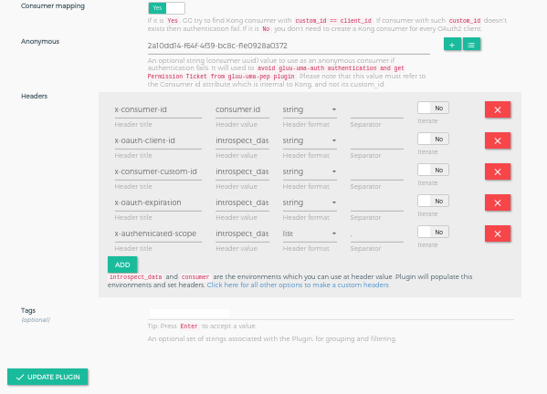

# Gluu OAuth Auth and OAuth PEP
## Overview
The OAuth Auth and OAuth PEP are used for client authentication and to enforce the presence of OAuth scopes for access to resources protected by the Gateway. OAuth scopes are defined in an external OAuth Authorization Server (AS) -- in most cases the Gluu Server. The Gateway and AS leverage the oxd OAuth middleware service for communication.

There are two plugins for OAuth security.

   1. **gluu-oauth-auth**: Authenticate client by OAuth Token. The plugin priority is `999`.
   1. **gluu-oauth-pep**: Authorization by OAuth token scopes. The plugin priority is `996`.

!!! Note
    The higher the priority, the sooner your plugin’s phases will be executed in regard to other plugins’ phases 

The plugin supports two types of tokens: 

   1. **Default Access Token**: The plugin will authenticate the token using introspection.
   1. **Access Token as JWT**: The plugin will authenticate the token using JWT to verify. Currently, the plugin supports three algorithms:  **RS256**, **RS384** and **RS512**.

## Configuration

Plugins can be configured at the **Service**, **Route** or **Global** level. There are several possibilities for plugin configuration with services and routes. For information on plugin precedence, [read the Kong docs](https://docs.konghq.com/0.14.x/admin-api/#precedence).

!!! Important
    During plugin configuration, the **GG UI** creates a new OP Client if the **oxd ID** is left blank. However, if configuring with the **Kong Admin API**, existing client credentials must be used.

!!! Important
    konga.log also shows the curl commands for all API requests to Kong and oxd made by the Konga GUI. This curl command can be used to automate configuration instead of using the web interface.

### Service Level

1. Add Service

      Follow these step to add Service using GG UI:
 
      - Click [`SERVICES`](../../admin-gui/#services) on the left panel
      - Click on [`+ ADD NEW SERVICE`](../../admin-gui/#add-service) button
      - Fill the form by your upstream service details

1. Add Route

      Route is recommended to reach at kong proxy. Follow these steps to add route:
      
      - Click on `service name` or `edit` button of above added service
      - Click [`ROUTES`](../../admin-gui/#routes)
      - Click the [`+ ADD ROUTE`](../../admin-gui/#add-route) button
      - Fill the form by routing details. Check kong docs for more routing capabilities [here](https://docs.konghq.com/0.14.x/proxy/#routes-and-matching-capabilities).

1. Add Plugins

     Follow these steps to add plugins:

     - Click [`SERVICES`](../../admin-gui/#services) on the left panel
     - Click on `name` or `edit` button
     - Click on [`Plugins`](../../admin-gui/#route-plugins)
     - Click on `+ ADD PLUGIN` button
     - You will see `Gluu OAuth Auth & PEP` title and `+` icon in pop-up
     - Click here for [next](#add-plugin) step
     
### Route Level

1. Add Service

      Follow these step to add Service using GG UI
 
      - Click [`SERVICES`](../../admin-gui/#services) on the left panel
      - Click on [`+ ADD NEW SERVICE`](../../admin-gui/#add-service) button
      - Fill the form by your upstream service details

1. Add Route

      Follow these steps to add route:
      
      - Click on `service name` or `edit` button of above added service
      - Click [`ROUTES`](../../admin-gui/#routes)
      - Click the [`+ ADD ROUTE`](../../admin-gui/#add-route) button
      - Fill the form by routing details. Check kong docs for more routing capabilities [here](https://docs.konghq.com/0.14.x/proxy/#routes-and-matching-capabilities).

1. Add Plugins

     Follow these steps to add plugins:

     - Click [`ROUTES`](../../admin-gui/#routes) on the left panel
     - Click on `route id/name` or `edit` button
     - Click on [`Plugins`](../../admin-gui/#route-plugins)
     - Click on `+ ADD PLUGIN` button
     - You will see `Gluu OAuth Auth & PEP` title and `+` icon in pop-up
     - Click here for [next](#add-plugin) step

### Global Plugin

A global plugin will apply to all services and routes.

Follow these steps to add plugins:

   - Click [`Plugins`](../../admin-gui/#plugins) on the left panel
   - You will see `Gluu OAuth Auth & PEP` title and `+` icon in pop-up
   - Click here for [next](#add-plugin) step
     
### Add Plugin

You will see `Gluu OAuth Auth & PEP` title and `+` icon in a pop-up.


Clicking on the `+` icon will bring up the below form. Check [here](#parameters) for all the parameter descriptions.




#### Add Plugin using Kong API

!!! Note
    Use [OXD API](https://gluu.org/docs/oxd/4.0/) for [client registration](https://gluu.org/docs/oxd/4.0/api/#register-site).

Configuration for `gluu-oauth-auth`. Check [here](#gluu-oauth-auth) for parameter descriptions.

```
$ curl -X POST \
  http://<kong_hostname>:8001/plugins \
  -H 'Content-Type: application/json' \
  -d '{
  "name": "gluu-oauth-auth",
  "config": { <parameters> },
  "route": { "id": "<kong_route_object_id>" }
}'
```

Configuration for `gluu-oauth-pep`. Check [here](#gluu-oauth-pep) for parameter descriptions.

```
$ curl -X POST \
  http://<kong_hostname>:8001/plugins \
  -H 'Content-Type: application/json' \
  -d '{
  "name": "gluu-oauth-pep",
  "config": { <parameters> },
  "route": { "id": "<kong_route_object_id>" }
}'
```

The above example is passing `route` property which will add the plugin for route level.

| Request | For |
|---------|-----|
|`"route": { "id": "<kong_route_object_id>" }`|Plugin will add for kong route object|
|`"service": { "id": "<kong_service_object_id>" }`|Plugin will add for kong service object|
|  | If you not pass any `service` or `route`, it will add globally. Plugin will execute for any routes and services|

### Parameters

The following parameters can be used in this plugin's configuration.

#### Gluu-OAuth-Auth

| field | Default | Description |
|-------|---------|-------------|
|**op_url**||The URL of your OP server. Example: https://op.server.com|
|**oxd_url**||The URL of your oxd server. Example: https://oxd.server.com|
|**oxd_id**|| The ID for an existing client used to introspect the token. If left blank, a new client will be registered dynamically |
|**client_id**|| An existing client ID used to get a protection access token to access the introspection API. Required if an existing oxd ID is provided.|
|**client_secret**|| An existing client secret, used to get a protection access token to access the introspection API. Required if an existing oxd ID is provided.|
|**anonymous**||An optional string (consumer UUID) value to use as an “anonymous” consumer if authentication fails. If empty (default), the request will fail with an authentication failure 4xx. This value must refer to the Consumer ID attribute that is internal to Kong, and not its custom_id.|
|**pass_credentials**|pass|It allows to 3 values. `pass`, `hide` and `phantom_token`. Used to operate the authorization header from the upstream service as per configuration. In `phantom_token` case, the plugin will replace bearer token with new generated JWT(with introspection result) token, so for outside there is bearer token and JWT for internal use.|
|**custom_headers**||Used to set the custom headers, which is passed to upstream service by kong after authentication. Check [here for more details](../common-features/#custom-headers)|

#### Gluu-OAuth-PEP

| field | Default | Description |
|-------|---------|-------------|
|**op_url**||The URL of your OP server. Example: https://op.server.com|
|**oxd_url**||The URL of your oxd server. Example: https://oxd.server.com|
|**oxd_id**|| The ID for an existing client used to introspect the token. If left blank, a new client will be registered dynamically |
|**client_id**|| An existing client ID used to get a protection access token to access the introspection API. Required if an existing oxd ID is provided.|
|**client_secret**|| An existing client secret, used to get a protection access token to access the introspection API. Required if an existing oxd ID is provided.|
|**oauth_scope_expression**|| Used to add scope security on an OAuth scope token. Check [here](#oauth-scope-expression) for description. |
|**deny_by_default**| true | For paths not protected by OAuth scope expressions. If true, denies unprotected paths.|
|**method_path_tree**||It is for plugin internal use. We use it for tree-level matching for dynamic paths which registered in `uma_scope_expression`|

!!! Note
    GG UI can create a dynamic client. However, if the Kong Admin API is used for plugin configuration, it requires an existing client using the oxd API, then passing the client's credentials to the Gluu-OAuth-PEP plugin.

#### Phantom Token

In some cases, there is a requirement that bearer token for outside of the network and JWT token for the internal network. Check [here](../common-features/#phantom-token) for more details.

#### OAuth Scope Expression

It is stringify json, providing security for OAuth scopes. It checks the scope (from token introspection) of the token with the configured OAuth expression. Below is the structure of the `oauth_scope_expression`.

- `path`: it is your url which you want to protect. There is a regular expression facility for path configuration. Check [here](../common-features/#dynamic-resource-protection) for more dynamic path registration details.
    - `condition`: it is the array of conditions for the path where you can define acr values to the path. You can add multiple conditions with different Http Method.
        - `httpMethods`: it is an HTTP Method. During authentication, the plugin uses it as a filter for the request. **`?`** in the HTTP method allow all the http methods. It should be in a capital case. e.g. GET, POST, PUT.
        - `scope_expression`: It is the rules to check the values. Check the below example for details.
        - `data`: It is the data for the `scope_expression`.

Example of JSON expression
```
[
  {
    "path": "/images",
    "conditions": [
      {
        "httpMethods": [
          "GET"
        ],
        "scope_expression": {
          "rule": {
            "and": [
              {
                "var": 0
              },
              {
                "or": [
                  {
                    "var": 1
                  },
                  {
                    "var": 2
                  }
                ]
              }
            ]
          },
          "data": [
            "openid",
            "email",
            "clientinfo"
          ]
        }
      }
    ]
  }
]
```

JSON expression in string format(stringify json)
```
"[{\"path\":\"/images\",\"conditions\":[{\"httpMethods\":[\"GET\"],\"scope_expression\":{\"rule\":{\"and\":[{\"var\":0},{\"or\":[{\"var\":1},{\"var\":2}]}]},\"data\":[\"openid\",\"email\",\"clientinfo\"]}}]}]"
```


At runtime, the plugin matches the scope expression with token scopes. The inner expression is executed first, matching the scopes from the expression one by one with the requested scope. For each match,`true` is returned. If a check does not match, it returns `false`.

**Example 1**: Token with the `["clientinfo"]` scope only.

The values of `data` will convert into Boolean values. If the token scope matches the expression scope, return `true`. If not, return `false`.

```
["openid","email","clientinfo"] --> [false, false, true]
```

Check the result using [http://jsonlogic.com](http://jsonlogic.com/play.html).


The result is `false`, so the request is not allowed.

**Example 2**: Token with `["openid", "clientinfo"]` scopes.

The data value is

```
["openid","email","clientinfo"] --> [true, false, true]
```


The result is `true`, so the request is allowed.

#### Dynamic Resource Protection

There are 3 elements to make more dynamic path registration and protection. Check [here](../common-features/#dynamic-resource-protection) for more details.

## Usage

### Create Client

Create a client using the [create client consumer section](../../admin-gui/#create-client) or use the oxd `register-site` API to create a client.

### Create Consumer

A client credential needs to be associated with an existing Consumer object. To create a Consumer, use the [Consumer section](../../admin-gui/#consumers).

Create a consumer using the Kong Admin API:

```
$ curl -X POST \
    http://<kong_hostname>:8001/consumers \
    -H 'Content-Type: application/json' \
    -d '{
   "username": "<kong_consumer_name>",
   "custom_id": "<gluu_client_id>"
  }'
```

### Security & Access Proxy

To access a proxy upstream API, pass an OAuth token in the authorization header. Generate the OAuth token using OP Client credentials by sending a request to the oxd `/get-client-token` API.

For example, to access a Kong proxy using an OAuth token:

```
curl -X GET \
  http://<kong_hostname>:8000/{path matching a configured Route} \
  -H 'Authorization: Bearer <oauth_token>' \
```

!!! Note
    Kong normally provides the 8443 port for https by default, but during the setup script installation, it is changed to 443.

## Upstream Headers

When a client has been authenticated, the plugin will append some headers to the request before proxying it to the upstream service to identify the consumer and the end-user in the code:

Check [here](../common-features/#custom-headers) to setup custom headers.

This information can be used to implement additional logic. For example, use the `Consumer` value to query the Kong Admin API and retrieve more information about the Consumer.
