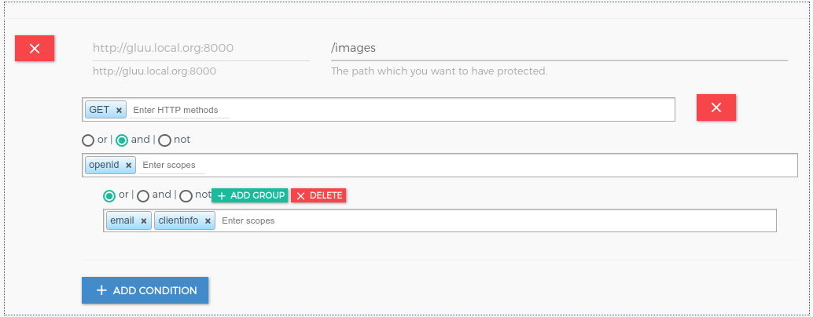
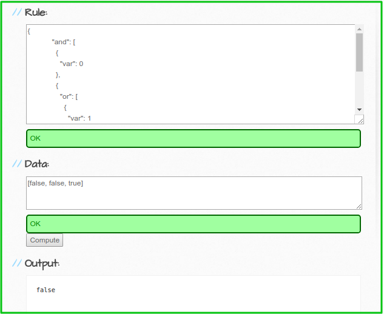

# Gluu OAuth PEP

It is used to add Client authentication with OAuth scope security. This plugin enables the use of an external OpenID Provider for OAuth2 client authentication. It needs to connect to Gluu's `oxd` service, which is an OAuth2 client middleware service.

It will support two tokens.

   1. **Default Access Token**: plugin will authenticate it using introspection
   2. **Access Token as JWT**: plugin will authenticate it using JWT verify.

## Configuration

You can configure plugin on **Service**, **Route** and **Global**. There are several possibilities for plugin configuration with services and routes. [More Details](https://docs.konghq.com/0.14.x/admin-api/#precedence).

### Enable plugin on Service

#### 1. Add Service

##### 1.1 Add Service using GG UI

Use [Service section](../admin-gui/#2-add-service) to add service using GG UI.


##### 1.2 Add Service using Kong Admin API

```
$ curl -X POST \
  http://localhost:8001/services \
  -H 'Content-Type: application/json' \
  -d '{
  "name": "<service_name>",
  "url": "http://upstream-api-url.com"
}'
```

#### 2. Configure Plugin

##### 2.1 Configure plugin using GG UI

Use the [Manage Service](../admin-gui/#332-add-plugin) section in GG UI to enable the Gluu OAuth PEP plugin. In the security category, there is a Gluu OAuth PEP box. Click on the **+ icon** to enable the plugin.


After clicking on **+ icon**, you will see the below form.


##### 2.2 Configure plugin using Kong Admin API

```
$ curl -X POST \
  http://localhost:8001/plugins \
  -H 'Content-Type: application/json' \
  -d '{
  "name": "gluu-oauth-pep",
  "config": {
    "oxd_url": "<your_oxd_server_url>",
    "op_url": "<your_op_server_url>",
    "oxd_id": "<oxd_id>",
    "client_id": "<client_id>",
    "client_secret": "<client_secret>",
    "oauth_scope_expression": [
      {
        "path": "/posts",
        "conditions": [
          {
            "httpMethods": [
              "GET"
            ],
            "scope_expression": {
              "rule": {
                "and": [
                  {
                    "var": 0
                  },
                  {
                    "var": 1
                  }
                ]
              },
              "data": [
                "admin",
                "employee"
              ]
            }
          }
        ]
      }
    ],
    "ignore_scope": <false|true>,
    "deny_by_default": <false|true>,
    "hide_credentials": <false|true>
  },
  "service_id": "<kong_service_object_id>"
}'
```

!!! Note
    Kong not allow to proxy only using service object. you must have to add route for this. In short, you need one service to register Upstream API and one route for proxy.

### Enable plugin on Route

#### 1. Add Route

##### 1.1 Add Route using GG UI

Use [Manage Service Section](../admin-gui/#32-routes) to add route using GG UI.


##### 1.2 Add Route using Kong Admin API

```
$ curl -X POST \
    http://localhost:8001/routes \
    -H 'Content-Type: application/json' \
    -d '{
    "hosts": [
      "<your_host.com>"
    ],
    "service": {
      "id": "<kong_service_object_id>"
    }
  }'
```

#### 2. Configure Plugin

##### 2.1 Configure plugin using GG UI

Use the [Manage Service](../admin-gui/#332-add-plugin) section in GG UI to enable the Gluu OAuth PEP plugin. In the security category, there is a Gluu OAuth PEP box. Click on the **+ icon** to enable the plugin.


After clicking on **+ icon**, you will see the below form.


##### 2.2 Configure plugin using Kong Admin API

```
$ curl -X POST \
  http://localhost:8001/plugins \
  -H 'Content-Type: application/json' \
  -d '{
  "name": "gluu-oauth-pep",
  "config": {
    "oxd_url": "<your_oxd_server_url>",
    "op_url": "<your_op_server_url>",
    "oxd_id": "<oxd_id>",
    "client_id": "<client_id>",
    "client_secret": "<client_secret>",
    "oauth_scope_expression": [
      {
        "path": "/posts",
        "conditions": [
          {
            "httpMethods": [
              "GET"
            ],
            "scope_expression": {
              "rule": {
                "and": [
                  {
                    "var": 0
                  },
                  {
                    "var": 1
                  }
                ]
              },
              "data": [
                "admin",
                "employee"
              ]
            }
          }
        ]
      }
    ],
    "ignore_scope": <false|true>,
    "deny_by_default": <false|true>,
    "hide_credentials": <false|true>
  },
  "route_id": "<kong_route_object_id>"
}'
```

### Enable plugin Globally

If you enable plugin globally, it will apply for all the services and routes.

#### 1. Configure Plugin

##### 1.1 Configure plugin using GG UI

Use the [Plugin section](../admin-gui/#add-plugin) in GG UI to enable the Gluu OAuth PEP plugin. In the security category, there is a Gluu OAuth PEP box. Click on the **+ icon** to enable the plugin.


After clicking on **+ icon**, you will see the below form.


##### 1.2 Configure plugin using Kong Admin API

```
$ curl -X POST \
  http://localhost:8001/plugins \
  -H 'Content-Type: application/json' \
  -d '{
  "name": "gluu-oauth-pep",
  "config": {
    "oxd_url": "<your_oxd_server_url>",
    "op_url": "<your_op_server_url>",
    "oxd_id": "<oxd_id>",
    "client_id": "<client_id>",
    "client_secret": "<client_secret>",
    "oauth_scope_expression": [
      {
        "path": "/posts",
        "conditions": [
          {
            "httpMethods": [
              "GET"
            ],
            "scope_expression": {
              "rule": {
                "and": [
                  {
                    "var": 0
                  },
                  {
                    "var": 1
                  }
                ]
              },
              "data": [
                "admin",
                "employee"
              ]
            }
          }
        ]
      }
    ],
    "ignore_scope": <false|true>,
    "deny_by_default": <false|true>,
    "hide_credentials": <false|true>
  }
}'
```

### Parameters

Here is a list of all the parameters which can be used in this plugin's configuration.

| field | Default | Description |
|-------|---------|-------------|
|**op_url**||The URL of you OP server. Example: https://op.server.com|
|**oxd_url**||The URL of you OXD server. Example: https://oxd.server.com|
|**oxd_id**||It is used to introspect the token.|
|**client_id**|| It is used to get protection access token to access introspect API. If you enter oxd id, you also need to enter client id and client secret of existing oxd client.|
|**client_secret**||It is used to get protection access token to access introspect API. If you enter oxd id, you also need to enter client id and client secret of existing oxd client.|
|**oauth_scope_expression**||It is used to add scope security on OAuth scope token.|
|**ignore_scope**| false |It will not check any token scope during authentication time.|
|**deny_by_default**| true |This functionality is for the path which is not protected by OAuth scope expression. If it is true then deny unprotected path otherwise allow.|
|**anonymous**||An optional string (consumer uuid) value to use as an “anonymous” consumer if authentication fails. If empty (default), the request will fail with an authentication failure 4xx. Please note that this value must refer to the Consumer id attribute which is internal to Kong, and not its custom_id.|
|**hide_credentials**|false|An optional boolean value telling the plugin to show or hide the credential from the upstream service. If true, the plugin will strip the credential from the request (i.e. the Authorization header) before proxying it.|


!!! Note
    GG UI provide facility to create dynamic client. if you are configuring plugin only using Kong Admin API then you need to create client usign OXD API and then pass same client credential to Gluu-OAuth-PEP plugin.

#### OAuth Scope Expression

OAuth Scope Expression is a JSON expression, security for OAuth scopes. It checks the scope (from token introspection) of the token with the configured OAuth JSON expression.

!!! Note
    You can enable and disable the OAuth scope expression by setting `ignore_scope`.

Let's say you have an API which you would like to protect:

```
[
  {
    "path": "/images",
    "conditions": [
      {
        "httpMethods": [
          "GET"
        ],
        "scope_expression": {
          "rule": {
            "and": [
              {
                "var": 0
              },
              {
                "or": [
                  {
                    "var": 1
                  },
                  {
                    "var": 2
                  }
                ]
              }
            ]
          },
          "data": [
            "openid",
            "email",
            "clientinfo"
          ]
        }
      }
    ]
  }
]
```



At the runtime, it matches the scope expression with token scopes. The inner expression is executed first. It takes the scopes from the expression one by one and matches them with the requested scope. If it exists, `true` is returned. If not, it is `false`.

**Example.1**: Let's assume a token with the `["clientinfo"]` scope only.

The values of `data` will convert into boolean values. if token scope match with expression scope, then return `true` otherwise `false`.

```
["openid","email","clientinfo"] --> [false, false, true]
```

You can check the result using [http://jsonlogic.com](http://jsonlogic.com/play.html).



The result is `false`, so the request is not allowed.

**Example.2**: Let's assume a token with `["openid", "clientinfo"]` scopes.

The data values is

```
["openid","email","clientinfo"] --> [true, false, true]
```


The result is `true`, so the request is allowed.

#### Dynamic resource protection

If you want to protect a dynamic resource with UMA or OAuth scopes, you can do this by securing the parent path. For example, if you want to secure both `/folder` and `/folder/[id]`, you only need to secure `/folder` with a chosen scope. The protection of the parent will be applied to its children, unless different protection is explicitly defined.

Use cases for different resource security:

- Rule1 for path GET /root                  `{scope: a and b}`

- Rule2 for path GET /root/folder1          `{scope: c}`

- Rule3 for path GET /root/folder1/folder2  `{scope: d}`

```
GET /root                                  --> Apply Rule1
GET /root/1                                --> Apply Rule1
GET /root/one                              --> Apply Rule1
GET /root/one/two                          --> Apply Rule1
GET /root/two?id=df4edfdf                  --> Apply Rule1

GET /root/folder1                          --> Apply Rule2
GET /root/folder1/1                        --> Apply Rule2
GET /root/folder1?id=dfdf454gtfg           --> Apply Rule2
GET /root/folder1/one/two                  --> Apply Rule2
GET /root/folder1/one/two/treww?id=w4354f  --> Apply Rule2

GET /root/folder1/folder2/1                --> Apply Rule3
GET /root/folder1/folder2/one/two          --> Apply Rule3
GET /root/folder1/folder2/dsd545df         --> Apply Rule3
GET /root/folder1/folder2/one?id=fdfdf     --> Apply Rule3
```

## Usage

### Create Client

Create a client using [Create client consumer section](../admin-gui/#create-client). You can use OXD register-site API to create client.

### Create Consumer

You need to associate a client credential to an existing Consumer object. To create a Consumer use [Consumer section](../admin-gui/#consumers).

Create consumer using Kong Admin API.

```
$ curl -X POST \
    http://localhost:8001/consumers \
    -H 'Content-Type: application/json' \
    -d '{
  	"username": "<kong_consumer_name>",
  	"custom_id": "<gluu_client_id>"
  }'
```

### Security & Access Proxy

You need to pass OAuth token in authorization header to access proxy upstream API. You can generate the OAuth token using OP Client credentials by requesting to OXD `/get-client-token` API.

Example for access kong proxy using OAuth token:

```
curl -X GET \
  http://localhost:8000/{path matching a configured Route} \
  -H 'Authorization: Bearer <oauth_token>' \
```

!!! Note
    Kong provides the 8443 port for https by default, but during the setup script installation, we change it to 443.

## Upstream Headers

When a client has been authenticated, the plugin will append some headers to the request before proxying it to the upstream service, so that you can identify the consumer and the end user in your code:

1. **X-Consumer-ID**, the ID of the Consumer on Kong
2. **X-Consumer-Custom-ID**, the custom_id of the Consumer (if set)
3. **X-Consumer-Username**, the username of the Consumer (if set)
4. **X-Authenticated-Scope**, the comma-separated list of scopes that the end user has authenticated, if available (only if the consumer is not an 'anonymous' consumer)
5. **X-OAuth-Client-ID**, the authenticated client id, if oauth_mode is enabled (only if the consumer is not an 'anonymous' consumer)
6. **X-OAuth-Expiration**, the token expiration time, integer timestamp, measured in the number of seconds since January 1, 1970 UTC, indicating when this token will expire, as defined in JWT RFC7519. It is only returned in oauth_mode (only if the consumer is not an 'anonymous' consumer)
7. **X-Anonymous-Consumer**, will be set to true when authentication fails, and the 'anonymous' consumer is set instead.

You can use this information on your side to implement additional logic. You can use the X-Consumer-ID value to query the Kong Admin API and retrieve more information about the Consumer.

