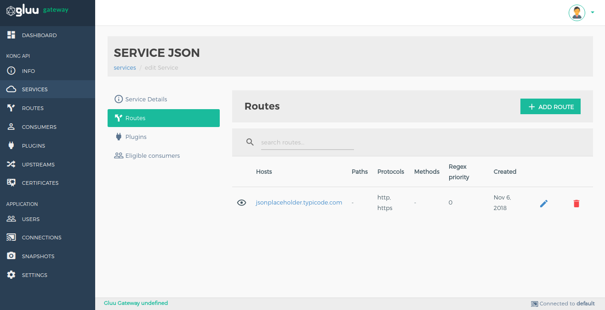
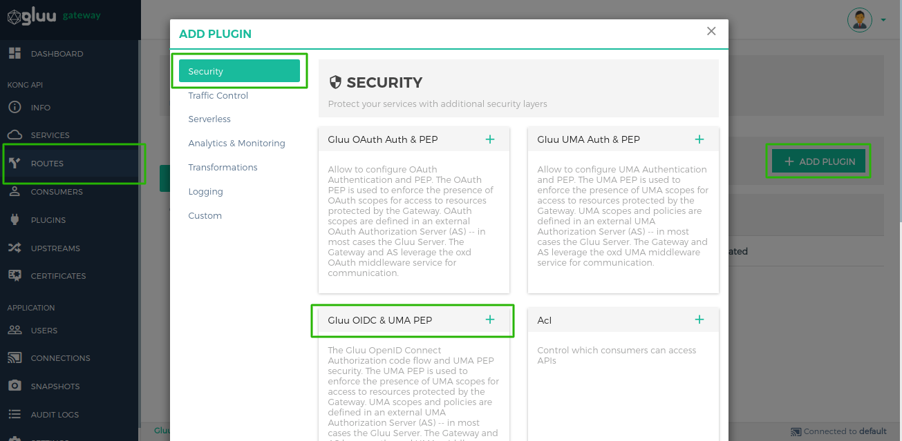
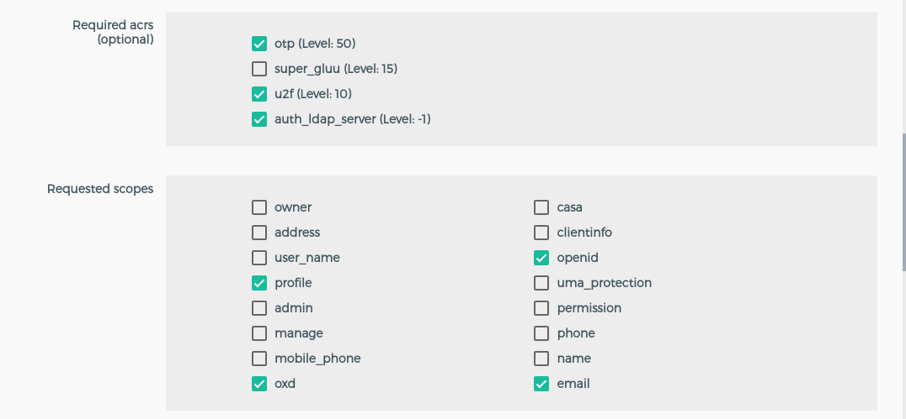
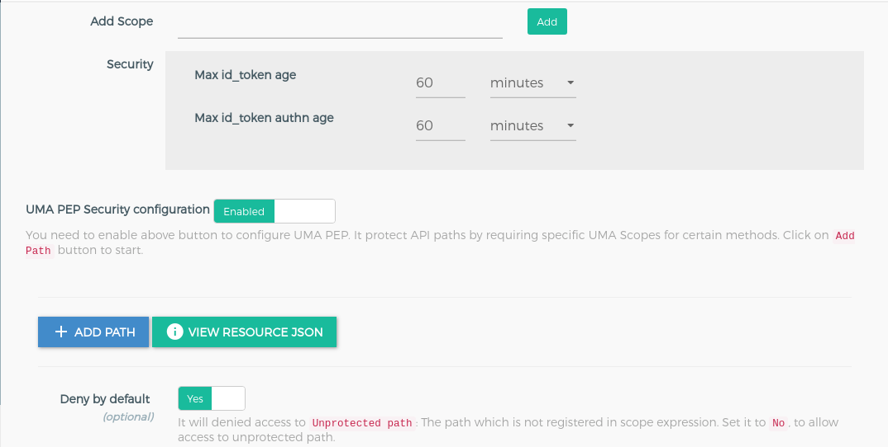
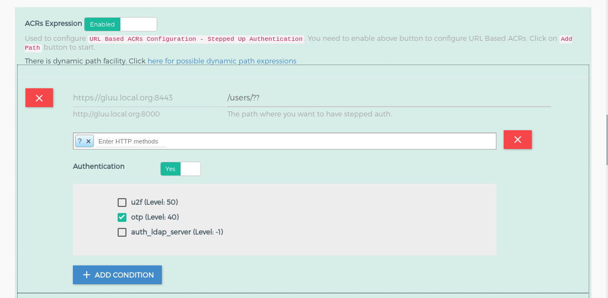
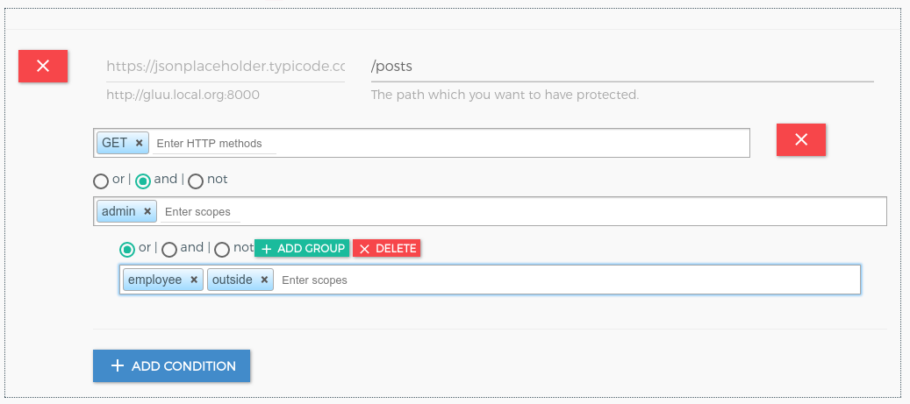

# Gluu OpenID Connect and UMA
## Overview
The Gluu OpenID Connect Authorization code flow and UMA PEP security. The UMA PEP is used to enforce the presence of UMA scopes for access to resources protected by the Gateway. You can optionally configure UMA PEP with OpenID Connect plugin also you can configure UMA-PEP to add claim gathering security. 

There are two plugins for OAuth security.

   1. **gluu-openid-connect**: Authenticate user using OpenID Connect authorization code flow. The plugin priority is `997`.
   1. **gluu-uma-pep**: Authorization by UMA scopes. The plugin priority is `995`. `obtain_rpt` and `redirect_claim_gathering_url`, you need to set this two properties for integrate UMA-PEP plugin with OpenID Connect plugin

## Configuration

We recommend enabling the plugin on Route Object because plugin needs correct redirect_uri, post_logout_uri and claim_gathering_uri for authorization code flow.

!!! Important
    konga.log also shows the curl commands for all API requests to Kong and oxd made by the Konga GUI. This curl command can be used to automate configuration instead of using the web interface.

#### Add Route using GG UI

Use [Manage Service Section](../admin-gui/#service-routes) to add a route using GG UI.



#### Add Route using Kong Admin API

```
$ curl -X POST \
    http://<kong_hostname>:8001/routes \
    -H 'Content-Type: application/json' \
    -d '{
    "hosts": [
      "<your_host.com>"
    ],
    "service": {
      "id": "<kong_service_object_id>"
    }
  }'
```

!!! Information
    There are several possibilities for what to put in the `hosts` field. One technique is to send the request to a proxy. See more information and possibilities in the [Proxy reference](https://docs.konghq.com/0.14.x/proxy/) Kong Documents.

#### Configure Route Plugin using GG UI

Use the [Manage Route](../admin-gui/#manage-route) section in the GG UI to enable the Gluu UMA PEP plugin. In the security category, there is a Gluu UMA PEP box. Click on the **+** icon to enable the plugin.



Clicking on the **+** icon will bring up the below form.



If you do not want to configure UMA-PEP then you just need to disable it using the button which is just beside of heading "UMA PEP Security Expression". You can see in below screenshot.



#### Configure Route Plugin using Kong Admin API

Configuration for `gluu-openid-connect` plugin

```
$ curl -X POST \
  http://<kong_hostname>:8001/plugins \
  -H 'Content-Type: application/json' \
  -d '{
  "name": "gluu-openid-connect",
  "config": {
    "oxd_url": "<your_oxd_server_url>",
    "op_url": "<your_op_server_url>",
    "oxd_id": "<oxd_id>",
    "client_id": "<client_id>",
    "client_secret": "<client_secret>",
    "authorization_redirect_path": "/callback",
    "post_logout_redirect_path_or_url": "/logout_redirect_uri",
    "logout_path": "/logout",
    "required_acrs": [
      "auth_ldap_server",
      "u2f",
      "otp"
    ],
    "requested_scopes": [
      "openid",
      "oxd",
      "email",
      "profile"
    ],
    "max_id_token_auth_age": 3600,
    "max_id_token_age": 3600
  },
  "route_id": "<kong_route_object_id>"
}'
```

Configuration for `gluu-uma-pep` plugin

```
$ curl -X POST \
  http://<kong_hostname>:8001/plugins \
  -H 'Content-Type: application/json' \
  -d '{
  "name": "gluu-uma-pep",
  "config": {
    "oxd_url": "<your_oxd_server_url>",
    "op_url": "<your_op_server_url>",
    "oxd_id": "<oxd_id>",
    "client_id": "<client_id>",
    "client_secret": "<client_secret>",
    "obtain_rpt": true,
    "redirect_claim_gathering_url": true,
    "claims_redirect_path": "/claims_callback",
    "deny_by_default": false,
    "require_id_token": true,
    "uma_scope_expression": [
      {
        "path": "/posts",
        "conditions": [
          {
            "httpMethods": [
              "GET"
            ],
            "scope_expression": {
              "rule": {
                "and": [
                  {
                    "var": 0
                  },
                  {
                    "var": 1
                  }
                ]
              },
              "data": [
                "admin",
                "employee"
              ]
            }
          }
        ]
      }
    ],
  },
  "route_id": "<kong_route_object_id>"
}'
```


### Parameters

Here is a list of all the parameters which can be used in this plugin's configuration.

#### gluu-openid-connect 

| field | Default | Description |
|-------|---------|-------------|
|**op_url**||The URL of your OP server. Example: https://op.server.com|
|**oxd_url**||The URL of your oxd server. Example: https://oxd.server.com|
|**oxd_id**|| The ID for an existing client, used to introspect the token. If left blank, a new client will be registered dynamically |
|**client_id**|| An existing client ID, used to get a protection access token to access the introspection API. Required if an existing oxd ID is provided.|
|**client_secret**|| An existing client secret, used to get protection access token to access the introspection API. Required if an existing oxd ID is provided.|
|**authorization_redirect_path**|| Redirect URL for your OP Client. You just need to set path here like `/callback` but you need to register OP Client with full URL like `https://kong.proxy.com/callback`. GG UI creates OP client for you and also register the gluu-openid-connect plugin.|
|**logout_path**|| Use this endpoint to request logout. Example: `/logout`|
|**post_logout_redirect_path_or_url**||Post logout redirect URL for your OP Client. You can set here internal kong proxy path(example: `/post_logout`) or you can set any external url also|
|**requested_scopes**||Scopes: ['email', 'openid', 'profile']|
|**required_acrs**||ARCS: ['u2f', 'otp', 'basic']|
|**max_id_token_age**||Maximum age of `id token` in seconds |
|**max_id_token_auth_age**||Maximum authentication age of `id_token` in seconds |

#### gluu-uma-pep 

| field | Default | Description |
|-------|---------|-------------|
|**op_url**||The URL of your OP server. Example: https://op.server.com|
|**oxd_url**||The URL of your oxd server. Example: https://oxd.server.com|
|**oxd_id**|| The ID for an existing client, used to introspect the token. If left blank, a new client will be registered dynamically |
|**client_id**|| An existing client ID, used to get a protection access token to access the introspection API. Required if an existing oxd ID is provided.|
|**client_secret**|| An existing client secret, used to get protection access token to access the introspection API. Required if an existing oxd ID is provided.|
|**uma_scope_expression**|| Used to add scope security on an UMA scope token.|
|**ignore_scope**| false | If true, will not check any token scopes while authenticating.|
|**deny_by_default**| true | For paths not protected by UMA scope expressions. If true, denies unprotected paths.|
|**require_id_token**|false| This is for Push Claim token. if it is true then it will use id_token for push claim token for getting RPT|
|**obtain_rpt**|false|It is used to get RPT when you configure `gluu-openid-connect` plugin with `gluu-uma-pep`|
|**claims_redirect_path**||Claims redirect URL in claim gathering flow for your OP Client. You just need to set path here like `/claim-callback` but you need to register OP Client with full URL like `https://kong.proxy.com/claim-callback`. GG UI creates OP client for you and also configure the `gluu-openid-connect` and `gluu-uma-pep` plugin.|
|**redirect_claim_gathering_url**|false|It used to tell plugin that if `need_info` response comes in claim gathering situation then redirect it for claim gathering.|


!!! Note
    GG UI can create a dynamic client. However, if the Kong Admin API is used for plugin configuration, it requires an existing client using the oxd API, then passing the client's credentials to the Gluu-OpenID-Connect and Gluu-UMA-PEP plugin.

#### UMA Scope Expression

The UMA Scope Expression is a JSON expression, used to register the resources in a resource server. See more details in the [Gluu Server docs](https://gluu.org/docs/ce/api-guide/uma-api/#uma-permission-registration-api).

For example, to protect an API:

```
[
  {
    "path": "/images",
    "conditions": [
      {
        "httpMethods": [
          "GET"
        ],
        "scope_expression": {
          "rule": {
            "and": [
              {
                "var": 0
              },
              {
                "or": [
                  {
                    "var": 1
                  },
                  {
                    "var": 2
                  }
                ]
              }
            ]
          },
          "data": [
            "admin",
            "employee",
            "ouside"
          ]
        }
      }
    ]
  }
]
```



At runtime, the plugin sends a request to the RS with an RPT token and checks the permission for requested resources.

#### Dynamic Resource Protection

There are 3 elements to make more dynamic path registration and protection:

- ? match any one path element
- ?? match zero or more path elements
- {regexp} - match single path element against PCRE

The priority for the elements are:

1. Exact match
1. Regexp match
1. ?
1. ??

!!! Note
    slash(/) is required before multiple wildcards placeholder.
    
Examples: 

Assume that below all path is register in one plugin

| Register Path | Allow path | Deny path |
|---------------|------------|-----------|
| `/folder/file.ext` | <ul><li>/folder/file.ext</li></ul> | <ul><li>/folder/file</li></ul> |
| `/folder/?/file` | <ul><li>/folder/123/file</li> <li>/folder/xxx/file</li></ul> | |
| `/path/??` | <ul><li>/path/</li> <li>/path/xxx</li> <li>/path/xxx/yyy/file</li></ul> | <ul><li>/path - Need slash at last</li></ul> |
| `/path/??/image.jpg` | <ul><li>/path/one/two/image.jpg</li> <li>/path/image.jpg</li></ul> | |
| `/path/?/image.jpg` | <ul><li>/path/xxx/image.jpg - ? has higher priority than ??</li></ul> | |
| `/path/{abc|xyz}/image.jpg` | <ul><li>/path/abc/image.jpg</li> <li>/path/xyz/image.jpg</li></ul> | |
| `/users/?/{todos|photos}` | <ul><li>/users/123/todos</li> <li>/users/xxx/photos</li></ul> | |
| `/users/?/{todos|photos}/?` | <ul><li>/users/123/todos/</li> <li>/users/123/todos/321</li> <li>/users/123/photos/321</li></ul> | |


## Usage

### Security & Access Proxy

After configuration just hit your proxy endpoint in browser.

!!! Note
    Kong normally provides the 8443 port for https by default, but during the setup script installation, it is changed to 443.

## Upstream Headers

When a client has been authenticated, the plugin will append some headers to the request before proxying it to the upstream service to identify the consumer and the end user in the code:

1. **X-OpenId-Connect-idtoken**, Base64 encoded ID Token JSON.
1. **X-OpenId-Connect-userinfo**, Base64 encoded Userinfo JSON.


