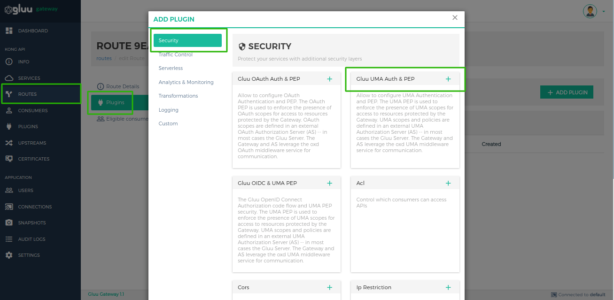
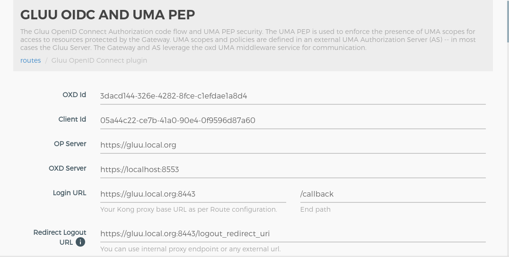

# Gluu OpenID Connect and UMA
## Overview
The Gluu OpenID Connect Authorization code flow and UMA PEP security. The UMA PEP is used to enforce the presence of UMA scopes for access to resources protected by the Gateway. You can optionally configure UMA PEP with OpenID Connect plugin also you can configure UMA-PEP to add claim gathering security. 

There are two plugins for OAuth security.

   1. **gluu-openid-connect**: Authenticate user using OpenID Connect authorization code flow. The plugin priority is `997`.
   1. **gluu-uma-pep**: Authorization by UMA scopes. The plugin priority is `995`. `obtain_rpt` and `redirect_claim_gathering_url`, you need to set this two properties for integrate UMA-PEP plugin with OpenID Connect plugin

## Configuration

We recommend enabling the plugin on Route Object because plugin needs correct redirect_uri, post_logout_uri and claim_gathering_uri for authorization code flow.

!!! Important
    konga.log also shows the curl commands for all API requests to Kong and oxd made by the Konga GUI. This curl command can be used to automate configuration instead of using the web interface.

#### Add Route using GG UI

Use [Manage Service Section](../admin-gui/#service-routes) to add a route using GG UI.


#### Add Route using Kong Admin API

```
$ curl -X POST \
    http://<kong_hostname>:8001/routes \
    -H 'Content-Type: application/json' \
    -d '{
    "hosts": [
      "<your_host.com>"
    ],
    "service": {
      "id": "<kong_service_object_id>"
    }
  }'
```

!!! Information
    There are several possibilities for what to put in the `hosts` field. One technique is to send the request to a proxy. See more information and possibilities in the [Proxy reference](https://docs.konghq.com/0.14.x/proxy/) Kong Documents.

#### Configure Route Plugin using GG UI

Use the [Manage Route](../admin-gui/#manage-route) section in the GG UI to enable the Gluu UMA PEP plugin. In the security category, there is a Gluu UMA PEP box. Click on the **+** icon to enable the plugin.



Clicking on the **+** icon will bring up the below form.



#### Configure Route Plugin using Kong Admin API

Configuration for `gluu-openid-connect` plugin

```
$ curl -X POST \
  http://<kong_hostname>:8001/plugins \
  -H 'Content-Type: application/json' \
  -d '{
  "name": "gluu-openid-connect",
  "config": {
    "oxd_url": "<your_oxd_server_url>",
    "op_url": "<your_op_server_url>",
    "oxd_id": "<oxd_id>",
    "client_id": "<client_id>",
    "client_secret": "<client_secret>",
    "authorization_redirect_path": "/callback",
    "post_logout_redirect_path_or_url": "/logout_redirect_uri",
    "logout_path": "/logout",
    "required_acrs": [
      "auth_ldap_server",
      "u2f",
      "otp"
    ],
    "requested_scopes": [
      "openid",
      "oxd",
      "email",
      "profile"
    ],
    "max_id_token_auth_age": 3600,
    "max_id_token_age": 3600
  },
  "route_id": "<kong_route_object_id>"
}'
```

Configuration for `gluu-uma-pep` plugin

```
$ curl -X POST \
  http://<kong_hostname>:8001/plugins \
  -H 'Content-Type: application/json' \
  -d '{
  "name": "gluu-uma-pep",
  "config": {
    "oxd_url": "<your_oxd_server_url>",
    "op_url": "<your_op_server_url>",
    "oxd_id": "<oxd_id>",
    "client_id": "<client_id>",
    "client_secret": "<client_secret>",
    "obtain_rpt": true,
    "redirect_claim_gathering_url": true,
    "deny_by_default": false,
    "require_id_token": true,
    "uma_scope_expression": [
      {
        "path": "/posts",
        "conditions": [
          {
            "httpMethods": [
              "GET"
            ],
            "scope_expression": {
              "rule": {
                "and": [
                  {
                    "var": 0
                  },
                  {
                    "var": 1
                  }
                ]
              },
              "data": [
                "admin",
                "employee"
              ]
            }
          }
        ]
      }
    ],
  },
  "route_id": "<kong_route_object_id>"
}'
```


### Parameters

Here is a list of all the parameters which can be used in this plugin's configuration.

| field | Default | Description |
|-------|---------|-------------|
|**op_url**||The URL of your OP server. Example: https://op.server.com|
|**oxd_url**||The URL of your oxd server. Example: https://oxd.server.com|
|**oxd_id**|| The ID for an existing client, used to introspect the token. If left blank, a new client will be registered dynamically |
|**client_id**|| An existing client ID, used to get a protection access token to access the introspection API. Required if an existing oxd ID is provided.|
|**client_secret**|| An existing client secret, used to get protection access token to access the introspection API. Required if an existing oxd ID is provided.|
|**uma_scope_expression**|| Used to add scope security on an UMA scope token.|
|**ignore_scope**| false | If true, will not check any token scopes while authenticating.|
|**deny_by_default**| true | For paths not protected by UMA scope expressions. If true, denies unprotected paths.|
|**anonymous**||An optional string (consumer UUID) value to use as an “anonymous” consumer if authentication fails. If empty (default), the request will fail with an authentication failure 4xx. This value must refer to the Consumer ID attribute that is internal to Kong, and not its custom_id.|
|**hide_credentials**|false|An optional boolean value telling the plugin to show or hide the credential from the upstream service. If true, the plugin will strip the credential from the request (i.e. the Authorization header) before proxying it.|

!!! Note
    GG UI can create a dynamic client. However, if the Kong Admin API is used for plugin configuration, it requires an existing client using the oxd API, then passing the client's credentials to the Gluu-UMA-PEP plugin.

#### UMA Scope Expression

The UMA Scope Expression is a JSON expression, used to register the resources in a resource server. See more details in the [Gluu Server docs](https://gluu.org/docs/ce/api-guide/uma-api/#uma-permission-registration-api).

!!! Note
    Enable and disable the UMA scope expression by setting `ignore_scope` to `true`.

For example, to protect an API:

```
[
  {
    "path": "/images",
    "conditions": [
      {
        "httpMethods": [
          "GET"
        ],
        "scope_expression": {
          "rule": {
            "and": [
              {
                "var": 0
              },
              {
                "or": [
                  {
                    "var": 1
                  },
                  {
                    "var": 2
                  }
                ]
              }
            ]
          },
          "data": [
            "admin",
            "employee",
            "ouside"
          ]
        }
      }
    ]
  }
]
```


At runtime, the plugin sends a request to the RS with an RPT token and checks the permission for requested resources.

#### Dynamic Resource Protection

To protect a dynamic resource with UMA or OAuth scopes, secure the parent path. For example, securing `folder` with a chosen scope will secure both `/folder` and `/folder/[id]`. Any protection on the parent will be applied to its children, unless different protection is explicitly defined.

Example use cases for different resource security rules:

- Rule1 for path GET /root                  `{scope: a and b}`

- Rule2 for path GET /root/folder1          `{scope: c}`

- Rule3 for path GET /root/folder1/folder2  `{scope: d}`

```
GET /root                                  --> Apply Rule1
GET /root/1                                --> Apply Rule1
GET /root/one                              --> Apply Rule1
GET /root/one/two                          --> Apply Rule1
GET /root/two?id=df4edfdf                  --> Apply Rule1

GET /root/folder1                          --> Apply Rule2
GET /root/folder1/1                        --> Apply Rule2
GET /root/folder1?id=dfdf454gtfg           --> Apply Rule2
GET /root/folder1/one/two                  --> Apply Rule2
GET /root/folder1/one/two/treww?id=w4354f  --> Apply Rule2

GET /root/folder1/folder2/1                --> Apply Rule3
GET /root/folder1/folder2/one/two          --> Apply Rule3
GET /root/folder1/folder2/dsd545df         --> Apply Rule3
GET /root/folder1/folder2/one?id=fdfdf     --> Apply Rule3
```

## Usage

### Create Client

Create a client using [create client consumer section](../admin-gui/#create-client). Use the oxd `register-site` API to create a client.

### Create Consumer

A client credential needs to be associated with an existing Consumer object. To create a Consumer, use the [Consumer section](../admin-gui/#consumers).

Create a consumer using the Kong Admin API.

```
$ curl -X POST \
    http://<kong_hostname>:8001/consumers \
    -H 'Content-Type: application/json' \
    -d '{
  	"username": "<kong_consumer_name>",
  	"custom_id": "<gluu_client_id>"
  }'
```

### Security & Access Proxy

To access a proxy upstream API, pass an UMA RPT token in the authorization header. Generate the UMA RPT token using OP Client credentials by sending a request to the oxd APIs.

For example, to access a Kong proxy using an UMA token:

```
curl -X GET \
  http://<kong_hostname>:8000/{path matching a configured Route} \
  -H 'Authorization: Bearer <uma_rpt_token>' \
```

!!! Note
    Kong normally provides the 8443 port for https by default, but during the setup script installation, it is changed to 443.

## Upstream Headers

When a client has been authenticated, the plugin will append some headers to the request before proxying it to the upstream service to identify the consumer and the end user in the code:

1. **X-Consumer-ID**, the ID of the Consumer on Kong
1. **X-Consumer-Custom-ID**, the custom_id of the Consumer (if set)
1. **X-Consumer-Username**, the username of the Consumer (if set)
1. **X-OAUTH-Client-ID**, the authenticated client ID (only if the consumer is not an 'anonymous' consumer)
1. **X-RPT-Expiration**, the token expiration time, integer timestamp, measured in the number of seconds since January 1, 1970 UTC, indicating when this token will expire, as defined in JWT RFC7519. It is only returned if the consumer is not set to 'anonymous'.
1. **X-Anonymous-Consumer**, will be set to true when authentication fails, and the 'anonymous' consumer is set instead.

This information can be used to implement additional logic. For example, use the X-Consumer-ID value to query the Kong Admin API and retrieve more information about the Consumer.

