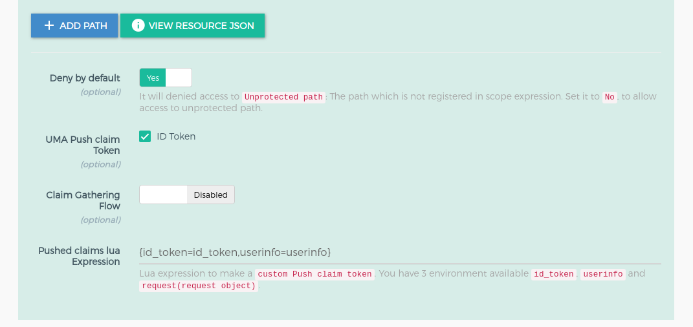

# Gluu OpenID Connect and UMA
## Overview
The `gluu-openid-connect` plugin allows you to integrate with Gluu CE Identity Provider(IdP). This plugin working as a proxy OAuth 2.0 resource server(RS) and/or as an OpenID Connect relying party(RP) between the client and the upstream service. 

Plugin providing you the `OpenID Connect Authorization code flow`. You just need to add your upstream service(your website) and `gluu-openid-connect` Plugin, after this when user request to the kong proxy, plugin will redirect user to IdP for authentication, IdP validate the user, redirect back to kong proxy, plugin validate the `id_token` and allows to access to the resources. 

We added a very powerful feature in `gluu-uma-pep` plugin which provides `UMA Claim gathering` authorization. which is easily integrate with `gluu-openid-connect` plugin. After successful user authentication, `gluu-openid-connect` communicate with `gluu-uma-pep` plugin by passing a valid `id_token`. The `gluu-uma-pep` plugin asks the authenticated user to provide some more extra information(claims) to authorize the user. This is used to authorize the user.

Below are the following features available in `gluu-openid-connect` plugin:

- User authentication using **OpenID Connect Authorization code flow** and `ID Token` verification.
- Configurable `ID Token` based authentication user session. This setting used to configure user login session time.
- Stepped-up authentication which is URL Based `acr_values` resource registration and configuration which forces a user to go through one more step to access the resources. For more details check [Gluu CE Docs](https://gluu.org/docs/ce/4.0/admin-guide/openid-connect/#authentication) for all available acr technique available in Gluu CE.
- `required_acrs_expression` feature where you have more control to authenticate the resources. You can easily add or remove the authentication on the register resources(URL Path).
- Easy integration and communication with `gluu-uma-pep` plugin for user authorization i.e. `UMA Claim gathering`. You just need to add the `gluu-uma-pep`. 
- Easy integration and communication with `gluu-opa-pep` plugin for user authorization. Check [`gluu-opa-pep`](../plugin/gluu-opa-pep.md) docs for more details.

There are two plugins for OAuth security.

   1. **gluu-openid-connect**: Authenticate user using OpenID Connect authorization code flow. The plugin priority is `997`.
   1. **gluu-uma-pep**: Authorization by UMA scopes. The plugin priority is `995`. `obtain_rpt` and `redirect_claim_gathering_url`, you need to set these two properties for integrating UMA-PEP plugin with OpenID Connect plugin

## Configuration

We recommend enabling the plugin on Route Object because plugin needs correct `redirect_uri`, `post_logout_uri` and `claim_gathering_uri` for authorization code flow.

!!! Important
    konga.log also shows the curl commands for all API requests to Kong and oxd made by the Konga GUI. This curl command can be used to automate configuration instead of using the web interface.

### Add Service

Follow these step to add Service using GG UI
 
- Click [`SERVICES`](../../admin-gui.md/#services) on the left panel
- Click on [`+ ADD NEW SERVICE`](../../admin-gui/#add-service) button
- Fill the form by your upstream service details

### Add Route

Follow these steps to add a route:

- Click on `service name` or `edit` button of above added service
- Click [`ROUTES`](../../admin-gui/#routes)
- Click the [`+ ADD ROUTE`](../../admin-gui/#add-route) button
- Fill the form by routing details. Check kong docs for more routing capabilities [here](https://docs.konghq.com/0.14.x/proxy/#routes-and-matching-capabilities).


### Add Plugin

Follow these steps to add `gluu-openid-connect` plugin:

- Click [`ROUTES`](../../admin-gui/#routes) on the left panel
- Click on `route id/name` or `edit` button
- Click on [`Plugins`](../../admin-gui/#route-plugins)
- Click on `+ ADD PLUGIN` button
- You will see `Gluu OIDC & UMA PEP` title and `+` icon in pop-up.


Clicking on the `+` icon will bring up the below form.


This section is used to add the `URL Based ACR feature`. Check [here](#dynamic-url-base-acrs-stepped-up-authentication) for more description to configure acr expression. If you do not want to configure the `ACR expression` then just disable using the button which is at the top beside the title. In `no acr expression` case, authentication flow executes with any acr, you may need to set acr at your OP Server side.


This section is used to add the `gluu-uma-pep` plugin. Check [here](#uma-scope-expression) for more description to configure uma expression. If you do not want to add `gluu-uma-pep` plugin, you just need to disable it using the button which is just beside of heading "UMA PEP Security Expression". You can see in below screenshot.




#### Configure Plugin using Kong Admin API

!!! Note
    Use [OXD API](https://gluu.org/docs/oxd/4.0/) for [client registration](https://gluu.org/docs/oxd/4.0/api/#register-site) and [UMA resource registration](https://gluu.org/docs/oxd/4.0/api/#uma-rs-protect-resources).

Configuration for `gluu-openid-connect` plugin. See [here](#gluu-openid-connect) all available parameters for plugin.

```
$ curl -X POST \
  http://<kong_hostname>:8001/plugins \
  -H 'Content-Type: application/json' \
  -d '{
  "name": "gluu-openid-connect",
  "config": { <parameters> },
  "route": { "id": "<kong_route_object_id>" }
}'
```

Configuration for `gluu-uma-pep` plugin. See [here](#gluu-uma-pep) all available parameters for plugin.

```
$ curl -X POST \
  http://<kong_hostname>:8001/plugins \
  -H 'Content-Type: application/json' \
  -d '{
  "name": "gluu-uma-pep",
  "config": { <parameters> },
  "route": { "id": "<kong_route_object_id>" }
}'
```

### Parameters

Here is a list of all the parameters which can be used in this plugin's configuration.

#### Gluu-OpenID-Connect

| field | Default | Description |
|-------|---------|-------------|
|**op_url**||The URL of your OP server. Example: https://op.server.com|
|**oxd_url**||The URL of your oxd server. Example: https://oxd.server.com|
|**oxd_id**|| The ID for an existing client, used to introspect the token. If left blank, a new client will be registered dynamically |
|**client_id**|| An existing client ID, used to get a protection access token to access the introspection API. Required if an existing oxd ID is provided.|
|**client_secret**|| An existing client secret, used to get protection access token to access the introspection API. Required if an existing oxd ID is provided.|
|**authorization_redirect_path**|| Redirect URL for your OP Client. You just need to set path here like `/callback` but you need to register OP Client with full URL like `https://kong.proxy.com/callback`. GG UI creates OP client for you and also register the gluu-openid-connect plugin.|
|**logout_path**|| Use this endpoint to request logout. Example: `/logout`. When you request this endpoint, plugin will first clear the current session and then redirect to OP for logout.|
|**post_logout_redirect_path_or_url**||Post logout redirect URL for your OP Client. You can set here internal kong proxy path(example: `/post_logout`) or you can set any external url also|
|**requested_scopes**||Scopes: ['email', 'openid', 'profile']|
|**required_acrs_expression**(optional)||Check [here](#dynamic-url-base-acrs-stepped-up-authentication) for details|
|**max_id_token_age**||Maximum age of `id token` in seconds |
|**max_id_token_auth_age**||Maximum authentication age of `id_token` in seconds |

#### Dynamic URL Base ACRs stepped up authentication

It is stringify json, Used to configure URL Based ACRs Configuration - Stepped Up Authentication. If you do not configure ACR expression, authentication flow will execute with any acr, you may need to set acr at your IdP side. Below is the structure of the `required_acrs_expression`.

- `path`: it is your url which you want to protect. There is regular expression facility for path configuration. Check [here](../common-features/#dynamic-resource-protection) for more dynamic path registration details.
    - `condition`: it is the array of conditions for the path where you can define acr values to the path. You can add multiple conditions with different Http Method.
        - `httpMethods`: it is HTTP Method. During authentication, the plugin uses it as a filter for the request. **`?`** in the HTTP method allow all the http methods. It should be in a capital case. e.g. GET, POST, PUT.
        - `no_auth`: If it is true then plugin doesn't perform any authentication and just allow the requested resources. If it is false that means you want to add authentication and for that, you need to configure `required_acrs`.
        - `required_acrs`: It is used to specify the `acr` values which you wanted to apply on a path.

Example of JSON expression
```
[
  {
    "path": "/users/??",
    "conditions": [
      {
        "httpMethods": [
          "?"
        ],
        "no_auth": false,
        "required_acrs": [
          "otp"
        ]
      }
    ]
  },
  {
    "path": "/??",
    "conditions": [
      {
        "httpMethods": [
          "?"
        ],
        "no_auth": false,
        "required_acrs": [
          "auth_ldap_server"
        ]
      }
    ]
  },
  {
    "path": "/home/??",
    "conditions": [
      {
        "httpMethods": [
          "?"
        ],
        "no_auth": true
      }
    ]
  }
]
```

JSON expression in string format(stringify json)
```
"[{\"path\":\"/users/??\",\"conditions\":[{\"httpMethods\":[\"?\"],\"no_auth\":false,\"required_acrs\":[\"otp\"]}]},{\"path\":\"/??\",\"conditions\":[{\"httpMethods\":[\"?\"],\"no_auth\":false,\"required_acrs\":[\"auth_ldap_server\"]}]},{\"path\":\"/home/??\",\"conditions\":[{\"httpMethods\":[\"?\"],\"no_auth\":true}]}]"
```

!!! Info
    `?` in the HTTP method means to allow all the http methods.


As per the above example, 

- For `/users/??` path, GG will initiate the `OTP` stepped up authentication 
- For other paths `/??`, GG will perform the `auth_ldap_server` authentication
- For `/home` there is `no_auth = true` set, which means the plugin will not perform any authentication. You just need to set `no_auth = true` for a path where you do not want to perform any authentication and just serve the request resources. 

#### Gluu-UMA-PEP 

| field | Default | Description |
|-------|---------|-------------|
|**op_url**||The URL of your OP server. Example: https://op.server.com|
|**oxd_url**||The URL of your oxd server. Example: https://oxd.server.com|
|**oxd_id**|| The ID for an existing client used to introspect the token. If left blank, a new client will be registered dynamically |
|**client_id**|| An existing client ID used to get a protection access token to access the introspection API. Required if an existing oxd ID is provided.|
|**client_secret**|| An existing client secret, used to get a protection access token to access the introspection API. Required if an existing oxd ID is provided.|
|**uma_scope_expression**|| Used to add scope security on an UMA scope token. The UMA Scope Expression is a JSON expression, used to register the resources in a resource server. See more details in the [Gluu Server docs](https://gluu.org/docs/ce/admin-guide/uma/#scopes-expressions). You can register a more dynamic path, there are 3 elements to make more dynamic path registration and protection. Check [here](../common-features/#dynamic-resource-protection) for more details.|
|**deny_by_default**| true | For paths not protected by UMA scope expressions. If true, denies unprotected paths.|
|**require_id_token**|false| This is for Push Claim token. if it is true then it will use id_token for push claim token for getting RPT|
|**obtain_rpt**|false|It is used to get RPT when you configure `gluu-openid-connect` plugin with `gluu-uma-pep`|
|**claims_redirect_path**||Claims redirect URL in claim gathering flow for your OP Client. You just need to set path here like `/claim-callback` but you need to register OP Client with full URL like `https://kong.proxy.com/claim-callback`. GG UI creates OP client for you and also configure the `gluu-openid-connect` and `gluu-uma-pep` plugin.|
|**redirect_claim_gathering_url**|false|It used to tell the plugin that if `need_info` response comes in claim gathering situation then redirect it for claim gathering.|
|**method_path_tree**||It is for plugin internal use. We use it for tree level matching for dynamic paths which registered in `uma_scope_expression`| 

!!! Note
    GG UI can create a dynamic client. However, if the Kong Admin API is used for plugin configuration, it requires an existing client using the oxd API, then passing the client's credentials to the Gluu-OpenID-Connect and Gluu-UMA-PEP plugin.

## Usage

### Security & Access Proxy

After configuration just hit your proxy endpoint in a browser.

!!! Note
    Kong normally provides the 8443 port for https by default, but during the setup script installation, it is changed to 443.

## Upstream Headers

When a client has been authenticated, the plugin will append some headers to the request before proxying it to the upstream service to identify the consumer and the end-user in the code:

1. **X-OpenId-Connect-idtoken**, Base64 encoded ID Token JSON.
1. **X-OpenId-Connect-userinfo**, Base64 encoded Userinfo JSON.


