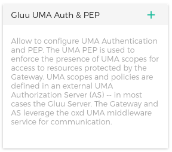
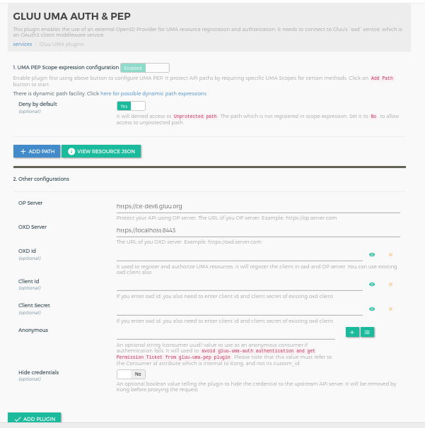

# Gluu UMA Auth and UMA PEP
## Overview
The UMA Auth and UMA PEP are used for client authentication and to enforce the presence of UMA scopes for access to resources protected by the Gateway. UMA scopes and policies are defined in an external UMA Authorization Server (AS) -- in most cases the Gluu Server. The Gateway and AS leverage the oxd UMA middleware service for communication. 

There are two plugins for OAuth security.

   1. **gluu-uma-auth**: Authenticate client by UMA RPT Token. The plugin priority is `998`.
   1. **gluu-uma-pep**: Authorization by UMA Scope security. The plugin priority is `995`.

The plugin supports two tokens:  

   1. **Default Access Token**: The plugin will authenticate the token using introspection.   
   1. **Access Token as JWT**: The plugin will authenticate the token using JWT verify. Currently, three algorithms are supported: **RS256**, **RS384** and **RS512**.

## Configuration

Plugins can be configured at the **Service**, **Route** or **Global** level. There are several possibilities for plugin configuration with services and routes. For information on plugin precedence, [read the Kong docs](https://docs.konghq.com/0.14.x/admin-api/#precedence).

!!! Important
    During plugin configuration, the **GG UI** creates a new OP Client if the **oxd ID** is left blank. However, if configuring with the **Kong Admin API**, existing client credentials must be used.

!!! Important
    konga.log also shows the curl commands for all API requests to Kong and oxd made by the Konga GUI. This curl command can be used to automate configuration instead of using the web interface.


### Service Level

1. Add Service

      Follow these step to add Service using GG UI:
 
      - Click [`SERVICES`](../../admin-guide/services-routes-config/) on the left panel
      - Click on [`+ ADD NEW SERVICE`](../../admin-guide/services-routes-config/) button
      - Fill the form by your upstream service details

1. Add Route

      Route is recommended to reach at kong proxy. Follow these steps to add route:
      
      - Click on `service name` or `edit` button of above added service
      - Click [`ROUTES`](../../admin-guide/services-routes-config/#create-a-new-route-attached-to-the-service)
      - Click the [`+ ADD ROUTE`](../../admin-guide/services-routes-config/#create-a-new-route-attached-to-the-service) button
      - Fill the form by routing details. Check kong docs for more routing capabilities [here](https://docs.konghq.com/0.14.x/proxy/#routes-and-matching-capabilities).

1. Add Plugins

     Follow these steps to add plugins:

     - Click [`SERVICES`](../../admin-guide/services-routes-config/) on the left panel
     - Click on `name` or `edit` button
     - Click on [`Plugins`](../../admin-guide/services-routes-config/#create-a-new-route-attached-to-the-service)
     - Click on `+ ADD PLUGIN` button
     - You will see `Gluu UMA Auth & PEP` title and `+` icon in pop-up
     - Click here for [next](#add-plugin) step
     
### Route Level

1. Add Service

      Follow these step to add Service using GG UI
 
      - Click [`SERVICES`](../../admin-guide/services-routes-config/) on the left panel
      - Click on [`+ ADD NEW SERVICE`](../../admin-guide/services-routes-config/) button
      - Fill the form by your upstream service details

1. Add Route

      Follow these steps to add route:
      
      - Click on `service name` or `edit` button of above added service
      - Click [`ROUTES`](../../admin-guide/services-routes-config/#create-a-new-route-attached-to-the-service)
      - Click the [`+ ADD ROUTE`](../../admin-guide/services-routes-config/#create-a-new-route-attached-to-the-service) button
      - Fill the form by routing details. Check kong docs for more routing capabilities [here](https://docs.konghq.com/0.14.x/proxy/#routes-and-matching-capabilities).

1. Add Plugins

     Follow these steps to add plugins:

     - Click [`ROUTES`](../../admin-guide/services-routes-config/#create-a-new-route-attached-to-the-service) on the left panel
     - Click on `route id/name` or `edit` button
     - Click on [`Plugins`](../../admin-guide/services-routes-config/#create-a-new-route-attached-to-the-service)
     - Click on `+ ADD PLUGIN` button
     - You will see `Gluu UMA Auth & PEP` title and `+` icon in pop-up
     - Click here for [next](#add-plugin) step

### Global Plugin

A global plugin will apply to all services and routes.

Follow these steps to add plugins:

   - Click `Plugins` on the left panel
   - You will see `Gluu UMA Auth & PEP` title and `+` icon in pop-up
   - Click here for [next](#add-plugin) step

### Add Plugin

You will see `Gluu UMA Auth & PEP` title and `+` icon in pop-up.



Clicking on the `+` icon will bring up the below form. Check [here](#parameters) for all the parameter descriptions.



#### Add Plugin using Kong API

!!! Note
    Use [OXD API](https://gluu.org/docs/oxd/4.0/) for [client registration](https://gluu.org/docs/oxd/4.0/api/#register-site).

Configuration for `gluu-uma-auth`. Check [here](#gluu-uma-auth) for parameter descriptions.

```
$ curl -X POST \
  http://<kong_hostname>:8001/plugins \
  -H 'Content-Type: application/json' \
  -d '{
  "name": "gluu-uma-auth",
  "config": { <parameters> },
  "route": { "id": "<kong_route_object_id>" }
}'
```

Configuration for `gluu-uma-pep`. Check [here](#gluu-uma-pep) for parameter descriptions.

```
$ curl -X POST \
  http://<kong_hostname>:8001/plugins \
  -H 'Content-Type: application/json' \
  -d '{
  "name": "gluu-uma-pep",
  "config": { <parameters> },
  "route": { "id": "<kong_route_object_id>" }
}'
```

The above example is passing `route` property which will add the plugin for route level.

| Request | For |
|---------|-----|
|`"route": { "id": "<kong_route_object_id>" }`|Plugin will add for kong route object|
|`"service": { "id": "<kong_service_object_id>" }`|Plugin will add for kong service object|
|  | If you not pass any `service` or `route`, it will add globally. Plugin will execute for any routes and services|

### Parameters

Here is a list of all the parameters which can be used in this plugin's configuration.

#### Gluu-UMA-Auth

| field | Default | Description |
|-------|---------|-------------|
|**op_url**||The URL of your OP server. Example: https://op.server.com|
|**oxd_url**||The URL of your oxd server. Example: https://oxd.server.com|
|**oxd_id**|| The ID for an existing client used to introspect the token. If left blank, a new client will be registered dynamically |
|**client_id**|| An existing client ID used to get a protection access token to access the introspection API. Required if an existing oxd ID is provided.|
|**client_secret**|| An existing client secret, used to get a protection access token to access the introspection API. Required if an existing oxd ID is provided.|
|**anonymous**||An required string (consumer Id) value to use as an “anonymous” consumer if authentication fails. You need to set the Anonymous consumer because it is used to bypass gluu-uma-auth authentication and help to get the ticket from gluu-uma-pep. |
|**pass_credentials**|pass|It allows 3 values. `pass`, `hide` and `phantom_token`. Used to operate the authorization header from the upstream service as per configuration. In `phantom_token` case, plugin will replace bearer token with new generated JWT(with introspection result) token, so for outside there is bearer token and JWT for internal use.|

#### Gluu-UMA-PEP 

| field | Default | Description |
|-------|---------|-------------|
|**op_url**||The URL of your OP server. Example: https://op.server.com|
|**oxd_url**||The URL of your oxd server. Example: https://oxd.server.com|
|**oxd_id**|| The ID for an existing client used to introspect the token. If left blank, a new client will be registered dynamically |
|**client_id**|| An existing client ID used to get a protection access token to access the introspection API. Required if an existing oxd ID is provided.|
|**client_secret**|| An existing client secret, used to get a protection access token to access the introspection API. Required if an existing oxd ID is provided.|
|**uma_scope_expression**|| Check [here](#uma-scope-expression) for description |
|**deny_by_default**| true | For paths not protected by UMA scope expressions. If true, denies unprotected paths.|
|**require_id_token**|false|It use when you configure `gluu-openid-connect` plugin. This is for the Push Claim token. if it is true then it will use id_token for push claim token for getting RPT|
|**obtain_rpt**|false|It is used to get RPT when you configure `gluu-openid-connect` plugin with `gluu-uma-pep`|
|**claims_redirect_path**||It use when you configure `gluu-openid-connect` plugin. Claims redirect URL in claim gathering flow for your OP Client. You just need to set path here like `/claim-callback` but you need to register OP Client with full URL like `https://kong.proxy.com/claim-callback`. GG UI creates OP client for you and also configure the `gluu-openid-connect` and `gluu-uma-pep` plugin.|
|**redirect_claim_gathering_url**|false|It use when you configure `gluu-openid-connect` plugin. It used to tell the plugin that if `need_info` response comes in claim gathering situation then redirect it for claim gathering.|
|**method_path_tree**||It is for plugin internal use. We use it for tree-level matching for dynamic paths which registered in `uma_scope_expression`| 


!!! Note
    GG UI can create a dynamic client. However, if the Kong Admin API is used for plugin configuration, it requires an existing client using the oxd API, then passing the client's credentials to the Gluu-UMA-PEP plugin.

#### Phantom Token

In some cases, there is a requirement that bearer token for outside of the network and JWT token for the internal network. Check [here](../common-features/#phantom-token) for more details.

#### UMA Scope Expression

It is stringify json. It used to register the resources in a resource server. See more details in the [Gluu Server docs](https://gluu.org/docs/ce/admin-guide/uma/#scopes-expressions).

!!! Important
    GG UI registers the resources for you during plugin configuration. If you are using APIs, you need to register `client` and `resources` using [OXD APIs](https://gluu.org/docs/oxd/4.0/api). You don't need to pass stringify json during resource registration using OXD API. It is required only in the plugin configuration.

- `path`: it is your url which you want to protect. There is a regular expression facility for path configuration. Check [here](../common-features/#dynamic-resource-protection) for more dynamic path registration details.
    - `condition`: it is the array of conditions for the path where you can define acr values to the path. You can add multiple conditions with different Http Method.
        - `httpMethods`: it is HTTP Method. During authentication, the plugin uses it as a filter for the request. **`?`** in the HTTP method allow all the http methods. It should be in a capital case. e.g. GET, POST, PUT.
        - `scope_expression`: It is the rules to check the values.
        - `data`: It is the data for the `scope_expression`.

Example of JSON expression
```
[
  {
    "path": "/users",
    "conditions": [
      {
        "httpMethods": [
          "GET"
        ],
        "scope_expression": {
          "rule": {
            "and": [
              {
                "var": 0
              },
              {
                "or": [
                  {
                    "var": 1
                  },
                  {
                    "var": 2
                  }
                ]
              }
            ]
          },
          "data": [
            "admin",
            "employee",
            "customer"
          ]
        }
      }
    ]
  }
]
```

JSON expression in string format(stringify json)
```
"[{\"path\":\"/users\",\"conditions\":[{\"httpMethods\":[\"GET\"],\"scope_expression\":{\"rule\":{\"and\":[{\"var\":0},{\"or\":[{\"var\":1},{\"var\":2}]}]},\"data\":[\"admin\",\"employee\",\"customer\"]}}]}]"
```

#### Dynamic Resource Protection

There are 3 elements to make more dynamic path registration and protection. Check [here](../common-features/#dynamic-resource-protection) for more details.

## Usage

### Create Client

Create a client using [create client consumer section](../../admin-guide/consumer-config/) or use the oxd `register-site` API to create a client.

### Create Consumer

A client credential needs to be associated with an existing Consumer object. To create a Consumer, use the [Consumer section](../../admin-guide/consumer-config/).

Create a consumer using the Kong Admin API.

```
$ curl -X POST \
    http://<kong_hostname>:8001/consumers \
    -H 'Content-Type: application/json' \
    -d '{
   "username": "<kong_consumer_name>",
   "custom_id": "<gluu_client_id>"
  }'
```

### Security & Access Proxy

To access a proxy upstream API, pass an UMA RPT token in the authorization header. Generate the UMA RPT token using OP Client credentials by sending a request to the oxd APIs.

For example, to access a Kong proxy using an UMA token:

```
curl -X GET \
  http://<kong_hostname>:8000/{path matching a configured Route} \
  -H 'Authorization: Bearer <uma_rpt_token>' \
```

!!! Note
    Kong normally provides the 8443 port for https by default, but during the setup script installation, it is changed to 443.

## Upstream Headers

When a client has been authenticated, the plugin will append some headers to the request before proxying it to the upstream service to identify the consumer and the end-user in the code:

1. **X-Consumer-ID**, the ID of the Consumer on Kong
1. **X-Consumer-Custom-ID**, the custom_id of the Consumer (if set)
1. **X-Consumer-Username**, the username of the Consumer (if set)
1. **X-OAUTH-Client-ID**, the authenticated client ID (only if the consumer is not an 'anonymous' consumer)
1. **X-RPT-Expiration**, the token expiration time, integer timestamp, measured in the number of seconds since January 1, 1970, UTC, indicating when this token will expire, as defined in JWT RFC7519. It is only returned if the consumer is not set to 'anonymous'.
1. **X-Anonymous-Consumer**, will be set to true when authentication fails, and the 'anonymous' consumer is set instead.

This information can be used to implement additional logic. For example, use the X-Consumer-ID value to query the Kong Admin API and retrieve more information about the Consumer.

