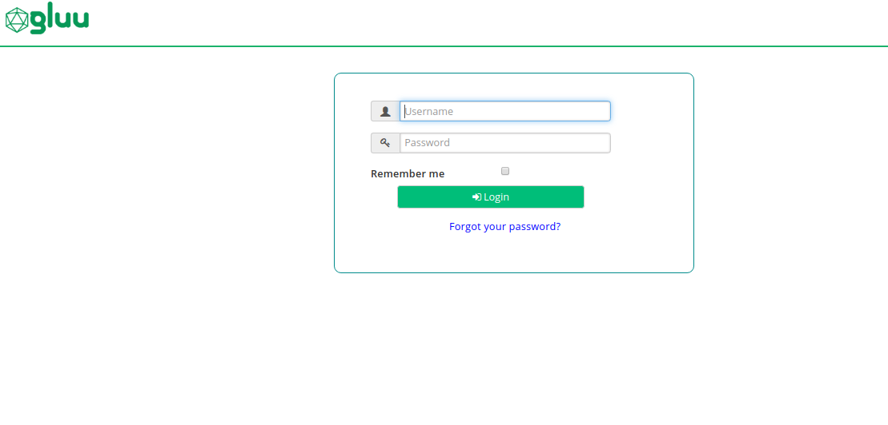

# Angular OpenID Connect OAuth Role based Security 

## Overview

In this tutorial, User first login into angular app using OpenID Connect Authorization Code flow and requested to protected resources(APIs), if user has correct role access permission then user will be able to access the resources otherwise deny.

In tutorial, for protected resources `/company`, if user has `admin` role then user can do any operation i.e. GET, POST, PUT, DELETE, if user has `user` role then user can only do `GET` operation.

For OpenID Connect Authorization Code flow, we are integrating the [AppAuthJS](https://github.com/openid/AppAuth-JS) and For resource protection role base access, we are using Gluu Gateway where we configure `gluu-oauth-auth` and `gluu-oauth-pep` plugin.  

## Requirements

- Gluu Server 4.2: This is our OpenID Connect Server (OP Server), from where Requesting(Relying) party issue the OAuth token with scopes. [Install Gluu](https://gluu.org/docs/ce/4.2/installation-guide/install-ubuntu/).

- Gluu Gateway 4.2: This is our Resource Server (RS), where it checks the token first. In the second step, scope expressions are enforced, a.k.a. the Policy Enforcement Point (PEP) and check the scopes, whether the token has sufficient scopes or not to access resources, a.k.a. the Policy Decision Point (PDP). [Install Gluu Gateway Beta](https://github.com/GluuFederation/gluu-gateway/wiki/Installation-development-build). 

- Protected Upstream(target or backend) APIs: In our demo, we are using a demo Node.js App, available [here](https://github.com/GluuFederation/gluu-gateway-setup/tree/version_4.2.0/gg-demo/node-api-2). You should have to deploy this app on Gluu-Gateway machine. 

- Angular Client: This is the client which request to protected resources. Please check below instruction for Angular Client project setup.

## Gluu Server Setup

### Create OP Client

OP Client for your angular client application which request for resources. This same client will be used to configure Gluu Gateway Kong consumer and in angular client.

1. Open Gluu CE oxTrust(Admin GUI).

2. Navigate to `Configuration > OpenID Connect > Clients > Add Client` and fill the details as below screenshot.

3. Make sure to set `Authentication method for the Token Endpoint: none`. In Frontend AppAuth JS is not support token endpoint authentication method. which is safe because its prevent to share `client_secret` publicly. We don't need to use `client_secret` in angular app.


### Add Role in User

Next is to add role in the user using Gluu oxTrust.

1. Open Gluu CE oxTrust(Admin GUI).

1. Navigate to `Configuration > Users > Add Person`

1. Click on `User Permission` option in `gluuPerson` tab in left side. Fill role and all other details. You can see in below screenshot.


### Update and enable Introspection script 

Gluu Server has great feature where you can add custom logic to modify the response of the token introspection. Below is the configuration:

1. Open Gluu CE oxTrust(Admin GUI)

1. Navigate to `Configuration > Manage Custom Script > Introspection`

1. We have demo script. Copy the introspection script from [here](https://raw.githubusercontent.com/GluuFederation/gluu-gateway-setup/version_4.2.0/gg-demo/introspection_script.py) and replace it in `Script` field and `enable` the `introspection_sample` script. You can add new script or update existing.


### Cors Settings

In case if you face CORS problem to hit `/token` endpoint then you need to set `corsAllowedOrigins` with your origin name. For example: If your angular app is on `https://my-demo.com` then set `corsAllowedOrigins: my-demo.com`. Wildcard characters are not allowed. 

To setup cors in oxTrust, navigate to `Login into oxTrust > JSON Configuration > oxAuth Configuration > corsAllowedOrigins`

## Gluu Gateway configuration

In this demo, we are going to register and protect the resources using `gluu-oauth-auth` and `gluu-oauth-pep` plugin. We will register the `/company/??` path with the scope expression i.e. role base rules.     

!!! Note
    The GG UI is only available on the localhost. Since it is on a remote machine, we need SSH port forwarding to reach the GG UI. Plugin configuration can be done either via REST calls or via the Gluu Gateway web interface.  

Applications and their ports:

| Port | Description |
|------|-------------|
|1338| Gluu Gateway Admin GUI|
|8001|Kong Admin API|
|8000|Kong Proxy Endpoint|
|443|Kong SSL Proxy Endpoint. Kong by default provides port 8443 for SSL proxy, but during setup changes it to 443.|
|8443|oxd Server| 

Log in to the Gluu Gateway Admin GUI(:1338) and follow the below steps.

### Add Service

Register the upstream website as a Service.

This demo uses [`http://localhost:3000`](https://github.com/GluuFederation/gluu-gateway-setup/tree/version_4.2.0/gg-demo/node-api-2) as the Upstream Website, the application which will be protected by Gluu Gateway security.

Follow these step to add a Service using GG UI
 
- Click `SERVICES` on the left panel
- Click on `+ ADD NEW SERVICE` button
- Fill in the following boxes:
    - **Name:** test-app, you can give any name here.
    - **URL:** http://localhost:3000


### Add Route

Follow these steps to add a route:

- Click on the `test-app` service

- Click `Routes`

- Click the `+ ADD ROUTE` button

- Fill in the following boxes:
     - **Name:** test-api, you can give any name here.
     - **Hosts:** `<your-server-host>`, `Tip: Press Enter to accept value`. This is the host of your gluu gateway proxy. This is the host that will be requested in the angular app. I have install GG on my server `gluu.local.org`. The rest of the tutorial will use `gluu.local.org` as an example, replace it with your host. Check the [Kong docs](https://docs.konghq.com/2.0.x/proxy/#routes-and-matching-capabilities) for more routing capabilities.
  


### Configure Plugin

#### Gluu OAuth Auth and PEP

Follow these steps to add a `gluu-oauth-auth` and `gluu-oauth-pep` plugin:

- Click `ROUTES` on the left panel
- Click on the `route id/name` with `gluu.local.org` as the host
- Click on `Plugins`
- Click on `+ ADD PLUGIN` button
- You will see `Gluu OAuth Auth and PEP` title and `+` icon in pop-up.
- Click on the `+` icon and it will show the below form. Add the ACR expression as in the below screenshots. 

    In below ACR expression `/company/??` path is protected. `HTTP GET` operation allow for both `user` and `admin`. `HTTP POST, PUT, PATCH, OPTIONS, DELETE` operation allow for only for `admin`.Check [here](../../plugin/gluu-oauth-auth-pep/#oauth-scope-expression) to make more complex ACR expression.


#### Cors Plugin

If you are frontend developer, you know the cors origin problem and preflight request problem. This problem occures when you are calling APIs from browser from different origin(domain) so in this case you need to add this plugin. If you are not facing cors problem then no need to add this plugin.

Configuration is as below :

- Click `ROUTES` on the left panel
- Click on the `route id/name` with `gluu.local.org` as the host
- Click on `Plugins`
- Click on `+ ADD PLUGIN` button
- You will see `Cors` title and `+` icon in pop-up and fill detail as per below screenshot. If your angular app is on https then in origin field you need to enter value with https. For Example: If your angular app host on `https://gg-demo.com` then you need to set `https://gg-demo.com` in origin field.


You can see in origin i've setup `http://localhost:4200` because angular app is running in localhost and port 4200. You can set as per your configuration.

### Consumer

OP Client is used to correlating an access token with a Kong consumer. You must create an OP client before you can register it here as a way to identify a consumer.

Follow these steps to make a **new OP Client** and **consumer** using GG UI:

- Click `CONSUMERS` on the left panel in GG UI

- Click on the `+ CREATE CONSUMER` button and add `client_id` in the `Gluu Client Id`. `client_id` is the id of the client which you have created in above Gluu oxTrust steps. This is the same client which will be used by angular app.


Here now we done the configuration part. The next is to setup the angular app and call the protected resources.

## Angular Client

You need `NodeJS >= 10.x.x` to setup Angular 8 App. Below are the steps to setup the angular app.

1. Download or clone the angular client code from [here](https://github.com/GluuFederation/angular-appauth-gg-role-security).

1. `cd angular-appauth-gg-role-security`

1. `npm install -g @angular/cli` to install angular cli which provide `ng` command. it helps to run angular app. I am using `Angular CLI: 8.3.6` version.

1. `npm i`

1. Set environments and configurations in [environment.ts](https://github.com/GluuFederation/angular-appauth-gg-role-security/blob/master/src/environments/environment.ts)

      ```
      export const environment = {
        production: false,
        client_id: '<client_id>', // which you create in Gluu oxTrust
        redirect_uri: 'http://localhost:4200/login',
        logout_redirect_uri: 'http://localhost:4200',
        openid_connect_url: '<your_gluu_server_url>',
        end_session_endpoint: '/oxauth/restv1/end_session', // you gluu server end_session_endpoint
        scope: 'openid email profile',
        extra: {prompt: 'consent', access_type: 'offline'},
        ggURL: '<your_gg_proxy_url>',
        companyEndpoint: '/company'
      };
      ```

## Authentication

1. `cd angular-appauth-gg-role-security`

1. Run the angular app by `ng s` command and hit the URL `http://localhost:4200` in browser. You will see the below screen.

      

1. Click on `login` and it will redirect you to your OP

      

1. Now you are logged in and you will see the company tab. Click on `Company` tab. If user has `user` role then he will be able to see records.

      

1. Now logged with the user which has only `user` role. you will get the permission problem for `delete, post and put` operation. And If user has `admin` role then he will able to do all the operation.

      
