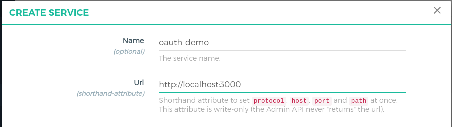
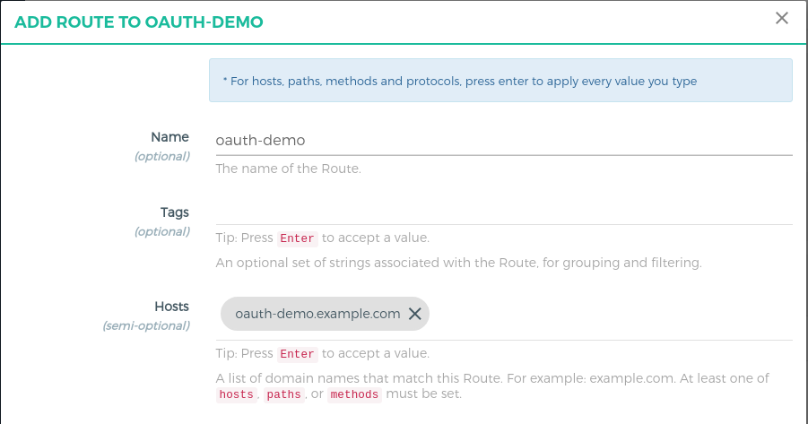
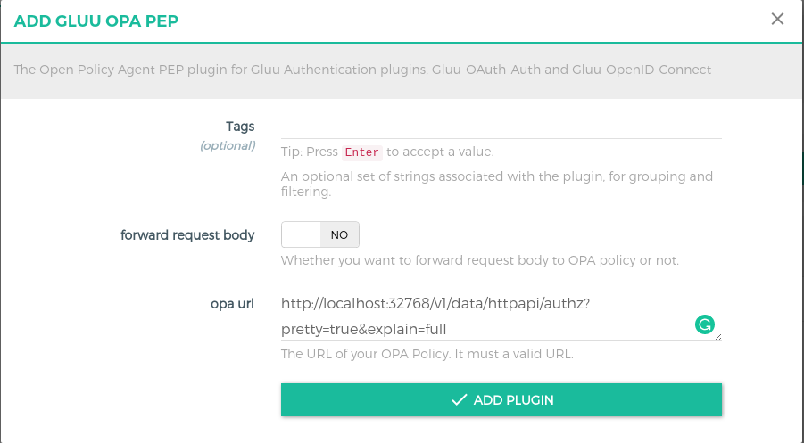
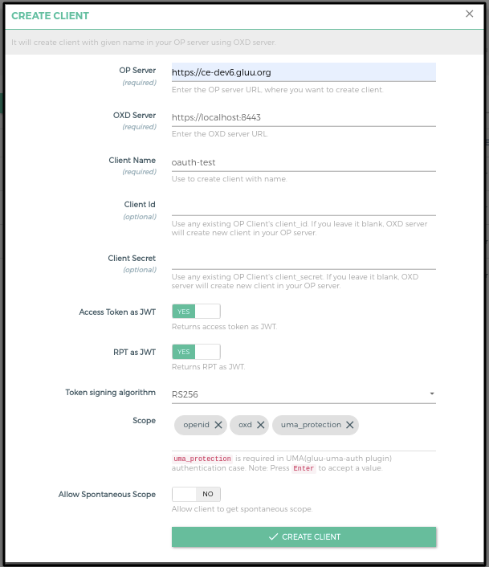
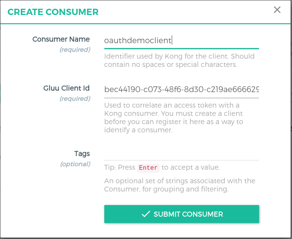

# OAuth API protection and OAuth scope security

## Overview

In this tutorial, we will use the [GLUU-OAuth-Auth](../plugin/gluu-oauth-auth-pep.md) for client authentication and [GLUU-OPA-PEP](../plugin/gluu-opa-pep.md) plugins to secure api by [OPA](https://openpolicyagent.org) Policy.  

In the demo, we will protect `/posts` api with `read` oauth scope. Plugin will check the request has token is active or not if true then check the OPA Policy. If a token has sufficient scope to pass policy, the user is granted access. If not, access is denied. 

## Requirements

- Gluu Gateway 4.0: This is our Resource Server (RS), where it checks the token first. In the second step, scope expressions are enforced, a.k.a. the Policy Enforcement Point (PEP). 

- Open Policy Agent(OPA) Server: This is policy server. It executes the policy and check whether the token has sufficient scopes or not to access resources, a.k.a. the Policy Decision Point (PDP). Install OPA from [here](https://openpolicyagent.org) and add [below policy](#opa-policy). 

- Gluu Server 4.0: This is our OpenID Connect Server (OP Server), from where Requesting(Relying) party issue the OAuth token with scopes. [Install Gluu](https://gluu.org/docs/ce/4.0/installation-guide/install-ubuntu/)

- Python Script demo app: This is our Requesting Party (RqP), which will be making authentication and authorization requests on behalf of the user. Installation instructions [below](#demo-app-configuration-rqp)

- Protected(Upstream) API: In our demo, we are using a demo Node.js App. Take Node.js demo from [here](https://github.com/GluuFederation/gluu-gateway/tree/version_4.0/gg-demo/node-api). 

## OPA Policy

For this demo, we are using below very simple policy. Deploy this policy in your OPA Server. For more complex policy please check [OPA docs](https://openpolicyagent.org).

Below policy will check endpoint should be `/posts`, HTTP method should be `GET` and the user should be `test@gluu.org` otherwise deny.
 
```
package httpapi.authz

# HTTP API request
import input

default allow = false

# allow posts with read scope
allow {
  input.path = ["posts"]
  input.request_token_data.scope = ["openid", "read"]
}
```

Check [OPA Plugin docs](/plugin/gluu-opa-pep/#what-is-passed-to-the-opa-policy-endpoint) for which data passed by OAuth plugin to OPA. 

## Gluu Server configuration (OP Server)
   
We need to add `read` scope at OP server so we can add it to OP Client and later on we can issue token along with the `read` scope. To add `read` scope, configure the following settings inside your Gluu Server: 

1. In oxTrust, navigate to `OpenID Connect` > `Scopes` 

1. Click on the `+ Add Scope` button

1. It will show the below form, Fill the `read` in display name and check the `Allow for dynamic registration` radio box.

    

1. Click on the `Add` button 

## Gluu Gateway configuration (RS)

!!! Note
    The GG UI is only available on the localhost. Since it is on a remote machine, we need SSH port forwarding to reach the GG UI. Plugin configuration can be done either via REST calls or via the Gluu Gateway web interface.  

Applications and their ports:

| Port | Description |
|------|-------------|
|1338| Gluu Gateway Admin GUI|
|8001|Kong Admin API|
|8000|Kong Proxy Endpoint|
|443|Kong SSL Proxy Endpoint. Kong by default provide 8443 port for SSL proxy but during setup, it changes into 443.|
|8443|oxd Server| 

### Add Service

Register your upstream API as a Service.

We are using [`http://localhost:3000`](https://github.com/GluuFederation/gluu-gateway/tree/version_4.0/gg-demo/node-api) as the Upstream API, it is your application where you want to add security.

Follow these step to add Service using GG UI
 
- Click `SERVICES` on the left panel
- Click on `+ ADD NEW SERVICE` button
- Fill in the following boxes:
    - **Name:** oauth-demo
    - **URL:** http://localhost:3000



### Add Route

Follow these steps to add a route:

- Click `oauth-demo` on the services

- Click on the `Routes`

- Click the `+ ADD ROUTE` button

- Fill in the following boxes:
     - **Hosts:** oauth-demo.example.com, `Tip: Press Enter to accept value`
  


### Configure `gluu-oauth-auth` Plugin

Follow these steps to add the plugin:

- Click `oauth-demo` on the services

- Click on the `Plugins`

- Click on the `+ ADD PLUGIN` button

- Click on the `+` of the title `Gluu OAuth Auth & PEP`

- It will show the plugin configuration form. Disable the oAuth Expression button at the top and add plugin by clicking on `+ ADD PLUGIN` button at the bottom.  


### Configure `gluu-opa-pep` plugin

- Click `oauth-demo` on the services

- Click on the `Plugins`

- Click on the `+ ADD PLUGIN` button

- You will see `Gluu OPA PEP` title and `+` icon in pop-up.

- Click on the `+` icon and it will show below form and add your OPA endpoint. In my case, I set up OPA Docker and below is the OPA endpoint. For more details check OPA [docs](https://openpolicyagent.org).



### Add Consumer with OP Client

OP Client is used to correlating an access token with a Kong consumer. You must create an OP client before you can register it here as a way to identify a consumer.

Follow these steps to make a **new OP Client** and **consumer** using GG UI:

- Click `CONSUMERS` on the left panel

- Click on `+ CREATE CLIENT` button

- Add `client name` and submit the form



- It will create a client in your OP Server and show you all the client details. You need to copy all the details. let's call it **consumer_op_client** so it will help you in the next steps.


- Click on the `+ CREATE CLIENT` button and add `client_id` in the `Gluu Client Id`.



## Demo app configuration (RqP) 

The demo app is a Python script. There is only one file. Download the `oauth-opa-demo.py` from the [GG repository here](https://github.com/GluuFederation/gluu-gateway/blob/version_4.0/gg-demo/oauth-opa-demo.py). 

Run `oauth-opa-demo.py` file using the below command.

```
$ python oauth-opa-demo.py
```

It will return the resource result i.e. the output of `/posts` endpoint. If not then you need to check the response.

#### Configuration

In `oauth-demo.py`, you need to set your configuration. Configuration details as below:

| Config | Details |
|--------|---------|
| oxd_server_url  | This your oxd server url. It is not recommended to use oxd here. You can directly request to OP token endpoint to get the token. For the demo, we are using oxd |
| consumer_client_id | This is the client id which we created during [consumer configuration](#add-consumer-with-op-client) step |
| consumer_client_secret | This is the client secret. Requesting party need to use both client_id and client_secret to get the token |
| kong_proxy_url | Proxy url of your kong. As per the above demo configuration, we are using `https://dev1.gluu.org` as a `kong_proxy_url` |
| kong_route_host | Kong route objects host which configured in above [route configuration](#add-route) step |
| op_server | Your OpenID Connect server url |

#### Steps by Steps implementation

There only two steps:

1. Get the OAuth token. we protected the resource with just the `read` scope so we just need to request for a token with `read` scope.

      ```
        curl -X POST https://<your_oxd_server_host>:8443/get-client-token
            --Header "Content-Type: application/json"
            --data '{"client_id": "<CONSUMER_OP_CLIENT_ID>", "client_secret": "<CONSUMER_OP_CLIENT_SECRET>", "op_host": "<YOUR_OP_SERVER>", "scope":["read"]}'
      ```

1. Request resource with above token

      ```
        curl -X GET https://<your_kong_proxy_host>/posts
            --Header "Authorization: Bearer <YOUR_NEW_RPT>"
            --Header "Host: oauth-demo.example.com"
      ```
