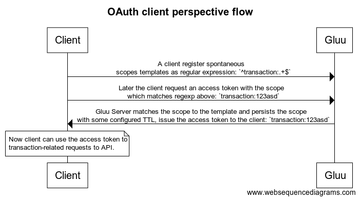
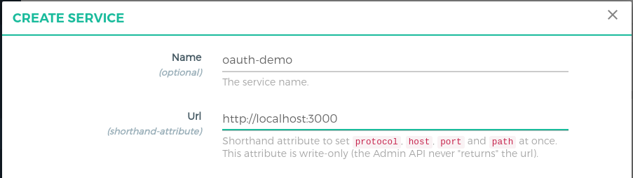
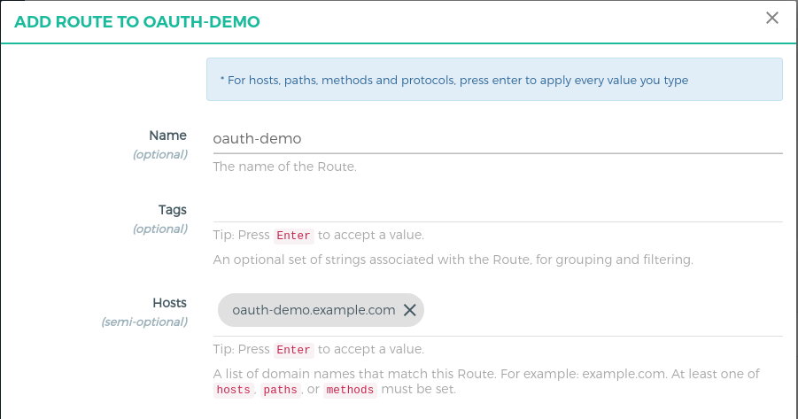
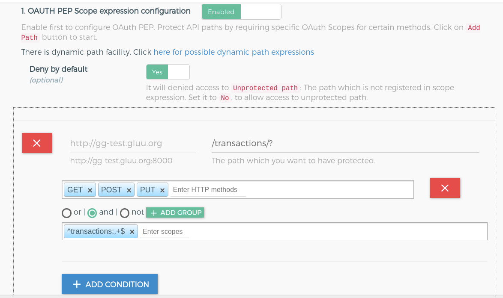
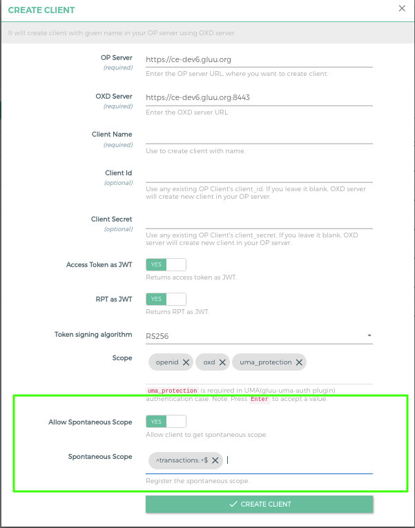
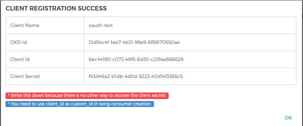
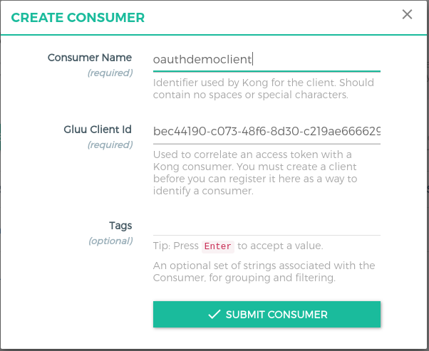
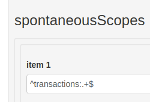

# OAuth Spontaneous scope and API Security

## Overview

From version 4.2, Gluu Server supports OAuth2 [spontaneous scopes](https://gluu.org/docs/gluu-server/4.2/admin-guide/openid-connect/#spontaneous-scopes). 

**For example:** You have transaction API like `/transactions/45`, `transactions/46`, `transactions/n`, you want to issue OAuth scope `read: 45` and `read: 46` like wise for every resources, In this case spontaneous scope will help you. OP Client will be able to issue the scope as per request.

Below flow diagram from OAuth OP Client Perspective:



In this tutorial, we will use the [GLUU-OAuth-Auth](../plugin/gluu-oauth-auth-pep.md) and [GLUU-OAuth-PEP](../plugin/gluu-oauth-auth-pep.md) plugins to protect the APIs using OAuth token and check spontaneous scope to authorize the request.  

## Requirements

- Gluu Gateway 4.2.0: This is our Resource Server (RS), where it checks the token first. In the second step, scope expressions are enforced, a.k.a. the Policy Enforcement Point (PEP) and check the scopes, whether the token has sufficient scopes or not to access resources, a.k.a. the Policy Decision Point (PDP). [Install Gluu Gateway](../installation.md). 

- Gluu Server 4.2.0: This is our OpenID Connect Server (OP Server), from where Requesting(Relying) party issue the OAuth token with scopes. [Install Gluu](https://gluu.org/docs/ce/4.2/installation-guide/install-ubuntu/)

- Python Script demo app: This is our Requesting Party (RqP), which will be making authentication and authorization requests on behalf of the user. Installation instructions [below](#demo-app-configuration-rqp)

- Protected(Upstream) API: In our demo, we are using a demo Node.js App. Take Node.js demo from [here](https://github.com/GluuFederation/gluu-gateway-setup/tree/version_4.2.0/gg-demo/node-api-2). 

## Gluu Gateway configuration (RS)

!!! Note
    The GG UI is only available on the localhost. Since it is on a remote machine, we need SSH port forwarding to reach the GG UI. Plugin configuration can be done either via REST calls or via the Gluu Gateway web interface.  

Applications and their ports:

| Port | Description |
|------|-------------|
|1338| Gluu Gateway Admin GUI|
|8001|Kong Admin API|
|8000|Kong Proxy Endpoint|
|443|Kong SSL Proxy Endpoint. Kong by default provide 8443 port for SSL proxy but during setup, it changes into 443.|
|8443|oxd Server| 

Login into Gluu Gateway Admin GUI(:1338) and follow the below steps.

### Add Service

Register your upstream API as a Service.

We are using [`http://localhost:3000`](https://github.com/GluuFederation/gluu-gateway-setup/tree/version_4.2.0/gg-demo/node-api-2) as the Upstream API, it is your application where you want to add security.

Follow these step to add Service using GG UI
 
- Click `SERVICES` on the left panel
- Click on `+ ADD NEW SERVICE` button
- Fill in the following boxes:
    - **Name:** oauth-demo
    - **URL:** http://localhost:3000



### Add Route

Follow these steps to add a route:

- Click `oauth-demo` on the services

- Click on the `Routes`

- Click the `+ ADD ROUTE` button

- Fill in the following boxes:
     - **Hosts:** oauth-demo.example.com, `Tip: Press Enter to accept value`
  


### Configure Plugin

Configure Gluu-OAuth-Auth and Gluu-OAuth-PEP with OAuth scopes and resources. Follow these steps to add the plugin:

- Click `oauth-demo` on the services

- Click on the `Plugins`

- Click on the `+ ADD PLUGIN` button

- Click on the `+` of the title `Gluu OAuth Auth & PEP`

- It will show the plugin configuration form. Click on `+ ADD PATH` and add `/transactions/?` path, check `and` radio, `http methods` and `^transactions:.+$` scope. Check [here](/plugin/gluu-oauth-auth-pep/#oauth-scope-expression) to add more complex dynamic path.



- Click on the `Add Plugin` button at end of the page.

### Add Consumer with OP Client

OP Client is used to correlating an access token with a Kong consumer. You must create an OP client before you can register it here as a way to identify a consumer.

Follow these steps to make a **new OP Client** and **consumer** using GG UI:

- Click `CONSUMERS` on the left panel

- Click on `+ CREATE CLIENT` button

- Fill `^transactions:.+$` in spontaneous scope field and **press enter** to accept value.

- Submit the form



- It will create a client in your OP Server and show you all the client details. You need to copy all the details. let's call it **consumer_op_client** so it will help you in the next steps.



- Click on the `+ CREATE CLIENT` button and add `client_id` in the `Gluu Client Id`.



You can also check in Gluu CE UI in client configuration. it will show the registered spontaneous scope.



## Demo app configuration (RqP) 

The demo app is a Python script. There is only one file. Download the `oauth-ss-demo.py` from the [GG repository here](https://github.com/GluuFederation/gluu-gateway-setup/blob/version_4.2.0/gg-demo/oauth-ss-demo.py). 

Run `oauth-demo.py` file using the below command.

```
$ python oauth-ss-demo.py
```

It will return the resource result i.e. the output of `/transactions/123` endpoint. If not then you need to check the response.

#### Configuration

In `oauth-ss-demo.py`, you need to set your configuration. Configuration details as below:

| Config | Details |
|--------|---------|
| oxd_server_url  | This your oxd server url. It is not recommended to use oxd here. You can directly request to OP token endpoint to get the token. For the demo, we are using oxd |
| consumer_client_id | This is the client id which we created during [consumer configuration](#add-consumer-with-op-client) step |
| consumer_client_secret | This is the client secret. Requesting party need to use both client_id and client_secret to get the token |
| kong_proxy_url | Proxy url of your kong. As per the above demo configuration, we are using `https://dev1.gluu.org` as a `kong_proxy_url` |
| kong_route_host | Kong route objects host which configured in above [route configuration](#add-route) step |
| op_server | Your OpenID Connect server url |

#### Steps by Steps implementation

There only two steps:

1. Get the OAuth token. we protected the resource with just the `transactions:123` scope so we just need to request for a token with `transactions:123` scope.

      ```
        curl -X POST https://<your_oxd_server_host>:8443/get-client-token
            --Header "Content-Type: application/json"
            --data '{"client_id": "<CONSUMER_OP_CLIENT_ID>", "client_secret": "<CONSUMER_OP_CLIENT_SECRET>", "op_host": "<YOUR_OP_SERVER>", "scope":["transactions:123"]}'
      ```

1. Request resource with above token

      ```
        curl -X GET https://<your_kong_proxy_host>/transactions/123
            --Header "Authorization: Bearer <ACCESS_TOKEN>"
            --Header "Host: oauth-demo.example.com"
      ```

[Click here more details about GG Spontaneous scope configuration](../plugin/common-features.md#spontaneous-scope).