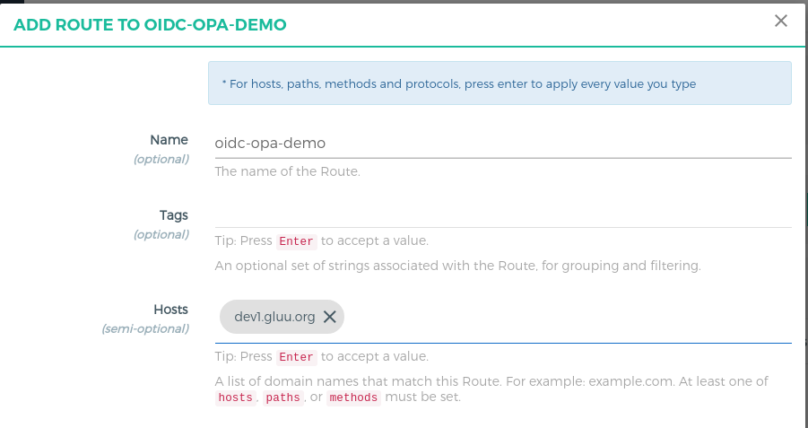

# OpenID Connect Authentication and OPA PEP Authorization 

## Overview

In this tutorial, we are going to add `OpenID Connect Authorization code flow` authentication by configuring the [`gluu-openid-connect`](../../plugin/gluu-openid-connect-uma-pep/) plugin and user authorization by the [`gluu-opa-pep`](../../plugin/gluu-opa-pep/) plugin. User will be authenticate first and second part is to check the user permission using [`OPA Policy`](https://openpolicyagent.org). 

In the demo, the user will first be authenticated by OpenID Connect and for `/flights` resource, only the user with email `test@gluu.org` has the right to access resources. 

Check [Open Policy Agent](https://openpolicyagent.org) for more complex policy.

## Requirements

- Gluu Gateway 4.0: This is our an OpenID Connect relying party(RP) between the client and the upstream service. [Install Gluu Gateway](../installation.md). [OXD Server](https://gluu.org/docs/oxd/4.0/) is a static APIs web application which will install during GG installation.

- Gluu Server 4.0: This is our OpenID Connect Server. [Install Gluu](https://gluu.org/docs/ce/4.0/installation-guide/install-ubuntu/)

- Open Policy Agent(OPA) Server: This is policy server. It executes the policy and check all the given values a.k.a. the Policy Decision Point (PDP). Install OPA from [here](https://openpolicyagent.org) and add [below policy](#opa-policy).

- Protected(Upstream) Website: In our demo, we are using a demo Node.js App. Take Node.js demo from [here](https://github.com/GluuFederation/gluu-gateway/tree/version_4.0/gg-demo/node-ejs). 

## OPA Policy

For this demo, we are using below very simple policy. Deploy this policy in your OPA Server. For more complex policy please check [OPA docs](https://openpolicyagent.org).

Below policy will check endpoint should be `flights`, HTTP method should be `GET` and the user should be `test@gluu.org` otherwise deny.
 
```
package httpapi.authz

# HTTP API request
import input

default allow = false

# Allow test user only
allow {
  input.method = "GET"
  input.path = ["flights"]
  input.userinfo.email = "test@gluu.org"
}
```

## Gluu Gateway configuration (RP)

!!! Note
    The GG UI is only available on the localhost. Since it is on a remote machine, we need SSH port forwarding to reach the GG UI. Plugin configuration can be done either via REST calls or via the Gluu Gateway web interface.  

Applications and their ports:

| Port | Description |
|------|-------------|
|1338| Gluu Gateway Admin GUI|
|8001|Kong Admin API|
|8000|Kong Proxy Endpoint|
|443|Kong SSL Proxy Endpoint. Kong by default provide 8443 port for SSL proxy but during setup, it changes into 443.|
|8443|oxd Server| 

Login into Gluu Gateway Admin GUI(:1338) and follow the below steps.

### Add Service

Register your upstream website as a Service.

We are using [`http://localhost:4400`](https://github.com/GluuFederation/gluu-gateway/tree/version_4.0/gg-demo/node-ejs) as the Upstream Website, it is your application where you want to add OpenID Connect Authentication. End-users always request to first kong proxy, the plugin will perform authentication and if all is ok then kong will forward a request to the upstream website and serve content which is return by the upstream website.

Follow these step to add Service using GG UI
 
- Click `SERVICES` on the left panel
- Click on `+ ADD NEW SERVICE` button
- Fill in the following boxes:
    - **Name:** oidc-opa-demo
    - **URL:** http://localhost:4400


### Add Route

Follow these steps to add a route:

- Click on the `oidc-opa-demo` service

- Click `Routes`

- Click the `+ ADD ROUTE` button

- Fill in the following boxes:
     - **Name:** oidc-opa-demo
     - **Hosts:** `<your-server-host>`, `Tip: Press Enter to accept value`. In my case, I am using server and updated `/etc/hosts` file. This is the host which we will use to request in a browser after configuration. You can register your domain host if you are using live servers. For further next tutorial, I am using `dev1.gluu.org`, you need to use your host. Check kong docs for more routing capabilities [here](https://docs.konghq.com/0.14.x/proxy/#routes-and-matching-capabilities).
  


### Configure `gluu-openid-connect` plugin

- Click `ROUTES` on the left panel
- Click on `route id/name` which has host `dev1.gluu.org`
- Click on `Plugins`
- Click on `+ ADD PLUGIN` button
- You will see `Gluu OIDC & UMA PEP` title and `+` icon in pop-up.
- Click on the `+` icon and it will show below form.
    - Disabled `ACR Expression` and `UMA PEP Security configuration`


### Configure `gluu-opa-pep` plugin

- Click `ROUTES` on the left panel
- Click on `route id/name` which has host `dev1.gluu.org`
- Click on `Plugins`
- Click on `+ ADD PLUGIN` button
- You will see `Gluu OPA PEP` title and `+` icon in pop-up.
- Click on the `+` icon and it will show below form and add your OPA endpoint. In my case, I set up OPA Docker and below is the OPA endpoint. For more details check OPA [docs](https://openpolicyagent.org).


This completes the configuration. Next, request the Kong proxy at `https://<your_host>/flights` in the browser. As per my configuration, I am requesting `https://dev1.gluu.org/flights`.

!!! Important
    The request should be `/flights` not a `/flights/`. extra `/` means extra path so it will deny by the policy.

## Authentication

1. Once you request to kong proxy, the plugin will redirect you to your OP side.

     
     
     After successful authentication, OP will show you all requested permissions, click on `Allow`.
     
     

2. After `allow`, you will get back to kong proxy and plugin will serve you `/flights` page.

     
     
3. Now try to click on any other page. let's click on `payments`. It will deny you because the policy only allows `flights`.

     

You can check the kong's [`error.log`](../../logs) file or [`gluu-opa-pep docs`](../../plugin/gluu-opa-pep) to check the request to OPA server and which data are passed to OPA endpoint.  

For more details and configuration check [`gluu-openid-connect` plugin docs](../../plugin/gluu-openid-connect-uma-pep/) and for [`gluu-opa-pep` check docs](../../plugin/gluu-opa-pep/).
