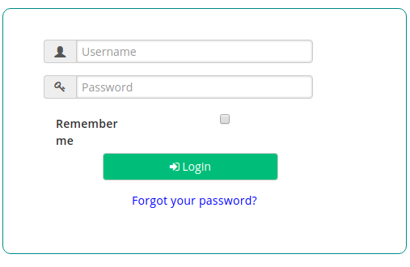

# OpenID Connect Stepped-up Authentication 

## Overview

This tutorial covers adding `OpenID Connect Authorization code flow` stepped-up authentication by configuring the [`gluu-openid-connect`](../../plugin/gluu-openid-connect-uma-pep/) plugin. 

In the demo, the user will first authenticate with basic (`auth_ldap_server`) auth, then needs to pass one more `OTP` authentication step for the `/payments/` resource. 

It is fully configurable, you can add stepped-up authentication on multiple resources. Check [here](../../plugin/gluu-openid-connect-uma-pep/) for more details. 

## Requirements

- Gluu Gateway 4.0: This is our an OpenID Connect relying party(RP) between the client and the upstream service. [Install Gluu Gateway](../installation.md). The [oxd server](https://gluu.org/docs/oxd/4.0/) is a static API web application that will install during GG installation.

- Gluu Server 4.0: This is our OpenID Connect Server. [Install Gluu](https://gluu.org/docs/ce/4.0/installation-guide/install-ubuntu/)

- Protected(Upstream) Website: In our demo, we are using a demo Node.js App. The Node.js demo is available [here](https://github.com/GluuFederation/gluu-gateway/tree/version_4.0/gg-demo/node-ejs). 

## Gluu Server configuration (OpenID Connect Server)
   
First, add `OTP` stepped-up authentication by enabling the `OTP` ACR in the OP Server. Configure the following settings inside your Gluu Server: 

1. In oxTrust, navigate to `Configuration` > `Manage Custom Scripts` 

1. Enable the `OTP` script
     
     

1. Now just confirm that it is enabled successfully by checking your OP discovery endpoint `<your_op_server>/.well-known/openid-configuration`, it should show `otp` in `acr_values_supported` property.

## Gluu Gateway configuration (RP)

In this demo, we are going to register and protect the whole upstream service(the website) using `gluu-openid-connect` plugin. We will register `/payments/??` path with the `OTP` ACR and for all other resources, the default `auth_ldap_server`. As a result, a request for `/payments`, will ask for an additional `OTP` authentication step to access the resource.     

!!! Note
    The GG UI is only available on localhost. Since it is on a remote machine, we need SSH port forwarding to reach the GG UI. Plugin configuration can be done either via REST calls or via the Gluu Gateway web interface.  

Applications and their ports:

| Port | Description |
|------|-------------|
|1338| Gluu Gateway Admin GUI|
|8001|Kong Admin API|
|8000|Kong Proxy Endpoint|
|443|Kong SSL Proxy Endpoint. Kong by default provides port 8443 for SSL proxy, but during setup changes it to 443.|
|8443|oxd Server| 

### Add Service

Register your upstream website as a Service.

For this demo, we are using [`http://localhost:4400`](https://github.com/GluuFederation/gluu-gateway/tree/version_4.0/gg-demo/node-ejs) as the Upstream Website, the application where OpenID Connect Authentication is added. End users always request to the Kong proxy first, then the plugin performs authentication. If it's successful, Kong will forward the request to the upstream website and serve the content that is returned by the upstream website.

Follow these step to add a Service using GG UI
 
- Click SERVICES on the left panel
- Click on **+ ADD NEW SERVICE** button
- Fill in the following boxes:
    - **Name:** oidc-steppedup-demo
    - **URL:** http://localhost:4400

### Add Route

Follow these steps to add route:

- Click `oidc-steppedup-demo` on the services

- Click `Routes`

- Click the `+ ADD ROUTE` button

- Fill in the following boxes:
     - Hosts: `<your-server-host>`, `Tip: Press Enter to accept value`. In my case, I am using a server and updated `/etc/hosts` file. This is the host which will be used to request in browser after configuration. You can register your domain host if you are using live servers. The examples in this tutorial use `dev1.gluu.org`, you need to substitute with your host. See the [Kong docs](https://docs.konghq.com/0.14.x/proxy/#routes-and-matching-capabilities) for more routing capabilities.
  

### Configure Plugin

- Click `ROUTES` on the left panel
- Click on `route id` which has host `dev1.gluu.org`
- Click on `Plugins`
- Click on `+ ADD PLUGIN` button
- You will see `Gluu OIDC & UMA PEP` title and `+` icon in pop-up.
- Click on `+` icon and it will show below form. Add the ACR expression as in below screenshots.
    - `OTP` stepped-up auth for path `/payments/??`
    - `auth_ldap_server` authentication for all other paths. Check [here](../../plugin/gluu-openid-connect-uma-pep/#dynamic-url-base-acrs-stepped-up-authentication) for detail ACR Expression description.

This finishes configuration. Next, request the Kong proxy at `https://<your_host>` in the browser. In my case, I am requesting `https://dev1.gluu.org`.

## Authentication

1. Once you request to the Kong proxy, the plugin will redirect to the OP side. The OP will request for `username` and `password`, because we added the `auth_ldap_server` ACR for any path `/??`.

     
     
     After successful authentication, the OP will disply all requested permissions. Click `Allow`.
     
     

2. After clicking `allow`, you will get back to the Kong proxy and the plugin will serve the default home page of the upstream service.

     
     
     Click on `Flights`. It is also in the `/??` path, so the user already has permission to access this resource.
     
     

3. Now click `Payments`, on which we added the `OTP` stepped-up authentication. The plugin will redirect again to the OP. As per the `OTP` script, it will ask first `username` and `password`.

     
     
     After successful authentication, the OP Server ask you to enroll a device. Scan the displayed QR Code in an authenticator application on your device, then click on `Finish`. Check Gluu CE Docs [here](https://gluu.org/docs/ce/authn-guide/otp/#recommended-otp-apps) for OTP supported application.
     
     
     
     After successful enrollment, it will prompt you to enter the OTP. Enter the OTP from the authenticator application and click on `Login`.
     
     

4. After `OTP` authentication, the OP server will redirect back to the Kong proxy and serve the `Payments` page. 

     

For more details and configuration check `gluu-openid-connect` plugin docs [here](../../plugin/gluu-openid-connect-uma-pep/).
