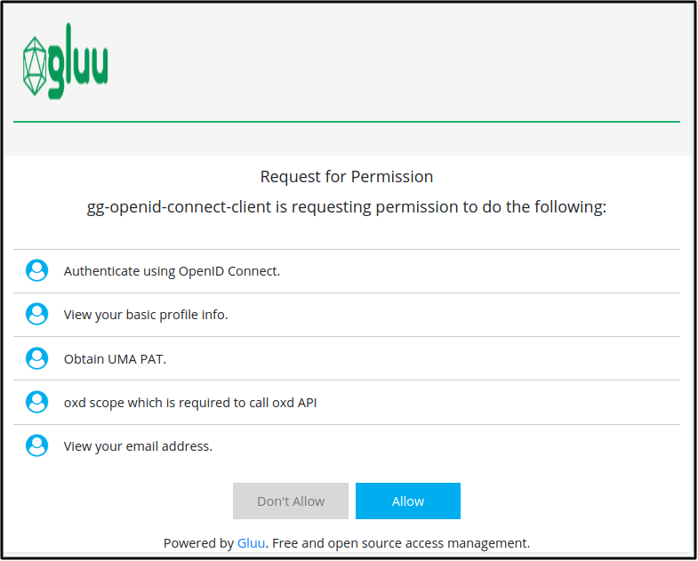

# OpenID Connect Stepped-up Authentication 

## Overview

In this tutorial, we are going to add `OpenID Connect Authorization code flow` stepped-up authentication by configuring the [`gluu-openid-connect`](../../plugin/gluu-openid-connect-uma-pep/) plugin. User will be authenticate first and one more authentication step will be perform for the configured resources. 

In demo, user will first authenticated by basic(`auth_ldap_server`) auth and for `/payments/` resource, user need to clear or pass one more `OTP` authentication step. 

It is fully configurable, you can add stepped-up authentication on multiple resources. Check [here](../../plugin/gluu-openid-connect-uma-pep/) for more details. 

## Requirements

- Gluu Gateway 4.0: This is our an OpenID Connect relying party(RP) between the client and the upstream service. [Install Gluu Gateway](../installation.md). [OXD Server](https://gluu.org/docs/oxd/4.0/) is a static APIs web application which will install during GG installation.

- Gluu Server 4.0: This is our OpenID Connect Server. [Install Gluu](https://gluu.org/docs/ce/4.0/installation-guide/install-ubuntu/)

- Protected(Upstream) Website: In our demo, we are using a demo Node.js App. Take Node.js demo from [here](https://github.com/GluuFederation/gluu-gateway/tree/version_4.0/gg-demo/node-ejs). 

## Gluu Server configuration (OpenID Connect Server)
   
In demo we are going to add `OTP` stepped-up authentication. For this you need to enable `OTP` acr in OP Server. configure the following settings inside your Gluu Server: 

1. In oxTrust, navigate to `Configuration` > `Manage Custom Scripts` 

1. Enable `OTP` script
     
     

1. Now just confirm that it is enabled successfully by checking your OP discovery endpoint `<your_op_server>/.well-known/openid-configuration`, it should show `otp` in `acr_values_supported` property.

## Gluu Gateway configuration (RP)

In demo, we are going to register and protect whole upstream service(your website) using `gluu-openid-connect` plugin. For stepped-up auth demo, we will register `/payments/??` path with `OTP` acr and for all other resources there is default `auth_ldap_server`. So once you request for `/payments`, it will aks you for one more step `OTP` authentication to access the resource.     

!!! Note
    The GG UI is only available on localhost. Since it is on a remote machine, we need SSH port forwarding to reach the GG UI. Plugin configuration can be done either via REST calls or via the Gluu Gateway web interface.  

Applications and their ports:

| Port | Description |
|------|-------------|
|1338| Gluu Gateway Admin GUI|
|8001|Kong Admin API|
|8000|Kong Proxy Endpoint|
|443|Kong SSL Proxy Endpoint. Kong by default provide 8443 port for SSL proxy but during setup it change into 443.|
|8443|oxd Server| 

### Add Service

Register your upstream website as a Service.

We are using [`http://localhost:4400`](https://github.com/GluuFederation/gluu-gateway/tree/version_4.0/gg-demo/node-ejs) as the Upstream Website, it is your application where you want to add OpenID Connect Authentication. End users always request to first kong proxy, plugin will perform authentication and if all is ok then kong will forward request to upstream website and serve content which is return by the upstream website.

Follow these step to add Service using GG UI
 
- Click SERVICES on the left panel
- Click on **+ ADD NEW SERVICE** button
- Fill in the following boxes:
    - **Name:** oidc-steppedup-demo
    - **URL:** http://localhost:4400

### Add Route

Follow these steps to add route:

- Click `oidc-steppedup-demo` on the services

- Click `Routes`

- Click the `+ ADD ROUTE` button

- Fill in the following boxes:
     - Hosts: `<your-server-host>`, `Tip: Press Enter to accept value`. In my case, I am using server and updated `/etc/hosts` file. This is the host which we will used to request in browser after configuration. You can register your domain host if you are using live servers. For further next tutorial I am using `dev1.gluu.org`, you need to use your host. Check kong docs for more routing capabilities [here](https://docs.konghq.com/0.14.x/proxy/#routes-and-matching-capabilities).
  

### Configure Plugin

- Click `ROUTES` on the left panel
- Click on `route id` which has host `dev1.gluu.org`
- Click on `Plugins`
- Click on `+ ADD PLUGIN` button
- You will see `Gluu OIDC & UMA PEP` title and `+` icon in pop-up.
- Click on `+` icon and it will show below form. Add the ACR expression as in below screenshots.
    - `OTP` stepped-up auth for path `/payments/??`
    - `auth_ldap_server` authentication for all other paths. Check [here](../../plugin/gluu-openid-connect-uma-pep/#dynamic-url-base-acrs-stepped-up-authentication) for detail ACR Expression description.

Configurations have been done here. Now request kong proxy that is `https://<your_host>` in browser. In my case, I am requesting `https://dev1.gluu.org`.

## Authentication

1. Once you request to kong proxy, plugin will redirect you to your OP side. OP will request for `username` and `password` because we added `auth_ldap_server` acr for any path `/??`.

     
     
     After successful authentication, OP will show you all requested permissions, click on `Allow`.
     

2. After `allow`, you will get back to kong proxy and plugin will serve you default home page of upstream service.

     
     
     Click on `Flights`, it is also in `/??` path so user has already permission to access this resource.
     

3. Now click to `Payments` on which we added `OTP` stepped-up authentication. Plugin will redirect you again to OP. As per `OTP` script, it will ask first `username` and `password`.

     
     
     After successful authentication, OP Server ask you to device enrollment. It will show you the QR Code which you need to scan in your device in authenticator application and click on `Finish`. Check Gluu CE Docs [here](https://gluu.org/docs/ce/authn-guide/otp/#recommended-otp-apps) for OTP supported application.
     
     
     After successful enrollment, it will prompt you to enter the OTP. Enter OTP which is in your authenticator application and click on `Login`.
     

4. After `OTP` authentication, OP server will redirect back to kong proxy and serve `Payments` page. 

     

For more details and configuration check `gluu-openid-connect` plugin docs [here](../../plugin/gluu-openid-connect-uma-pep/).
