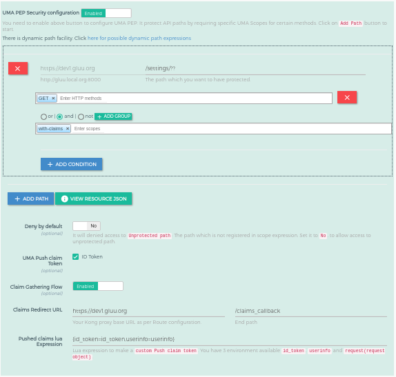

# OpenID Connect Authentication and UMA PEP Authorization 

## Overview

In this tutorial, we are going to add `OpenID Connect Authorization code flow` authentication by configuring the [`gluu-openid-connect`](../../plugin/gluu-openid-connect-uma-pep/) plugin and user authorization by the [`gluu-uma-pep`](../../plugin/gluu-uma-pep/) plugin. User will be authenticate first and second part is to check the user permission using the UMA Policy. 

In the demo, the user will first be **authenticated by OpenID Connect** and for `/settings` resource, user will be prompted to enter their `country` and `city` before being able to access a protected page. If the values entered are correct (US, NY), the user is granted access. If not, access is denied. We are using default UMA Policy available in Gluu CE which check the `Country=US` and `City=NY`. You can modify this policy and write the custom login to authorized user.    

!!! Info
    If you have 2-3 policies then it will be good to use UMA. But If you have much more numbers of policies then [OPA](../oidc-opa-tutorial) is the best option.

## Requirements

- Gluu Gateway 4.1: This is our an OpenID Connect relying party(RP) between the client and the upstream service. [Install Gluu Gateway](../installation.md). [OXD Server](https://gluu.org/docs/oxd/4.1/) is a static APIs web application which will install during GG installation.

- Gluu Server 4.1: This is our OpenID Connect Server. [Install Gluu](https://gluu.org/docs/ce/4.1/installation-guide/install-ubuntu/)

- Protected(Upstream) Website: In our demo, we are using a demo Node.js App. Take Node.js demo from [here](https://github.com/GluuFederation/gluu-gateway-setup/tree/version_4.1/gg-demo/node-ejs). 

    
## Gluu Gateway configuration (RP)

!!! Note
    The GG UI is only available on the localhost. Since it is on a remote machine, we need SSH port forwarding to reach the GG UI. Plugin configuration can be done either via REST calls or via the Gluu Gateway web interface.  

Applications and their ports:

| Port | Description |
|------|-------------|
|1338| Gluu Gateway Admin GUI|
|8001|Kong Admin API|
|8000|Kong Proxy Endpoint|
|443|Kong SSL Proxy Endpoint. Kong by default provide 8443 port for SSL proxy but during setup, it changes into 443.|
|8443|oxd Server| 

Login into Gluu Gateway Admin GUI(:1338) and follow the below steps.

### Add Service

Register your upstream website as a Service.

We are using [`http://localhost:4400`](https://github.com/GluuFederation/gluu-gateway-setup/tree/version_4.1/gg-demo/node-ejs) as the Upstream Website, it is your application where you want to add OpenID Connect Authentication. End-users always request to first kong proxy, the plugin will perform authentication and if all is ok then kong will forward a request to the upstream website and serve content which is return by the upstream website.

Follow these step to add Service using GG UI
 
- Click `SERVICES` on the left panel
- Click on `+ ADD NEW SERVICE` button
- Fill in the following boxes:
    - **Name:** oidc-opa-demo
    - **URL:** http://localhost:4400

### Add Route

Follow these steps to add a route:

- Click on the `oidc-uma-demo` service

- Click `Routes`

- Click the `+ ADD ROUTE` button

- Fill in the following boxes:
     - **Name:** oidc-uma-demo
     - **Hosts:** `<your-server-host>`, `Tip: Press Enter to accept value`. In my case, I am using server and updated `/etc/hosts` file. This is the host which we will use to request in a browser after configuration. You can register your domain host if you are using live servers. For further next tutorial, I am using `dev1.gluu.org`, you need to use your host. Check kong docs for more routing capabilities [here](https://docs.konghq.com/1.0.x/proxy/#routes-and-matching-capabilities).
  

### Configure `gluu-openid-connect` plugin

- Click `ROUTES` on the left panel
- Click on `route id/name` which has host `dev1.gluu.org`
- Click on `Plugins`
- Click on `+ ADD PLUGIN` button
- You will see `Gluu OIDC & UMA PEP` title and `+` icon in pop-up.
- Click on the `+` icon and it will show below form.
    - Enable `UMA PEP Security configuration` and disabled `ACR Expression`.
    - Fill `UMA PEP Security configuration` section form with the below details

|Fields|Value|Description|
|-----|-------|----------|
|Path|/settings/?|it will protect path `/settings/` and also any sub path in settings path.|
|HTTPMethods|GET|it will used to protect the HTTP Methods. `GET` means for the GET HTTP methods. You can configure as your requirement For Example: `GET`, `POST`, all others.|
|scope|with-claims|it is just a name of the scope. GG UI will create UMA scope in your Gluu CE. In Gluu CE UI(oxtrust) you need to add the UMA Policy in this scope|  
|Deny By Default|No(false)|it is optional. `false` means it is will allow unprotected path i.e. the path which is not registered. We registered only `/settings/??` path so except this path all other path are unprotected path.|
|Pushed Claim Token Lua expression|{id_token=id_token,userinfo=userinfo}|it is optional. If you want to pass Push claim token to get RPT Token then you need to enable `UMA Push Claim Token: True ID Token` in form and configure this expression. Plugin will pass this value to your UMA Policy and you can use this values to authorized the User.   Currently in default expression ti passing both values but you can modify it. Check [here](../../plugin/gluu-openid-connect-uma-pep/#configure-pushed-claims-lua-expression) for more about expression and build UMA policy.|

## Gluu Server configuration (AS)
   
To enable UMA Policy, configure the following settings inside your Gluu Server UI(oxTrust). We are configuring here UMA Claim gathering flow. We are using the default policy available in the Gluu CE but you can code policy as per your requirement. 

1. In oxTrust, navigate to `Configuration` > `Manage Custom Scripts` 

1. Enable `UMA RPT Polices` & `UMA Claims Gathering`

     There is one `uma_rpt_policy` included in the script. During authorization, it checks Country=US and City=NY. If you want to change the value, update this script or add your own new script. For more details, take a look at [Gluu CE Documentation](https://gluu.org/docs/ce/admin-guide/uma/#uma-rpt-authorization-policies).
     
     

1. Add policy in `with-claims` scope. Navigate to `UMA` > `Scopes`.

     
     
This completes the configuration. Next, request the Kong proxy at `https://<your_host>/settings/` in the browser. As per my configuration, I am requesting `https://dev1.gluu.org/settings/`.

!!! Important
    The request should be `/settings/` not a `/settings`. Look [here](../../plugin/common-features/#dynamic-resource-protection) for more detail about dynamic path registration.

## Authentication

1. Once you request to kong proxy, the plugin will redirect you to your OP side.

     
     
     After successful authentication, OP will show you all requested permissions, click on `Allow`.
     
     

1. Next Gluu Server prompt the user to enter some extra information to authorize a user. AS will first ask the user to enter a value for `Country`. Enter `US` in a country.
                    
     
     
1. After submitting a Country claim, AS will ask the user to enter a value for `City`. Enter `NY` in the city.

     
     
1. If all ok then you will see the below page that is `/settings/`

     

If you get some error then you can check the kong's [`error.log`](../../logs) file.  

For more details and configuration check [`gluu-openid-connect` plugin docs](../../plugin/gluu-openid-connect-uma-pep/).
