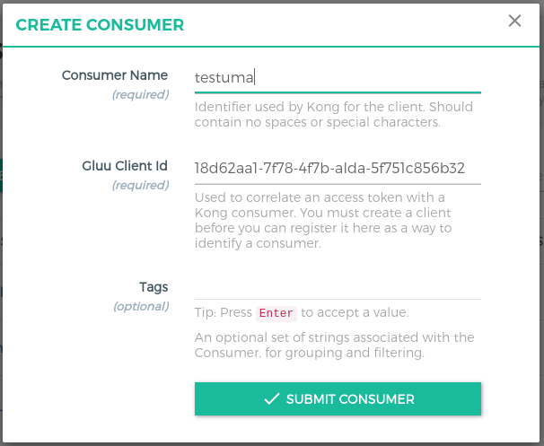

# UMA Claims Gathering authorization Tutorial

## Overview

In this tutorial, we will use the [GLUU-UMA-Auth](../plugin/gluu-uma-auth-pep.md) and [GLUU-UMA-PEP](../plugin/gluu-uma-auth-pep.md) plugins to implement a claims gathering workflow, where an authenticated user is prompted to input information to satisfy access policies. 

In the demo, the user will be prompted to enter their country and city before being able to access a protected page. If the values entered are correct (US, NY), the user is granted access. If not, access is denied. 

### Parties

The following diagram presents all actors that are part of the UMA Authorization flow. The person configuring this demo is the `Resource Owner`, who registers the resources in `Gluu Gateway - Resource server` and configures `Gluu Server - Authorization Server`. Further details are later in this tutorial.


### Flow

The following flow diagram shows the step-by-step activities performed by the actors in the UMA Claim Gathering authorization.


## Requirements

- Gluu Gateway 4.0: This is our UMA Resource Server (RS), where policies are enforced, a.k.a. the Policy Enforcement Point (PEP). [Install Gluu Gateway](../installation.md). [OXD Server](https://gluu.org/docs/oxd/4.0/) is a static APIs web application which will install during GG installation.

- Gluu Server 4.0: This is our UMA Authorization Server (AS), where policies are stored and evaluated, a.k.a. the Policy Decision Point (PDP). [Install Gluu](https://gluu.org/docs/ce/4.0/installation-guide/install-ubuntu/)

- Python CGI script demo app: This is our UMA Requesting Party (RqP), which will be making authentication and authorization requests on behalf of the user. Installation instructions [below](#demo-app-configuration-rqp)

- Protected(Upstream) API: In our demo, we are using a demo Node.js App. Take Node.js demo from [here](https://github.com/GluuFederation/gluu-gateway/tree/version_4.0/gg-demo/node-api). 

## Gluu Gateway configuration (RS)

!!! Note
    The GG UI is only available on localhost. Since it is on a remote machine, we need SSH port forwarding to reach the GG UI. Plugin configuration can be done either via REST calls or via the Gluu Gateway web interface.  

Applications and their ports:

| Port | Description |
|------|-------------|
|1338| Gluu Gateway Admin GUI|
|8001|Kong Admin API|
|8000|Kong Proxy Endpoint|
|443|Kong SSL Proxy Endpoint. Kong by default provide 8443 port for SSL proxy but during setup it change into 443.|
|8443|oxd Server| 

### Add Service

Register your upstream API as a Service. For more details, see the [Gluu UMA Auth and UMA PEP service docs](/plugin/gluu-uma-auth-pep/#service-level).

We are using [`http://localhost:3000`](https://github.com/GluuFederation/gluu-gateway/tree/version_4.0/gg-demo/node-api) as the Upstream API, it is your application where you want to add UMA Claim gathering authorization.

Follow these step to add Service using GG UI
 
- Click SERVICES on the left panel
- Click on **+ ADD NEW SERVICE** button
- Fill in the following boxes:
    - **Name:** claim-gathering
    - **URL:** http://localhost:3000


### Add Route

Follow these steps to add route:

- Click **claim-gathering** on the services

- Click Routes

- Click the + ADD ROUTE button

- Fill in the following boxes:
     - Hosts: gathering.example.com, `Tip: Press Enter to accept value`
  


### Configure Plugin on Service

Configure Gluu-UMA-Auth and Gluu-UMA-PEP with UMA scopes and resources. See more details in the [Service Plugin docs](/plugin/gluu-uma-auth-pep/#configure-service-plugin-using-gg-ui).

- Resource registration for **claim-gathering** service. Add `/posts/??` path, `http methods` and `claim_gathering` scope.


### Add Consumer with OP Client

OP Client is used to correlate an access token with a Kong consumer. You must create a OP client before you can register it here as a way to identify a consumer.

Follow these steps to make a **new OP Client** and **consumer** using GG UI:

- Click CONSUMERS on the left panel

- Click on **+ CREATE CLIENT** button

- Add `name` and submit the form


- It will create client in your OP Server and show you all the client details. You need to copy all the details. let's call it **consumer_op_client** so it will help you in next steps.


- Click on **+ CREATE CLIENT** button and add `client_id` in the `Gluu Client Id`.



## Gluu Server configuration (AS)
   
To enable UMA Claims Gathering, configure the following settings inside your Gluu Server: 

1. In oxTrust, navigate to `Configuration` > `Manage Custom Scripts` 

1. Enable UMA RPT Polices & UMA Claims Gathering

     There is one **uma_rpt_policy** included in the script. During authorization, it checks Country=US and City=NY. If you want to change the value, update this script or add your own new script. For more details, take a look at [Gluu CE Documentation](https://gluu.org/docs/ce/admin-guide/uma/#uma-rpt-authorization-policies).
     
     

1. UMA scope with Authorization Policy

     
     
1. Update the `consumer_op_client` with `claim_redirect_uris` using the oxd command for `update-site`:  

     ```
     curl -X POST https://gg.example.com:8443/update-site
           --Header "Authorization: Bearer <ACCESS_TOKEN>"
           --Header "Content-Type: application/json"
           --data '{"oxd_id": "<CONSUMER_OP_CLIENT_OXD_ID>","claims_redirect_uri":"<your_claims_redirect_uri>"}'
     ```
    
     If your cgi script is in `/usr/lib/cgi-bin/index.py` folder, your **claims_redirect_uri** will be `<your_cgi_server_url>/cgi-bin/index.py`. It will update your OP Client.
     
     
    
## Demo app configuration (RqP) 

The demo app is a Python CGI script. It needs to be installed on a CGI-enabled web server. 

The script is divided into 3 parts:

- `index.py` is the main script
- `helper.py` includes REST calls and the HTML template
- `config.py` is for custom configuration

Download the app from the [repository](https://github.com/GluuFederation/gluu-gateway/tree/version_4.0/gg-demo).

### Deploy

Since we are using a Python CGI script for simplicity, we first need to get a working web server to act as the Relying Party (RP). Install Apache on the host rp.server.com. This tutorial is using Ubuntu 16.04 LTS. 

First, install the Apache web server:

```
# apt-get update
# apt-get install apache2
# ln -s /etc/apache2/mods-available/cgi.load /etc/apache2/mods-enabled/
```

You will use Python's requests module to interact with oxd's REST API:

```
# apt-get install python-requests
```

Put all 3 files in `/usr/lib/cgi-bin` and give them `755` permission.

```
# chmod 755 index.py helper.py config.py
```

### Configuration

Use the `config.py` file to add your configuration

| Properties | Description |
|------------|-------------|
|gg_admin_url|Gluu Gateway kong admin URL|
|gg_proxy_url|Gluu Gateway kong proxy URL|
|oxd_host|OXD server URL|
|ce_url|CE OP Server URL|
|api_path|your API path which you register during plugin configuration. Example: request path `/posts/1`. Check [here](../../plugin/common-features/#dynamic-resource-protection) for more details about path regular expression.|
|host_with_claims|Kong Router object's host which you configure for claim gathering flow. As per above configuration, its value is `gathering.example.com`.|
|host_without_claims| Ignore this for now. You can make policy without claim flow. |
|client_oxd_id, client_id, client_secret|Consumer OP Client credentials|
|claims_redirect_url|Claims redirect URL. As per above configuration, it is `<your-server.com>/cgi-bin/index.py`.|

### UMA Authorization

If all the things configured well, request this `<your-server.com>/cgi-bin/index.py?claim=true` URL in browser. Below is the step by step output of demo application.

1. Request to resources and get ticket
 
     

1. **need_info** response

     

1. Get Claim Gathering URL. It will show you Claim gathering URL, Click on URL and it will redirect you to AS for claims.

     

1. Here AS ask user to enter some extra information to authorize a user. AS will first ask user to enter value for `Country`. Enter `US` in country.

     
     
1. After submitting Country claim, AS will user to enter value for `City`. Enter `NY` in city.

     
     
1. After redirect, demo app gets ticket from url and get new RPT Token.

     

1. Request resources with new RPT Token and show the requested resource output

     
        

#### Steps by Steps implementation

Belows are the steps perform by the Demo Application(Requesting Party).

1. Request to protected resources and Get a resource ticket

      ```
        curl -X GET http://gg.example.com:8000/posts/1
            --Header "Host: gathering.example.com"
      ```

      When you make this call, you'll receive a ticket in the WWW-Authenticate header with a permission ticket.

1. Request for RPT token and you will get a **need_info** ticket for one more step i.e. claim gathering

      ```
        curl -X POST https://gg.example.com:8443/uma-rp-get-rpt
            --Header "Authorization: Bearer <ACCESS_TOKEN>"
            --Header "Content-Type: application/json"
            --data '{"oxd_id": "<CONSUMER_OP_CLIENT_OXD_ID>","ticket":"<PERMISSION_TICKET>"}'
      ```

      When you make this call, you'll get a `need_info ticket` and `redirect_user` url.

1. Get Claim gathering URL

      You can use oxd `uma-rp-get-claims-gathering-url` command or concat your **claims_redirect_uri** to **redirect_user** URL
      
      For Example: Suppose you get `https://<your_op_server_host>/oxauth/restv1/uma/gather_claims?.....` as a **redirect_user(in need_info response)** then your final claim redirect url will be `https://<your_op_server_host>/oxauth/restv1/uma/gather_claims?.....&claims_redirect_uri=<your_claim_redirect_uri>`.  
            
      Request URL in the browser and add country and city data. Per default **uma_rpt_policy**, you need to enter **US** in Country and **NY** in City. If you change location values in the script, enter corresponding values here.
            
      If all claims are correct, the Gluu Server will redirect you to the `your_claim_redirect_uri` with a **new permission ticket**.

1. Get an RPT token with a **new permission ticket**

      ```
        curl -X POST https://gg.example.com:8443/uma-rp-get-rpt
            --Header "Authorization: Bearer <ACCESS_TOKEN>"
            --Header "Content-Type: application/json"
            --data '{"oxd_id": "<CONSUMER_OP_CLIENT_OXD_ID>","ticket":"<NEW_PERMISSION_TICKET>"}'
      ```
      
      When you make this call, you'll receive an RPT access token.

1. Request resource with new RPT Token

      ```
        curl -X GET http://gg.example.com:8000/<YOUR_PATH>
            --Header "Authorization: Bearer <YOUR_NEW_RPT>"
            --Header "Host: gathering.example.com"
      ```
      
!!! Info
    You can make a policy to without claim flow and just check request and return true and false. For Example: You can pass the id token as a PCT token, check the values in UMA Policy script and return true to allow and false to deny. In this case, there is no **need_info** response and no claim gathering process. Check [Gluu UMA Docs here](https://gluu.org/docs/ce/4.0/admin-guide/uma/) for more details. <br/> For none claim gathering, you need to set `host_with_claims` and request url of demo will be `<your-server.com>/cgi-bin/index.py` without `?claim=true`.

