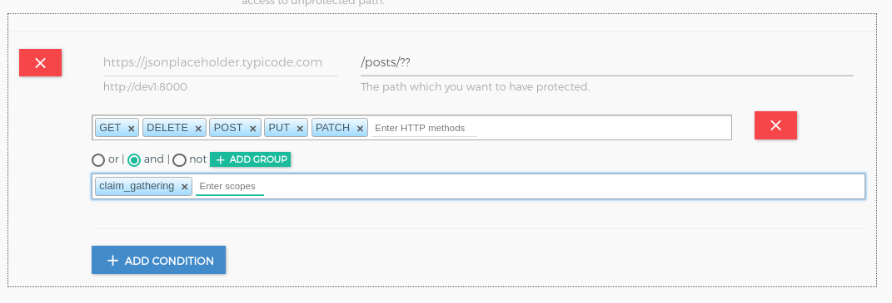
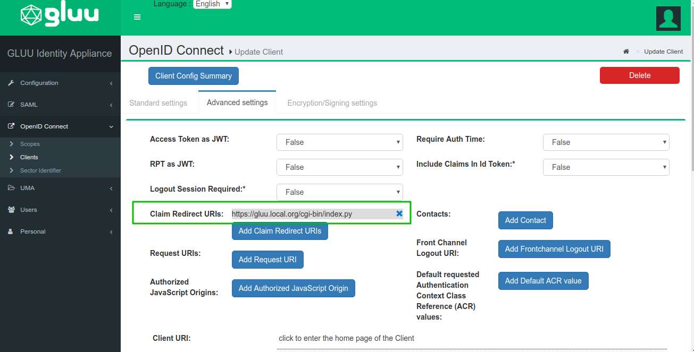

# Gluu Gateway UMA demo app

### 1. Parties


### 2. Flow


### 3. RS Configuration

RS configuration can be done either via REST calls or via Gluu Gateway web interface. You can configure plugin on **Service**, **Route** and **Global**. There are several possibilities for plugin configuration with services and routes. [More Details](https://docs.konghq.com/0.14.x/admin-api/#precedence). Take a look on [docs](https://gluu.org/docs/gg/plugin/gluu-uma-pep/) for configuration detail description.

Applications and their ports.

| Port | Description |
|------|-------------|
|8001|Kong Admin API|
|8000|Kong Proxy Endpoint|
|443|Kong SSL Proxy Endpoint. Kong by default provide 8443 port for SSL proxy but during setup it change into 443.|
|8443|OXD Server|

In demo, we are configuring plugin for service. Follow below step to configure plugin on service.

#### Step.1 [Add Service](/plugin/gluu-uma-pep/#1-add-service)

You need to register your upstream api in service. For more details take a look on details in [Gluu UMA PEP service](/plugin/gluu-uma-pep/#1-add-service) section.

For Demo, you need to add two different service with different name and URL. let's take some live API just for demo. `https://jsonplaceholder.typicode.com`.

- Service(claim-gatering)
    - `name: claim-gatering`
    - `URL: https://jsonplaceholder.typicode.com`
    - let's call it **claim_service**

- Service(none-claim-gatering):
    - `name: none-claim-gatering`
    - `URL: https://jsonplaceholder.typicode.com`
    - let's call it **none_claim_service**

#### Step.2 [Add Route](/plugin/gluu-uma-pep/#1-add-route)

For proxy you need to add route in service. For more details take a look on details in [Gluu UMA PEP route](/plugin/gluu-uma-pep/#1-add-route) section.

- Route1
    - Add first route in **claim_service** with hosts `gathering.example.com`

- Route2:
    - Add second route in **none_claim_service** with hosts `non-gathering.example.com`

#### Step.3 [Configure Plugin on Service](/plugin/gluu-uma-pep/#2-configure-plugin)

Configure Gluu-UMA-PEP with UMA scope and resources.

- Resource registration for **claim_service**.


- Resource registration for **none_claim_service**.


### 4. [UMA client registration](/plugin/gluu-uma-pep/#usage)

In this step, you can create OP Client using GG UI or you can use OXD server API for client registration. Take a look at [UMA client registration](/plugin/gluu-uma-pep/#usage) section for more details.

Then you need to use OP Client's client_id for Kong Consumer registration. let's call this OP client as **consumer_op_client**.

### 5. Call UMA protected API without claim gatering

You may need to take care from CE side for UMA Grant access when there is no policy in scope. `umaGrantAccessIfNoPolicies` flag in CE oxAuth json configuration is used to allow grant when there is no policy.

* Get resource ticket

```
  curl -X GET http://gg.example.com:8000/<YOUR_PATH>
      --Header "Host: non-gathering.example.com"
```

From this call you get ticket in WWW-Authenticate header with permission ticket

* Get client access token using consumer credentials.

```
 curl -X POST https://gg.example.com:8443/get-client-token
    --Header "Content-Type: application/json"
    --data '{"client_id":"<CONSUMER_OP_CLIENT_ID>", "client_secret":"<CONSUMER_OP_CLIENT_SECRET>", "op_host":"<YOUR_OP_HOST>","scope":[<YOUR_SCOPES>]}'
```

From this call you get Consumer access token

* Get RPT token

```
  curl -X POST https://gg.example.com:8443/uma-rp-get-rpt
      --Header "Authorization: Bearer <CONSUMER_ACCESS_TOKEN>"
      --Header "Content-Type: application/json"
      --data '{"oxd_id": "<CONSUMER_OP_CLIENT_OXD_ID>","ticket":"<PERMISSION_TICKET>"}'
```
From this call you will get access token (RPT).

* Call UMA protected API

```
  curl -X GET http://gg.example.com:8000/<YOUR_PATH>
      --Header "Authorization: Bearer <YOUR_RPT>"
      --Header "Host: non-gathering.example.com"
```

### 6. UMA flow with claims gathering

#### Prerequisites

* UMA scope with Authorization Policy


* Enabled UMA RPT Polices & UMA Claims Gathering


* Update consumer_op_client with `claim_redirect_uris` in CE. Add your CGI script URL.


#### Authentication

* Get resource ticket

```
  curl -X GET http://gg.example.com:8000/<YOUR_PATH>
      --Header "Host: gathering.example.com"
```

From this call you get ticket in WWW-Authenticate header with permission ticket.

* Get client access token using consumer credentials.

```
 curl -X POST https://gg.example.com:8443/get-client-token
    --Header "Content-Type: application/json"
    --data '{"client_id":"<CONSUMER_OP_CLIENT_ID>", "client_secret":"<CONSUMER_OP_CLIENT_SECRET>", "op_host":"<YOUR_OP_HOST>","scope":[<YOUR_SCOPES>]}'
```

From this call you get Consumer access token.

* Getting need_info ticket

```
  curl -X POST https://gg.example.com:8443/uma-rp-get-rpt
      --Header "Authorization: Bearer <CONSUMER_ACCESS_TOKEN>"
      --Header "Content-Type: application/json"
      --data '{"oxd_id": "<CONSUMER_OP_CLIENT_OXD_ID>","ticket":"<PERMISSION_TICKET>"}'
```

From this call you get need_info ticket and claims gathering url(redirect_user). You have to add your claims redirect uri as a url query parameter. You may need to add your claims redirect url to your client configuration in CE.

Next step is to request claim gatering url in browser and add country and city data, if all claim is ok then CE will redirect you to claim redirect uri with **new permission ticket**.

* Get RPT token with permission ticket

```
  curl -X POST https://gg.example.com:8443/uma-rp-get-rpt
      --Header "Authorization: Bearer <CONSUMER_ACCESS_TOKEN>"
      --Header "Content-Type: application/json"
      --data '{"oxd_id": "<CONSUMER_OP_CLIENT_OXD_ID>","ticket":"<NEW_PERMISSION_TICKET>"}'
```

From this call you will get access token (RPT).

* Call UMA protected API

```
  curl -X GET http://gg.example.com:8000/<YOUR_PATH>
      --Header "Authorization: Bearer <YOUR_RPT>"
      --Header "Host: gathering.example.com"
```

### 7. Demo

Demo is prepared as python CGI script. You need to put it in some CGI enabled web server. Script is divided into 3 parts:

* index.py - main script
* helper.py - REST calls and HTML template
* config.py - custom configuration

By default, UMA without claim gathering flow is executed.

If you want to execute UMA with claims gathering flow, add `claim=true` parameter in your url.
