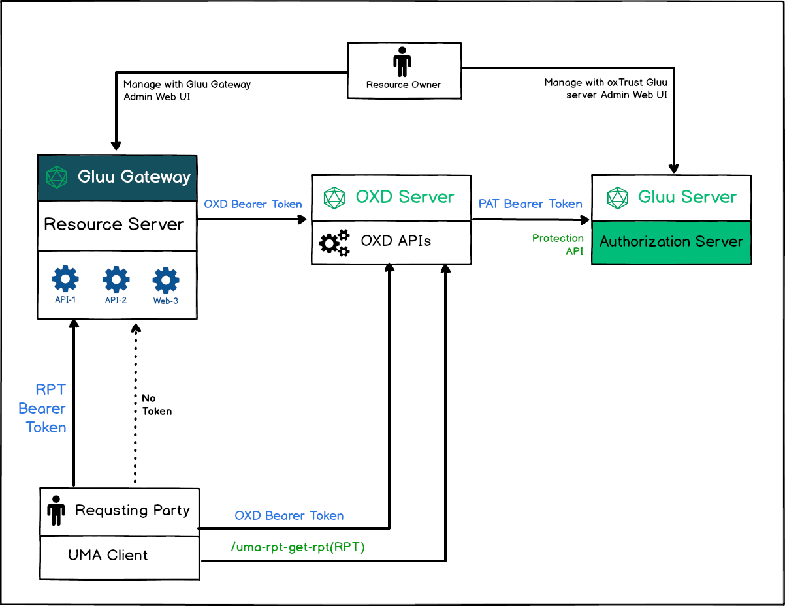
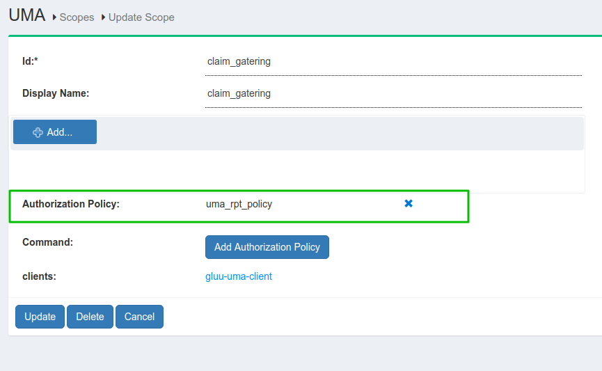

# Gluu Gateway UMA Tutorial app

## Overview

The tutorial for [UMA grant security](https://docs.kantarainitiative.org/uma/wg/rec-oauth-uma-grant-2.0.html) with GLUU-UMA-PEP plugin and Gluu CE. There are two different way to apply UMA security, **with Claim-Gatering-flow(need_info)** and **without Claim-Gatering-flow**. It explain you how to configure Gluu-UMA-PEP plugin with Kong and configure policy in Gluu CE. The [demo](https://github.com/GluuFederation/gluu-gateway/tree/version_4.0.0/gg-demo) is in **Python CGI** script which you can deploy on any CGI enabled server.

## Parties



## Flow


## RS Configuration

!!! Note
    RS configuration can be done either via REST calls or via the Gluu Gateway web interface. 

Configure plugin on **Service**, **Route** and **Global**. 

There are several possibilities for plugin configuration with services and routes. More information is available in the [Kong docs](https://docs.konghq.com/0.14.x/admin-api/#precedence), and configuration detail descriptions are available in the [Gluu Gateway docs](https://gluu.org/docs/gg/plugin/gluu-uma-pep/).

Applications and their ports:

| Port | Description |
|------|-------------|
|1338| Gluu Gateway Admin GUI|
|8001|Kong Admin API|
|8000|Kong Proxy Endpoint|
|443|Kong SSL Proxy Endpoint. Kong by default provide 8443 port for SSL proxy but during setup it change into 443.|
|8443|OXD Server|

In the following demo, we are configuring plugin for service. Follow the steps below. 

### Step.1 [Add Service](/plugin/gluu-uma-pep/#1-add-service)

Register your upstream API in service. For more details see the [Gluu UMA PEP service docs](/plugin/gluu-uma-pep/#1-add-service).

For the Demo, you need to add two different service with different name and URL. let's take some live API just for demo. `https://jsonplaceholder.typicode.com`.

- Service(claim-gatering)
    - `name: claim-gatering`
    - `URL: https://jsonplaceholder.typicode.com`
    - let's call it **claim_service**

- Service(none-claim-gatering):
    - `name: none-claim-gatering`
    - `URL: https://jsonplaceholder.typicode.com`
    - let's call it **none_claim_service**

### Step.2 [Add Route](/plugin/gluu-uma-pep/#1-add-route)

For proxy you need to add route in service. For more details take a look on details in [Gluu UMA PEP route](/plugin/gluu-uma-pep/#1-add-route) section.

- Route1
    - Add first route in **claim_service** with hosts `gathering.example.com`

- Route2:
    - Add second route in **none_claim_service** with hosts `non-gathering.example.com`

### Step.3 [Configure Plugin on Service](/plugin/gluu-uma-pep/#2-configure-plugin)

Configure Gluu-UMA-PEP with UMA scope and resources.

- Resource registration for **claim_service**.


- Resource registration for **none_claim_service**.


## [UMA client registration](/plugin/gluu-uma-pep/#usage)

In this step, you can create OP Client using GG UI or you can use OXD server API for client registration. Take a look at [UMA client registration](/plugin/gluu-uma-pep/#usage) section for more details.

Then you need to use OP Client's client_id for Kong Consumer registration. let's call this OP client as **consumer_op_client**.

## Call UMA protected API without claim gatering

You may need to take care from CE side for UMA Grant access when there is no policy in scope. `umaGrantAccessIfNoPolicies` flag in CE oxAuth json configuration is used to allow grant when there is no policy.

* Get resource ticket

```
  curl -X GET http://gg.example.com:8000/<YOUR_PATH>
      --Header "Host: non-gathering.example.com"
```

From this call you get ticket in WWW-Authenticate header with permission ticket

* Get client access token using consumer credentials.

```
 curl -X POST https://gg.example.com:8443/get-client-token
    --Header "Content-Type: application/json"
    --data '{"client_id":"<CONSUMER_OP_CLIENT_ID>", "client_secret":"<CONSUMER_OP_CLIENT_SECRET>", "op_host":"<YOUR_OP_HOST>","scope":[<YOUR_SCOPES>]}'
```

From this call you get Consumer access token

* Get RPT token

```
  curl -X POST https://gg.example.com:8443/uma-rp-get-rpt
      --Header "Authorization: Bearer <CONSUMER_ACCESS_TOKEN>"
      --Header "Content-Type: application/json"
      --data '{"oxd_id": "<CONSUMER_OP_CLIENT_OXD_ID>","ticket":"<PERMISSION_TICKET>"}'
```
From this call you will get access token (RPT).

* Call UMA protected API

```
  curl -X GET http://gg.example.com:8000/<YOUR_PATH>
      --Header "Authorization: Bearer <YOUR_RPT>"
      --Header "Host: non-gathering.example.com"
```

## UMA flow with claims gathering

### Prerequisites

* Enabled UMA RPT Polices & UMA Claims Gathering

    There is one **uma_rpt_policy**. During authorization, it checks County=US and City=NY. If you want to change value then you can update this script or you can add your own new script. For more details take a look on [Gluu CE Documentation](https://gluu.org/docs/ce/admin-guide/uma/#uma-rpt-authorization-policies).
    
    

* UMA scope with Authorization Policy

    

* Update consumer_op_client with `claim_redirect_uris` in CE. Add your CGI script URL.

    

### Authentication

* Get resource ticket

```
  curl -X GET http://gg.example.com:8000/<YOUR_PATH>
      --Header "Host: gathering.example.com"
```

From this call you get ticket in WWW-Authenticate header with permission ticket.

* Get client access token using consumer credentials.

```
 curl -X POST https://gg.example.com:8443/get-client-token
    --Header "Content-Type: application/json"
    --data '{"client_id":"<CONSUMER_OP_CLIENT_ID>", "client_secret":"<CONSUMER_OP_CLIENT_SECRET>", "op_host":"<YOUR_OP_HOST>","scope":[<YOUR_SCOPES>]}'
```

From this call you get Consumer access token.

* Getting need_info ticket

```
  curl -X POST https://gg.example.com:8443/uma-rp-get-rpt
      --Header "Authorization: Bearer <CONSUMER_ACCESS_TOKEN>"
      --Header "Content-Type: application/json"
      --data '{"oxd_id": "<CONSUMER_OP_CLIENT_OXD_ID>","ticket":"<PERMISSION_TICKET>"}'
```

From this call you get need_info ticket and claims gathering url(redirect_user). You have to add your claims redirect uri as a url query parameter. You may need to add your claims redirect url to your client configuration in CE.

Next step is to request claim gatering url in browser and add country and city data, As per default **uma_rpt_policy**, you need to enter `US` in Country and `NY` in City. If you change values in script then enter changed values.

If all claim is ok then CE will redirect you to claim redirect uri with **new permission ticket**.

* Get RPT token with permission ticket

```
  curl -X POST https://gg.example.com:8443/uma-rp-get-rpt
      --Header "Authorization: Bearer <CONSUMER_ACCESS_TOKEN>"
      --Header "Content-Type: application/json"
      --data '{"oxd_id": "<CONSUMER_OP_CLIENT_OXD_ID>","ticket":"<NEW_PERMISSION_TICKET>"}'
```

From this call you will get access token (RPT).

* Call UMA protected API

```
  curl -X GET http://gg.example.com:8000/<YOUR_PATH>
      --Header "Authorization: Bearer <YOUR_RPT>"
      --Header "Host: gathering.example.com"
```

## Demo

Demo is prepared as python CGI script. You need to put it in some CGI enabled web server. Script is divided into 3 parts:

* index.py - Main script
* helper.py - REST calls and HTML template
* config.py - Custom configuration

Take demo from [Gluu-Gateway repository](https://github.com/GluuFederation/gluu-gateway/tree/version_4.0.0/gg-demo).

By default, **UMA without claim gathering flow is executed.**

If you want to execute UMA with claims gathering flow, add `claim=true` parameter in your url.

### Deploy

Since we are going to write a python cgi script for simplicity, we first need to get a working web server to act as the Relying Party (RP). Apache will be installed on the host rp.server.com. I am using Ubuntu 16.04 LTS for this purpose. First install apache web server:

```
# apt-get update
# apt-get install apache2
# ln -s /etc/apache2/mods-available/cgi.load /etc/apache2/mods-enabled/
```

We will use Python's requests module to interact with oxd's REST API:

```
# apt-get install python-requests
```

Put all 3 files in `/usr/lib/cgi-bin` and give them 755 permission.

```
# chmod 755 index.py helper.py config.py
```

If you set configuration as above then you can request to

1. With claim gathering flow: `<your-server.com>/cgi-bin/index.py?claim=true`
2. Without claim gathering flow: `<your-server.com>/cgi-bin/index.py`

### Configuration

Use `config.py` file for add your configuration

| Properties | Description |
|------------|-------------|
|gg_admin_url|Gluu Gateway kong admin URL|
|gg_proxy_url|Gluu Gateway kong proxy URL|
|oxd_host|OXD server URL|
|ce_url|CE OP Server URL|
|api_path|your api path which you register during plugin configuration|
|host_with_claims|Kong Router object's host which you configure for claim gathering flow. As per above configuration, its value is `gathering.example.com`.|
|host_without_claims|Kong Router object's host which you configure for without claim gathering flow. As per above configuration, its value is `non-gathering.example.com`.|
|client_oxd_id, client_id, client_secret|Consumer OP Client credentials|
|claims_redirect_url|Claims redirect URL. As per above configuration, it is `<your-server.com>/cgi-bin/index.py`.|

