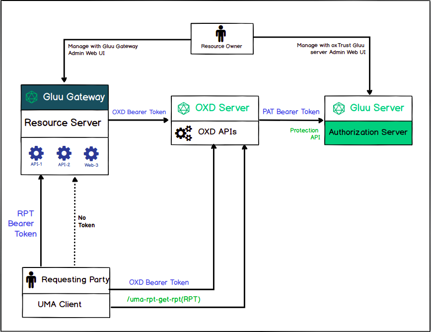
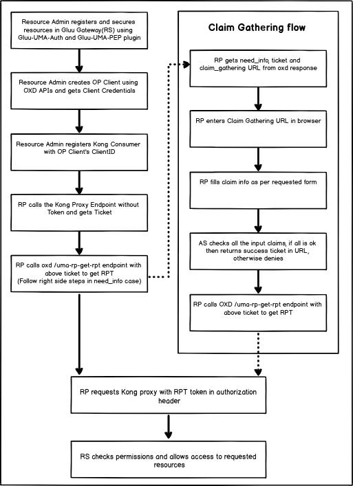
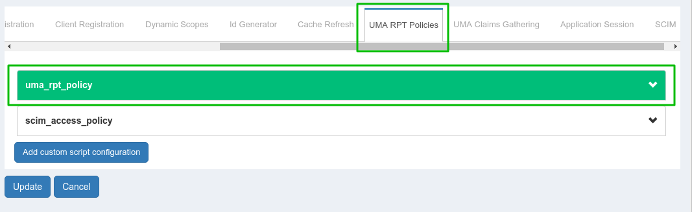
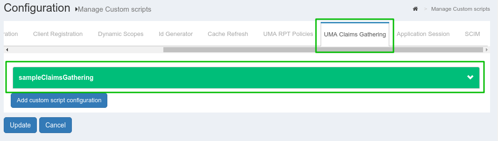

# Gluu Gateway UMA Tutorial

## Overview

This tutorial covers [UMA grant security](https://docs.kantarainitiative.org/uma/wg/rec-oauth-uma-grant-2.0.html) using the GLUU-UMA-Auth and GLUU-UMA-PEP plugin and the Gluu CE. There are two different ways to apply UMA security, **with Claim-Gathering-flow** and **without Claim-Gathering-flow**. The [demo](https://github.com/GluuFederation/gluu-gateway/tree/version_2.0/gg-demo) is a **Python CGI** script that can be deployed on any CGI-enabled server.

## Parties



## Flow


## Plugin Configuration

!!! Note
    Plugin configuration can be done either via REST calls or via the Gluu Gateway web interface.  

Configure plugin on **Service**, **Route** and **Global**. 

There are several possibilities for plugin configuration with services and routes. More information is available in the [Kong docs](https://docs.konghq.com/0.14.x/admin-api/#precedence), and configuration detail descriptions are available in the [Gluu Gateway docs](/plugin/gluu-uma-auth-pep).

Applications and their ports:

| Port | Description |
|------|-------------|
|1338| Gluu Gateway Admin GUI|
|8001|Kong Admin API|
|8000|Kong Proxy Endpoint|
|443|Kong SSL Proxy Endpoint. Kong by default provide 8443 port for SSL proxy but during setup it change into 443.|
|8443|OXD Server|

The following tutorial demonstrates plugin configuration for a Service. Follow the steps below. 

### Add Service

Register your upstream API as a Service. For more details, see the [Gluu UMA Auth and UMA PEP service docs](/plugin/gluu-uma-auth-pep/#service-level).

For this demo, you'll need to add two different services with different names. You can use this live test API, `https://jsonplaceholder.typicode.com`.

- Service(claim-gathering)
    - `name: claim-gathering`
    - `URL: https://jsonplaceholder.typicode.com`
    - let's call it **claim_service**

- Service(non-claim-gathering):
    - `name: non-claim-gathering`
    - `URL: https://jsonplaceholder.typicode.com`
    - let's call it **non_claim_service**

### Add Route

For a proxy, you need to add a Route to the Service. For more details, see the [Gluu UMA Auth and UMA PEP route docs](/plugin/gluu-uma-auth-pep/#route-level).

- Route1
    - Add the first route in **claim_service** with `gathering.example.com` as the host.

- Route2:
    - Add the second route in **non_claim_service** with `non-gathering.example.com` as the host.

### Configure Plugin on Service

Configure Gluu-UMA-Auth and Gluu-UMA-PEP with UMA scopes and resources. See more details in the [Service Plugin docs](/plugin/gluu-uma-auth-pep/#configure-service-plugin-using-gg-ui).

- Resource registration for **claim_service**.


- Resource registration for **none_claim_service**.


## UMA Client Registration

Create an OP Client using the GG UI, or you can use the oxd server API for client registration. Take a look at [UMA client registration](/plugin/gluu-uma-pep/#create-client) section for more details. Let's call this OP client **consumer_op_client**

Once you have an OP client, use its client_id for Kong Consumer registration. .

## Call UMA protected API without Claim Gathering

To use UMA Grant access with no policy in a scope, you need to set the `umaGrantAccessIfNoPolicies` flag in CE oxAuth JSON configuration to `true`. Then, do the following:

* Get a resource ticket

```
  curl -X GET http://gg.example.com:8000/<YOUR_PATH>
      --Header "Host: non-gathering.example.com"
```

When you make this call, you'll receive a ticket in the WWW-Authenticate header with a permission ticket.

* Get a client access token using consumer credentials.

```
 curl -X POST https://gg.example.com:8443/get-client-token
    --Header "Content-Type: application/json"
    --data '{"client_id":"<CONSUMER_OP_CLIENT_ID>", "client_secret":"<CONSUMER_OP_CLIENT_SECRET>", "op_host":"<YOUR_OP_HOST>","scope":[<YOUR_SCOPES>]}'
```
When you make this call, you'll receive a Consumer access token.

* Get an RPT token

```
  curl -X POST https://gg.example.com:8443/uma-rp-get-rpt
      --Header "Authorization: Bearer <CONSUMER_ACCESS_TOKEN>"
      --Header "Content-Type: application/json"
      --data '{"oxd_id": "<CONSUMER_OP_CLIENT_OXD_ID>","ticket":"<PERMISSION_TICKET>"}'
```
When you make this call, you'll receive an RPT access token.

* Call the UMA-protected API

```
  curl -X GET http://gg.example.com:8000/<YOUR_PATH>
      --Header "Authorization: Bearer <YOUR_RPT>"
      --Header "Host: non-gathering.example.com"
```

## UMA flow with Claims Gathering

### Prerequisites

* Enable UMA RPT Polices & UMA Claims Gathering

    There is one **uma_rpt_policy** included in the script. During authorization, it checks County=US and City=NY. If you want to change the value, then you can update this script or add your own new script. For more details, take a look at [Gluu CE Documentation](https://gluu.org/docs/ce/admin-guide/uma/#uma-rpt-authorization-policies).
    
    

* UMA scope with Authorization Policy

    

* Update the consumer_op_client with `claim_redirect_uris` in CE. Add your CGI script URL.

    

### Authentication

* Get a resource ticket

```
  curl -X GET http://gg.example.com:8000/<YOUR_PATH>
      --Header "Host: gathering.example.com"
```

When you make this call, you'll receive a ticket in the WWW-Authenticate header with a permission ticket.

* Get a client access token using consumer credentials.

```
 curl -X POST https://gg.example.com:8443/get-client-token
    --Header "Content-Type: application/json"
    --data '{"client_id":"<CONSUMER_OP_CLIENT_ID>", "client_secret":"<CONSUMER_OP_CLIENT_SECRET>", "op_host":"<YOUR_OP_HOST>","scope":[<YOUR_SCOPES>]}'
```

When you make this call, you'll receive a Consumer access token.

* Get a need_info ticket

```
  curl -X POST https://gg.example.com:8443/uma-rp-get-rpt
      --Header "Authorization: Bearer <CONSUMER_ACCESS_TOKEN>"
      --Header "Content-Type: application/json"
      --data '{"oxd_id": "<CONSUMER_OP_CLIENT_OXD_ID>","ticket":"<PERMISSION_TICKET>"}'
```

When you make this call, you'll get a need_info ticket and a claims gathering URL for user redirection. You have to add your `claims redirect` URI as a URL query parameter. You may need to add your `claims redirect` URL to your client configuration in CE.

The next step is to request a claim gatering URL in the browser and add country and city data. Per default **uma_rpt_policy**, you need to enter `US` in Country and `NY` in City. If you change location values in the script, enter corresponding values here.

If all claims are correct, the Gluu Server will redirect you to the `claim redirect` URI with a **new permission ticket**.

* Get an RPT token with a permission ticket

```
  curl -X POST https://gg.example.com:8443/uma-rp-get-rpt
      --Header "Authorization: Bearer <CONSUMER_ACCESS_TOKEN>"
      --Header "Content-Type: application/json"
      --data '{"oxd_id": "<CONSUMER_OP_CLIENT_OXD_ID>","ticket":"<NEW_PERMISSION_TICKET>"}'
```

When you make this call, you'll receive an RPT access token.

* Call an UMA protected API

```
  curl -X GET http://gg.example.com:8000/<YOUR_PATH>
      --Header "Authorization: Bearer <YOUR_RPT>"
      --Header "Host: gathering.example.com"
```

## Demo

The Demo is a Python CGI script. You need to put it in a CGI-enabled web server. The script is divided into 3 parts:

* index.py - Main script
* helper.py - REST calls and HTML template
* config.py - Custom configuration

Download the Demo from the [Gluu-Gateway repository](https://github.com/GluuFederation/gluu-gateway/tree/version_2.0/gg-demo).

By default, the **UMA without claim gathering flow** is executed.

If you want to execute UMA with claims gathering flow, add `claim=true` parameter to your URL.

### Deploy

Since we are going to write a Python CGI script for simplicity, we first need to get a working web server to act as the Relying Party (RP). Install Apache on the host rp.server.com. This tutorial is using Ubuntu 16.04 LTS. First, install the Apache web server:

```
# apt-get update
# apt-get install apache2
# ln -s /etc/apache2/mods-available/cgi.load /etc/apache2/mods-enabled/
```

You will use Python's requests module to interact with oxd's REST API:

```
# apt-get install python-requests
```

Put all 3 files in `/usr/lib/cgi-bin` and give them `755` permission.

```
# chmod 755 index.py helper.py config.py
```

If you set the configuration as above then you can send a request to

1. With claim gathering flow: `<your-server.com>/cgi-bin/index.py?claim=true`
2. Without claim gathering flow: `<your-server.com>/cgi-bin/index.py`

### Configuration

Use the `config.py` file to add your configuration

| Properties | Description |
|------------|-------------|
|gg_admin_url|Gluu Gateway kong admin URL|
|gg_proxy_url|Gluu Gateway kong proxy URL|
|oxd_host|OXD server URL|
|ce_url|CE OP Server URL|
|api_path|your API path which you register during plugin configuration|
|host_with_claims|Kong Router object's host which you configure for claim gathering flow. As per above configuration, its value is `gathering.example.com`.|
|host_without_claims|Kong Router object's host which you configure for without claim gathering flow. As per above configuration, its value is `non-gathering.example.com`.|
|client_oxd_id, client_id, client_secret|Consumer OP Client credentials|
|claims_redirect_url|Claims redirect URL. As per above configuration, it is `<your-server.com>/cgi-bin/index.py`.|
